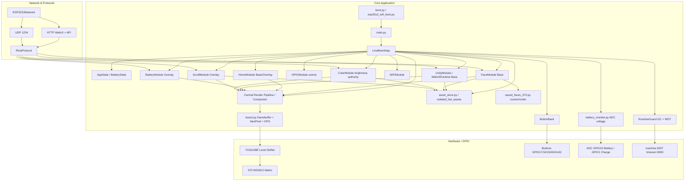
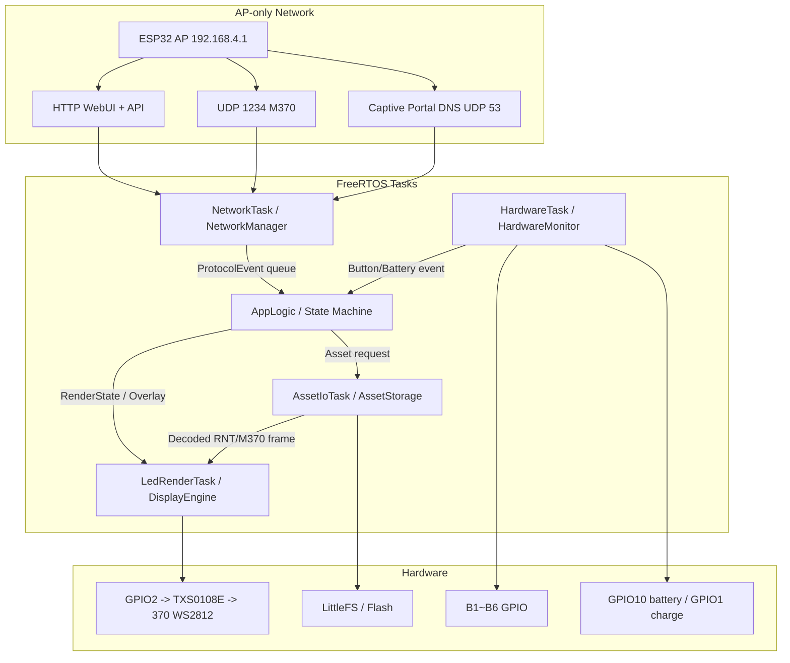
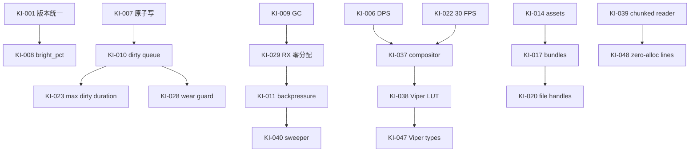

# RinaChanBoard ESP32-S3 370 LED 固件 — 设计、规格与实施计划

> **适用对象**：固件包 `esp32s3_firmware(15).zip`,固件目录 `esp32s3_firmware/`
> **目标板**：ESP32-S3 + 370 颗 WS2812 / NeoPixel 兼容 LED 不规则矩阵(物理 22×18)
> **当前版本**:启动 Banner `1.8.0`,协议 `1.7.4-rnt-command-only`(版本号不一致,见 [§1.3](#13-已知问题与统一项))
> **文档原则**:只记录固件常量中能确认的硬件/软件规格。未出现在常量中的 PCB 尺寸、线宽、电源路径器件型号、外壳尺寸等**不在本文中臆测**。
> **v27 方向**:新增 C++ / ESP-IDF 迁移架构。MicroPython 方案保留为现状与过渡基线;新开发建议转向 C++/FreeRTOS 以根除 GC/Viper/heap 碎片等深水区风险。
> **v28 方向**:C++ 目标框架收敛为 **PlatformIO + Arduino Core + FreeRTOS**。优先复用 ESPAsyncWebServer、AsyncUDP、NeoPixelBus、ArduinoJson、LittleFS,把近 200 个 MicroPython 文件压缩为 5 个核心 C++ 领域模块。

---

## 目录

- [0. 如何阅读本文档](#0-如何阅读本文档)
- [1. 项目概览](#1-项目概览)
  - [1.1 当前固件摘要](#11-当前固件摘要)
  - [1.2 关键设计原则](#12-关键设计原则)
  - [1.3 已知问题与统一项](#13-已知问题与统一项)
  - [1.4 深水区问题—方案总览](#14-深水区问题方案总览)
  - [1.5 当前发布阻断项状态](#15-当前发布阻断项状态)
  - [1.6 v27 C++ 迁移路线总览](#16-v27-c-迁移路线总览)
  - [1.7 v28 PlatformIO / Arduino Core 实战决策](#17-v28-platformio--arduino-core-实战决策)
- [2. 硬件规格](#2-硬件规格)
  - [2.1 主控与运行环境](#21-主控与运行环境)
  - [2.2 LED 矩阵硬件](#22-led-矩阵硬件)
  - [2.3 LED 坐标与协议兼容](#23-led-坐标与协议兼容)
  - [2.4 物理按键](#24-物理按键)
  - [2.5 电池与充电检测](#25-电池与充电检测)
  - [2.6 功耗与供电预算](#26-功耗与供电预算)
- [3. 网络与协议规格](#3-网络与协议规格)
  - [3.1 AP Wi-Fi（AP-only）](#31-ap-wifiap-only)
  - [3.2 HTTP / UDP 服务](#32-http--udp-服务)
- [4. 软件架构](#4-软件架构)
  - [4.1 模块职责一览](#41-模块职责一览)
  - [4.2 系统架构图](#42-系统架构图)
  - [4.3 主循环执行模型](#43-主循环执行模型)
  - [4.4 模块代理架构 (`app_module_base.py`)](#44-模块代理架构-app_module_basepy)
  - [4.6 C++ / FreeRTOS 目标架构](#46-c--freertos-目标架构)
  - [4.7 PlatformIO / Arduino Core 目标工程结构](#47-platformio--arduino-core-目标工程结构)
- [5. 功能列表](#5-功能列表)
  - [5.1 核心显示](#51-核心显示)
  - [5.2 WebUI](#52-webui)
  - [5.3 电池与充电](#53-电池与充电)
  - [5.4 协议兼容](#54-协议兼容)
- [6. 关键实现细节](#6-关键实现细节)
  - [6.1 LED 绘制与 M370 解码](#61-led-绘制与-m370-解码)
  - [6.2 颜色与亮度 authority](#62-颜色与亮度-authority)
  - [6.3 按键与手动控制](#63-按键与手动控制)
  - [6.4 HTTP / UDP / WebUI 路由](#64-http--udp--webui-路由)
  - [6.5 协议路由](#65-协议路由)
  - [6.6 RNT2 媒体播放](#66-rnt2-媒体播放)
  - [6.7 电池三层架构](#67-电池三层架构)
  - [6.8 设置持久化](#68-设置持久化)
  - [6.9 运行时稳定性防线](#69-运行时稳定性防线)
  - [6.10 LED 资源隔离、bundle 合并与按需加载](#610-led-资源隔离bundle-合并与按需加载)
  - [6.11 集中式渲染管线与画家算法](#611-集中式渲染管线与画家算法)
  - [6.12 单线程深水区实现准则](#612-单线程深水区实现准则)
  - [6.13 Viper / ADC / Flash / JSON 深度耦合优化](#613-viper--adc--flash--json-深度耦合优化)
  - [6.14 实施阶段性能深度优化](#614-实施阶段性能深度优化)
  - [6.16 C++ 迁移实施细则](#616-c-迁移实施细则)
  - [6.17 PlatformIO / Arduino Core 实施细则](#617-platformio--arduino-core-实施细则)
- [7. 实施计划](#7-实施计划)
  - [优化矩阵(全量汇总)](#优化矩阵全量汇总)
- [8. 部署与测试](#8-部署与测试)
  - [8.1 推荐目录结构](#81-推荐目录结构)
  - [8.2 上传与运行](#82-上传与运行)
  - [8.3 验收清单](#83-验收清单)
- [9. 后续维护规则](#9-后续维护规则)
  - [9.1 架构边界](#91-架构边界)
  - [9.2 编码与设计规则](#92-编码与设计规则)

---

## 0. 如何阅读本文档

本文档是 RinaChanBoard ESP32-S3 370 LED 固件的设计、规格、实施合并文档。不同读者建议的阅读路径:

| 读者角色 | 重点章节 |
|---|---|
| 硬件验证 / PCB 装配 | [§2 硬件规格](#2-硬件规格)、[§8.3 验收清单](#83-验收清单)硬件部分 |
| 固件开发 / 模块改造 | [§1.3 已知问题](#13-已知问题与统一项)、[§4 软件架构](#4-软件架构)、[§6 关键实现细节](#6-关键实现细节)、[§9 维护规则](#9-后续维护规则) |
| WebUI / 协议扩展 | [§3.2 HTTP/UDP](#32-http--udp-服务)、[§5.2 WebUI 功能](#52-webui)、[§6.4–6.5 路由](#64-http--udp--webui-路由) |
| 测试 / 验收 | [§7 实施计划](#7-实施计划)、[§8.3 验收清单](#83-验收清单) |
| 新开发者 / 外部 AI 修复者 | [§1.4 深水区问题—方案总览](#14-深水区问题方案总览)、[§6.12 单线程深水区实现准则](#612-单线程深水区实现准则)、[§9.2 编码与设计规则](#92-编码与设计规则) |

文档中的章节交叉引用使用 `→ §x.y` 的形式标注。

---


### 0.1 术语表

| 术语 | 含义 |
|---|---|
| compositor | 集中式渲染管线;仲裁 base layer、按 z-index 叠加 overlay、应用 LUT/DPS、唯一调用 `board.show()` 的执行体 |
| authority | 某状态的唯一权威源;其他模块必须通过该 authority 读写,不得维护副本 |
| release gate | 发布前必须满足的硬约束;不满足即不得标记为 release 包 |
| hot path | 主循环高频执行的代码路径,通常每 15~33 ms 至少执行一次 |
| backpressure | 应用层流量控制;发送端因接收端慢而暂停读源数据,等待 socket 可写 |
| dirty queue | 持久化延迟提交队列;模块只标记 dirty,实际写盘由 queue 统一调度 |
| logical RGB | 模块语义颜色 0~255;尚未应用亮度 cap |
| cap-applied RGB | 应用 brightness LUT 后的颜色 0~cap;尚未应用 DPS |
| DPS | Dynamic Power Scaling;基于最终合成帧估算电流并限幅 |
| LUT | Lookup Table;预计算的查表数组,避免热路径乘除 |
| Q8/Q16 定点 | 用整数表示小数;Q8 是 `value × 256`,Q16 是 `value × 65536`,乘除用位移避免浮点 |
| ticks rollover | `ticks_ms()` / `ticks_us()` 计数器周期翻转;`ticks_diff` 只在半周期内安全 |
| service loop | 主循环单次迭代;包含网络、按键、ADC、render 等阶段 |
| frame deadline | LED 物理刷新的目标时刻;到达后才触发 `np.write()` |
| RNT2 | RinaChan 时间轴格式;每行一帧 m370 hex |
| M370 | 370 颗物理 LED 的 bit packed 协议;93 hex 字符 |
| isolated_led_assets | LED 资源根目录;所有显示数据的唯一来源 |
| bundle | 多个小资源按类别合并的单文件;固定 ≤32 KiB 便于 random access |

> **时间基约定**:文档中 `33.33 ms` 是 `FRAME_PERIOD_US = 33333` 的人读形式,所有 frame deadline 比较代码使用 `ticks_us()` + `ticks_diff()`;ms 形式只用于日志/UI 显示。`POLL_PERIOD_MS` 是 service loop 粗粒度目标,与 frame deadline 解耦。

## 1. 项目概览

### 1.1 当前固件摘要

| 项目 | 当前值 / 说明 |
|---|---|
| 固件形态 | ESP32-S3 MicroPython 单板固件,同时运行 LED 渲染、HTTP WebUI、UDP 协议、电池监测、按键扫描 |
| 主入口 | `main.py` |
| 启动辅助 | `boot.py` + `esp32s3_wifi_boot.py`,仅提前打开 AP_IF 预留 AP Wi-Fi 内存;不创建/连接 STA_IF |
| 启动 Banner | `RinaChanBoard ESP32-S3 370LED modular 1.8.0 color_module-authority brightness-sync AP+protocol+RNT2 battery` |
| 协议版本字符串 | `rina_protocol.VERSION = 1.7.4-rnt-command-only` |
| 文件数量 | 当前包内约 192 个文件 |
| WebUI | `webui_index.html.gz`,压缩约 60 KB,解压 HTML 约 359 KB |
| Unity / RNT2 资源 | 隔离资源包 `isolated_led_assets/`:voice 143 个 `.rnt`、music 8 个、video 7 个,共 158 条 RNT timeline |
| 默认设置文件 | `linaboard_settings.json` |
| 文档修订 | v24:复核 A/B/E/F/H 审查项;补强 DPS 闭合预算、us 时间基、logical RGB 数据流、RNT 算画分离、numeric gate、NeoPixel probe、威胁模型、OTA 与诊断 ring buffer |
| 默认自定义脸 | `isolated_led_assets/resources/faces/default/*.m370` 11 个默认 face;运行时自定义 face 仍由 `saved_faces_370.py` / 设置文件管理 |
| LED 资源隔离包 | `isolated_led_assets/manifest_bundled.json` 人读索引,`resources/bundles/*_index_*.json` + `resources/database/*.json` 固件紧凑索引;大量小 `.rgb` / `.m370` / `.rbitmap.json` / voice `.rnt` 合并为 ≤32 KiB bundle,大 music/video `.rnt` 继续独立流式读取 |
| 主要技术风险 | 单线程主循环须避免 HTTP 发送、RNT 播放、资源 JSON 解析阻塞 AP / LED 刷新;本版无 Wi-Fi 扫描/配网/STA 重连路径 |

### 1.2 关键设计原则

以下原则贯穿整个固件设计,改动时务必遵守(详见 [§9](#9-后续维护规则)):

1. **协议唯一入口** — 所有 WebUI / UDP 命令进入 `rina_protocol.py` 路由,功能模块只接收 callback。
2. **颜色与亮度唯一 authority** — `color_module.py` 是全局颜色/亮度的唯一权威,功能模块不维护独立 cap。
3. **渲染唯一出口** — 功能模块只能更新状态、`mark_dirty()` 并实现 `render_base()` / `render_overlay()`;只有 `LinaBoardApp.render_pass()` 可以在 30 FPS deadline 到达时合成 framebuffer 并调用 `board.show()`。
4. **AP-only 连接性边界** — 本版只保留设备自身 AP Wi-Fi 控制面;固件不得实现 STA 连接、Wi-Fi 扫描、配网、保存外部 SSID/密码或 `/api/wifi/*` 配置接口;仅 `esp32s3_wifi_ap.py` 可直接调用 `network.WLAN(AP_IF)`。
5. **RNT2 命令式播放** — 浏览器只发 kind/key/play/stop,固件从 flash 流式读取,不一次性载入 RAM。
6. **LED 资源隔离** — 所有会直接/间接写入 LED 的颜色、icon、字体、默认 face、FaceModule、legacy component、RNT timeline 必须放入 `isolated_led_assets/`,业务代码不得继续内嵌大数组。
7. **资源小文件合并** — 大量小资源文件不得逐个散落在 flash 文件系统中;颜色、字体、icon、face module、legacy component、默认脸、voice RNT 应按类别合并为 bundle + offset index,单个 bundle 默认 ≤32 KiB,music/video 大 RNT 保持独立流式读取。
8. **轻量格式优先** — 单帧用 `.m370`,时间轴用 `.rnt`,小图/字体/部件用 `rbitmap1`,颜色用 `.rgb`;ESP32 热路径禁止解析完整 `manifest.json`。
9. **HTTP 协作式短块 + 背压** — 静态文件分块 512 B,但慢客户端 `EAGAIN` 时必须暂停文件读取并等待 `POLLOUT`;只因长时间无吞吐才断连。
10. **网络 RX 零分配** — 高频 UDP / HTTP 接收不得使用 `sock.recv()` 反复创建 bytes;必须预分配 `bytearray` 并用 `sock.recvinto()` + `memoryview` 解析。
11. **网络控制强制 manual-off** — 任何 WebUI/网络绘制命令都要 `exit_manual_control_from_network()`,避免 A/M 与 WebUI 脱节。
12. **持久化集中** — 长期状态全部写入 `linaboard_settings.json`,saved face 列表是唯一例外(单独文件)。
13. **内存预分配与确定性 GC** — 渲染热路径启动时分配缓冲,`service()` 中禁止新建大 `bytearray`;除 idle GC 外,heap 低于高水位阈值时必须在 `board.show()` 后、网络解析前强制 GC。
14. **持久化防抖** — 所有 flash 写入(设置、自定义脸等)先更新 RAM/临时状态并进入 dirty 队列,必须等待静默窗口后统一原子写入;本版不保存外部 敏感配置或配网状态。
15. **JSON 负载必须限额** — HTTP body、Path B RAM timeline、settings/history 持久化都必须有明确大小上限;超过上限在 socket 接收层返回 413,不得进入 `ujson.loads()`。
16. **强制非阻塞 I/O** — HTTP/UDP socket 必须 `setblocking(False)` 或走 `select.poll()`;发送端采用应用层背压,慢客户端等待可写时不得继续读文件或堆积 chunk。
17. **WS2812 物理刷新时间优先** — 370 颗 WS2812 单次 `np.write()` 理论耗时约 11.1 ms,加 reset latch 后约 11.5 ms 以上;LED 输出默认 30 FPS,主循环服务周期与 LED frame deadline 必须解耦。
18. **时间流逝必须区分短期/长期域** — 短周期 timeout/动画/去抖使用 `ticks_ms()` + `ticks_diff()`;超过 1 天的 uptime、电池历史、长期静默判断使用 RTC 秒或 `time.time()` 等长期时间源,不得用 `ticks_ms()` 记长期历史。
19. **WDT 保底** — 主循环每轮末尾喂硬件看门狗;已知可能阻塞的底层网络维护操作必须有维护窗口/超时策略,避免误触发或掩盖死锁。
20. **DPS + WDT + 模拟电压检测保护** — 帧级 DPS 管瞬时电流,WDT 管死锁恢复,电池/充电状态仅通过 GPIO10/GPIO1 模拟电压检测;本版硬件只保留模拟电压检测。

### 1.3 已知问题与统一项

| ID | 类型 | 描述 | 影响 | 处置 |
|---|---|---|---|---|
| KI-001 | 一致性 | `main.py` Banner 写 `1.8.0`,`rina_protocol.VERSION` 写 `1.7.4-rnt-command-only`,WebUI / 串口 / 协议查询显示不同版本 | 用户/调试者困惑 | P0:新增 `version.py` 提供单一 `VERSION` 常量,`main.py` Banner 与 `rina_protocol.VERSION` 都引用它 |
| KI-002 | 表达冗余 | 旧版 §2.5 把 `CHARGE_DETECT_NON_CHARGING_V` 与 `CHARGE_DETECT_HYSTERESIS_LOW_V` 列为两条但实际是同一阈值 | 文档误导 | 本版已合并(见 [§2.5](#25-电池与充电检测)) |
| KI-003 | 硬件假设 | TXS0108E 上电毛刺会被放大为随机闪帧,目前靠 NeoPixel 初始化后立即写全黑帧抑制 | 极少数情况下仍可能首帧异常 | 硬件层:数据线下拉或换 74AHCT 系列缓冲;固件层保留启动黑帧 |
| KI-004 | 电源 | 固件 cap=170/255 仅限亮度,不等于电源保护;370 颗 WS2812 满白理论 ~22 A | 长期高亮可能烧线/烧 LED | 硬件 BOM 与外部电源校核;UI 默认 30%,详见 [§2.6](#26-功耗与供电预算) |
| KI-005 | 估算精度 | 电池剩余/充电时间估算在历史不足时偏差大 | 用户看到不准的预估 | P2:在 JSON 加 `confidence` 字段,前端低置信度时显示"估算" |
| KI-006 | 架构缺口 / **状态:待实现** | 当前只有**通道级**亮度 cap(`MAX_BRIGHTNESS_HARD_CAP=170`),**缺帧级动态功率限制 (DPS)**:cap=170 时全白 370 颗 LED 仍可拉 ~14.8 A,瞬时拉跨 5V 轨可能触发 ESP32 brownout reset;同时 DPS 默认值必须绑定 2S 电池 + 65 W 供电架构和实测 5V 轨能力,不能继续使用拍脑袋的 5 A | 用户拉满亮度且显示大面积亮像素时风险高;若预算过低浪费硬件能力,预算过高则触发电源保护、线材或连接器风险 | **发布阻断/P1**:以 `65 W × BUCK_EFFICIENCY / 5 V` 计算 5V 轨理论上限,90% 效率约 11.7 A;电流预算分四层:`POWER_THEORETICAL_MAX_MA`、`HARDWARE_SUSTAINED_MAX_MA`、`POWER_BUDGET_MA_ABSOLUTE_MAX`、`POWER_BUDGET_MA_DEFAULT`;默认 `POWER_BUDGET_MA_DEFAULT=8550`,硬上限 `POWER_BUDGET_MA_ABSOLUTE_MAX=9000`;在 `board.show()` 前基于最终合成帧估算电流并按 Q8/Q16 定点缩放;WebUI 不得越过硬上限 |
| KI-007 | 数据安全 | `settings_store.save_settings()` 直接覆写 `linaboard_settings.json`,写入中途断电会损坏 JSON | 用户电池校准、自定义脸列表丢失 | P1:写入临时文件 `linaboard_settings.json.tmp`,`os.sync()` / fsync 后 `os.rename()` 原子替换 |
| KI-008 | API 语义 / **状态:待修复** | `requestState` / `/api/status` 返回的 `bright` 字段当前是**通道 cap 原值**(0~170),但 WebUI 与第三方客户端通常按"百分比"使用 | 滑块显示错位、第三方脚本误判亮度,潜在导致设置回写错误 | **发布阻断/P0**:在 `rina_protocol.py` / `/api/status` 边界把 `bright` 改为 `bright_pct` 语义,新增 `bright_pct`(5~100 UI %) 与 `bright_cap`(0~170 raw);WebUI slider 只读 `bright_pct`;保留 `bright` 作为百分比别名而不是 raw cap |
| KI-051 | 连接性范围收缩 / **状态:必须执行** | 旧文档与旧固件规划包含 STA、Wi-Fi 扫描、配网保存和 `/api/wifi/*` 配置接口,但本版硬件/需求只保留 AP Wi-Fi 控制面 | 多余 STA/scan/save 代码会引入底层阻塞、WDT 误复位、Flash 写入面和敏感配置暴露风险 | **发布阻断/P0**:删除 STA 连接、扫描、配网页面与 API;`esp32s3_wifi_ap.py` 只负责固定 AP_IF 启动与 AP 状态;WebUI 不显示 Wi-Fi 配网页;`/api/wifi/scan`、`/api/wifi/save` 返回 404/410 或不注册 |
| KI-009 | 内存稳定性 | MicroPython 在 HTTP 字符串拼接、`M370:<93 hex>` 解析、JSON 序列化/反序列化时会产生大量短生命周期对象;高负载 UDP + RNT 播放可能长期没有 idle 窗口,导致自动 GC 在随机分配点触发 10~50 ms 卡顿 | LED 掉帧、UDP 丢包、RNT 播放抖动,极端情况下 heap 耗尽或 WDT 误触发 | P1:渲染 framebuffer / bit buffer / response buffer 启动预分配;`service()` 热路径禁止 `return bytearray(...)`;保留 idle GC,并新增 high-watermark GC:当 `gc.mem_free()` 低于总 heap 20% 或绝对阈值时,在 `board.show()` 后、网络解析前强制 `gc.collect()` |
| KI-010 | Flash 寿命 | 设置持久化虽规划原子写入,但亮度 slider、自定义脸保存、saved face 列表同步或第三方脚本高频更新都可能频繁覆写 flash | Flash 提前磨损,设置/自定义脸文件损坏概率上升 | P1:建立统一 flash dirty queue;`linaboard_settings.json`、自定义 faces 等所有非紧急写入均先更新 RAM/暂存状态,最后一次修改静默 ≥ 5 s 后再原子写入;强制 flush 也必须走同一队列与原子写入 |
| KI-011 | I/O 阻塞 | 若 `esp32s3_network.py` 任何 socket 为阻塞模式,慢手机 TCP 窗口满时 `send()` 可能卡死整个 ESP32;若 EAGAIN 后按队列深度激进断连,弱网手机会反复重试导致 WebUI 永远加载不完 | AP 无响应、LED 停帧、主循环 15~16.67 ms 调度失效;或浏览器在弱网下持续重试 | P1:所有 socket 强制非阻塞或走 `select.poll()`;实现应用层背压:未发送完当前 chunk 时暂停从文件读取下一块,注册 `POLLOUT` 等待可写;只有整体无吞吐超过阈值(如 10 s)才断开 |
| KI-012 | 死锁恢复 | 单线程轮询架构遇到死循环、ADC/网络/文件系统异常阻塞时缺少硬件恢复机制 | 设备冻结或长阻塞导致 AP/LED 停止响应 | P1:启动 `machine.WDT(timeout=3000)` 并仅在主循环尾部 feed;HTTP/UDP/文件/ADC 均必须状态机化并快速返回;本版不提供 Wi-Fi scan / STA reconnect 这类长阻塞网络维护入口 |
| KI-014 | 资源耦合 | 颜色、默认 face、icon、字体、FaceModule、legacy component、RNT timeline 若继续散落在 Python / 大 JSON / WebUI 中,会让固件逻辑与 LED 显示数据强耦合 | 更新资产需要改代码,打包体积膨胀,热路径解析大 JSON 容易造成卡顿 | P1:采用 `isolated_led_assets/` 作为唯一 LED 资源根;运行时通过 `asset_store.py` 按需读取 `.m370` / `.rnt` / `.rbitmap.json` / `.rgb` |
| KI-015 | 索引内存风险 | `manifest.json` 是人读完整索引,当前约 131 KB;ESP32 启动或播放时若直接 `ujson.load()` 全量解析会产生大量临时对象 | 启动慢、heap 碎片、GC 抖动,严重时 OOM | P1:ESP32 禁止解析完整 `manifest.json` / `manifest_bundled.json`;运行时只读 per-category bundle index、split timeline index 或 `resources/database/*_compact.json` 分库索引,并优先按路径/offset 读取资源 |
| KI-016 | 资源一致性 | `.m370`、`.rnt`、`.rbitmap.json`、`.rgb` 若缺少统一 validator,可能出现 93 hex 长度错误、RNT 行数不一致、row_hex 宽度错误、manifest 路径失效 | 单个坏资源会导致播放失败、LED 错位或 WebUI 列表显示但无法播放 | P1:新增 `tools/validate_led_assets.py`,校验 manifest 引用、格式、长度、计数、路径存在性;ZIP 打包前必须通过 |
| KI-017 | 资源文件碎片 / **状态:正在迁移中** | 隔离资源包原始形态约 958 个 asset 文件,其中大量 `.rgb`、`.m370`、`.rbitmap.json`、`.txt`、小型 voice `.rnt` 文件只有几十到几百字节 | 上传慢,文件系统目录项开销大,运行时频繁 open/close 增加延迟与碎片风险 | **发布阻断/P1**:必须完成 `AssetStore` bundle backend 接入,使用 `resources/bundles/*.bin` + per-category `*_index_*.json`;小文件按类别合并,单个 bundle 默认 ≤32 KiB;运行时通过 `seek(offset)` / slice reader 读取,不得退回逐小文件 open/close |
| KI-019 | 资源内存峰值 | `.rbitmap.json` 虽然只在首次解析时展开,但 `ujson.load()` / `ujson.loads()` 仍会在 MicroPython 中瞬间产生大量 dict/list/string 临时对象 | 单个大 JSON 图像可能在解析瞬间触发 GC/OOM,导致 AP 卡顿或播放掉帧 | P1:限制单个 `.rbitmap.json` ≤ 2 KiB;全屏或接近全屏的静态图必须使用 `.m370`,动画必须使用 `.rnt`;validator 对超限 rbitmap 直接 reject |
| KI-020 | 文件句柄泄漏 | RNT stream / bundle slice reader 播放中途若收到新的 `timeline370LoadRnt`、`runtimeStop` 或客户端异常断开,旧 player 的 file handle 若未关闭会残留 | ESP32 文件描述符数量有限,多次快速切换后可能触发 `EMFILE: Too many open files` 或后续资源无法打开 | P1:`WebUIRuntime` 激活新 player 前必须 `close_active_player()`;`RntStreamReader`、`RntSliceReader`、`AssetHandle` 必须提供幂等 `close()`;所有异常路径用 `try/finally` 确保关闭 |
| KI-021 | ADC / Wi-Fi 共存噪声 | ESP32 Wi-Fi PA 发射大包时会扰动 ADC 采样,16 次纯均值会被少数尖峰拉偏 | 网络繁忙时电池百分比、电压显示抖动,可能误触发低电提示或校准漂移 | P1/P2:`battery_monitor.py` 改为 median-mean filter:每组 16 样本排序后丢弃最高 4 个和最低 4 个,仅对中间 8 个求平均;校准层只接受连续稳定窗口 |
| KI-022 | 时序物理限制 | 370 颗 WS2812 按 800 kHz / 24 bit 计算,单次 `np.write()` 约 11.1 ms,加 reset latch 后必然超过 11.5 ms;若仍以 60 FPS 刷新,约 70% 的帧周期会被 LED 硬阻塞吃掉 | 60 FPS 下 Python 只剩约 5 ms 处理网络、TCP 背压、按键、ADC、RNT 文件 I/O,高负载时极易掉帧或 AP 抖动 | P1:LED 目标帧率改为 **30 FPS**:`TARGET_FPS=30`,`FRAME_PERIOD_US=33333`;主循环可继续 15~16.67 ms 服务网络/按键,但 `board.show()` 只在 frame deadline 到达且 framebuffer dirty 时执行;所有动画/超时/媒体推进使用 delta-time,状态页输出 `last_loop_ms`、`max_loop_ms`、`last_show_ms`、`last_service_overhead_ms` |
| KI-023 | Flash 防抖饥饿 | dirty queue 只按“最后修改后静默 5 s”落盘时,外部脚本每 4 s 修改一次亮度或用户持续操作会让 dirty_time 无限刷新 | 设置、自定义脸长期停留在 RAM,电池耗尽或拔电后丢失最近所有改动 | P1:每个 dirty item 同时记录 `first_dirty_time`;若 dirty 持续超过 `MAX_DIRTY_DURATION_MS`(建议 30~60 s),即使未达到静默窗口也强制原子落盘 |
| KI-024 | ADC 滤波隐藏分配 | median-mean filter 若在热路径使用普通 `list`、`sorted()` 或切片求和,会产生短生命周期对象和 heap 碎片 | 长期采样会破坏热路径零大分配原则,引发不可控 GC 或 heap 碎片 | P1/P2:ADC 样本缓冲启动时预分配为 `array('H', [0]*16)`;使用原地 insertion sort;求中间 8 个样本时用索引循环,禁止 `sorted()`、新建 list 和切片 |
| KI-025 | HTTP bridge 串线 | `/api/request?wait=1` 若多个请求共享 `127.0.0.1:0xF0F0` 捕获回复,Response A 可能被错误返回给 Request B | WebUI 状态错乱、第三方 API 获得错误响应,严重时协议状态机误判 | P1:同一时间只允许一个 pending wait request,第二个返回 429 或排队;同时每个 wait request 必须携带 request ID,桥接层只接受 ID 匹配的 reply |
| KI-026 | RNT 帧对齐 | RNT 30 fps 与实际服务 loop 存在相位偏移;GC 或网络阻塞后若逐帧补偿,会出现连跳、卡顿或音画不同步;60 fps 资源不适合 370 LED + MicroPython 常规播放 | 媒体播放不稳定,高 fps 资源会抢占网络/ADC 时间预算 | P1/P2:`WebUIRuntime.service()` 根据 `target_frame = floor((now_ms - start_ms) * fps / 1000)` 绝对定位;显示输出限制为 30 FPS,落后时允许跳帧追赶,不把积压帧快速补播;validator 对 60 fps 资源给出 warn 或要求预降采样 |
| KI-027 | 服务开销不可见 | 30 FPS 后单帧预算约 33.33 ms,扣除 `np.write()` 约 11.5 ms 后仍需知道剩余时间被网络 I/O、文件 I/O、ADC、GC 还是协议解析吃掉 | 掉帧时无法判断瓶颈来源,优化容易误判 | P1:新增 `service_overhead_ms` 与分项耗时统计:`network_ms`、`runtime_file_ms`、`protocol_ms`、`adc_ms`、`gc_ms`、`flash_flush_ms`;`/api/status` 输出 last/max/avg 与 overrun 计数 |
| KI-028 | Flash 高频强制落盘磨损 | `MAX_DIRTY_DURATION_MS` 解决饥饿,但 1 Hz 自动化脚本持续修改亮度时,固件仍可能每 30~60 s 强制写盘一次,展会/测试场景下产生大量擦写 | 长时自动化运行造成 flash wear 风险,同时频繁写盘可能干扰实时性 | P1:dirty queue 增加 write-rate guard:连续 3 个 age-forced flush 周期内同一 item 被规律覆盖时,挂起非关键落盘或延长 flush 窗口,并在 `/api/status` 输出 `flash_wear_warning=true`、`flash_wear_suspended_items`、`flash_write_count_session` |
| KI-029 | 网络 RX 分配抖动 | UDP/HTTP 接收若使用 `sock.recv(1024)`,每个包都会分配新的 `bytes`,UDP flood 或高频状态轮询会制造大量短生命周期对象 | heap 碎片、idle GC 失效、随机强制 GC 卡顿,严重时 OOM | P1:所有高频 socket RX 使用启动时预分配的 `bytearray` + `sock.recvinto()`;协议解析基于 `memoryview` 与 length,禁止热路径复制完整 packet |
| KI-030 | ticks_ms 长周期 rollover | `ticks_ms()` 约 30-bit 计数器会周期翻转,`ticks_diff()` 只保证短时间差安全;若把 `last_button_press_ms`、长期 uptime 或多日电池历史保留超过半周期,会出现负值或错误超时 | 长期开机 7~12 天后 debounce、auto、flush 或历史统计可能异常 | P1:建立时间域规则:短周期使用 `ticks_ms()`/`ticks_diff()`,长期记录使用 `time.time()` / RTC 秒 / 持久化 cycle counter;长期状态不得保存 ticks 值 |
| KI-031 | JSON OOM 尖刺 | `ujson.loads()` / `ujson.dumps()` 会把 JSON 整体载入或生成到 RAM;Path B RAM timeline、HTTP body、settings/history 若无限制,实际峰值可能达原数据 3~4 倍 | OOM、随机 GC、AP 卡顿,甚至在保存设置或解析 timeline 时 WDT 复位 | P1:HTTP 层先检查 `Content-Length` / 接收字节数,Path B payload 默认 ≤4 KiB,超限直接 413;settings/history 限制条目数与 payload size,持久化优先小块写入或小型 bounded JSON |
| KI-032 | 电池校准棘轮效应 | 自动学习 min/max 若 outward 扩张立即采纳、历史极值永不衰减,偶发低温压降或热插拔尖峰会把校准范围永久拉宽 | 电池百分比长期卡在中间区间,0~100% 显示迟钝且不可信 | P2:校准层加入 decay:极端 min/max 只有连续稳定触达才采纳;超过 10 次完整充放电周期仍未复现的极值缓慢向默认 6.2 V / 8.0 V 回归 |
| KI-033 | 安全 / 路径穿越 | 静态文件服务若把 URL 路径直接拼接到文件系统路径,`/../../linaboard_settings.json`、`/../saved_faces_370.py`、`/../isolated_led_assets/...` 等请求可能越权读取配置或资源 | 敏感配置泄漏,WebUI 暴露面扩大;AP 接入者可尝试探测文件系统 | P1:HTTP 静态文件必须使用 allowlist root + 路径清洗;禁止 `..`、反斜杠、空字节、绝对路径和越权目录;只允许读取 WebUI 静态文件,配置文件和资源根不可由静态路由访问 |
| KI-034 | 输入健壮性 | 外部 UDP/HTTP/Path B 可直接提交脏 `M370:ZZZZ...`、错误长度 hex 或非法数字;若底层 `int(c,16)` / hex decode 抛 `ValueError` 且未捕获,主循环会崩溃并触发 WDT 重启 | 单个恶意或损坏包即可让设备复位,播放中断,AP 短暂不可用 | P1:所有外部输入的 hex/数字解析必须先做长度与字符集检查,再在 `try/except ValueError` 中 fail-closed;返回 `ERR:format` 或丢弃,异常不得穿透到主循环 |
| KI-035 | AP-only 回归风险 | 若保留旧 STA/配网/扫描代码,即使默认不用,也可能被 WebUI/API 或旧配置触发底层阻塞、凭证写盘和额外攻击面 | AP 控制面抖动、LED 30 FPS 被抢占、Flash dirty queue 复杂化、路径穿越测试面扩大 | P0/P1:删除 STA、scan、save 配网相关代码路径;`network.WLAN(STA_IF)` 不应在运行期创建/active;如需未来恢复必须作为独立版本重新评审 |
| KI-036 | 电池百分比边界振荡 | 即使 ADC 经过 median-mean,百分比在 67.4%/67.6% 等边界附近仍可能在 67/68 间跳动;若电池百分比变化 ≥1% 触发 dirty,会反复刷新 dirty_time 并最终强制落盘 | 电池显示抖动,settings/history 周期性落盘,增加 flash wear | P1/P2:百分比显示层加入 hysteresis;当前显示 68% 时,raw 需跌破 67.0% 才显示 67%,上升同理需超过上边界;持久化只记录经 hysteresis 稳定后的显示值或低频 history 样本 |
| KI-037 | 渲染架构 | 单线程协作式系统若允许各模块在事件回调或 service 中直接绘图并 `board.show()`,会导致模块互相覆盖、闪烁、撕裂,且 30 FPS deadline 无法统一控制 | 电池 overlay、IP 滚动、runtime、face/auto、flash edge feedback 同时活跃时画面不稳定;多个 `np.write()` 会浪费 11.5 ms+ 的硬阻塞时间 | P1:引入集中式 render pipeline / compositor。模块只能更新内部状态和 `mark_dirty()`,禁止直接 `board.show()`;主循环末尾由 `LinaBoardApp.render_pass()` 选择唯一 base layer,按 z-index 合成 overlay,再统一 brightness cap → DPS → `board.show()` |
| KI-038 | 渲染热路径 Python 循环开销 | 集中式 compositor 在 `board.show()` 前需要对 370 LED / 1110 bytes 做 brightness cap、DPS 估算和必要的整帧缩放;若用普通 Python `for` 循环逐字节乘除,可能消耗 10~15 ms,与 `np.write()` 约 11.5 ms 叠加后击穿 30 FPS 预算 | 30 FPS 掉帧、RNT 播放抖动、网络服务被渲染阶段饿死 | P1:发布固件必须把 `apply_global_brightness_cap()`、`apply_frame_dps()` 等全帧热路径迁移到 `@micropython.viper` / `ptr32` 或等效 native/C 热路径;亮度 cap 使用 256-byte LUT,把乘除法降为查表;清屏路径不得普通 Python 循环;若无 Viper/native,必须用实测证明最坏帧满足 30 FPS;状态页拆分 `render_compose_ms`、`clear_ms`、`brightness_cap_ms`、`dps_ms`、`show_ms` |
| KI-039 | RNT 小块 Flash I/O 抖动 | RNT stream 若每帧用 `readline()` 从 LittleFS/FAT 读取一行,每 33.33 ms 频繁唤醒文件系统;小读放大 open/read/seek 调度开销 | 媒体帧间隔不稳定,GC/Flash I/O 与 WS2812 输出互相争抢预算 | P1:引入 `ChunkedRntReader`,使用预分配 1024~2048 B bytearray 与 `readinto()`/chunk read 批量读取,在内存中用 `memoryview` 查找 `\n` 切行;热路径禁止逐行 Flash 读取 |
| KI-040 | TCP 半开连接与文件句柄泄漏 | 手机下载 WebUI 中途息屏/杀后台/离开 AP 时,非阻塞 socket 可能长期停在 EAGAIN 且 `POLLOUT` 不再就绪,不一定抛出 `ECONNRESET`;若只靠异常关闭,关联静态文件 reader 会残留 | 少数幽灵客户端即可耗尽 ESP32 文件描述符,触发 `EMFILE`,并与 RNT/Asset 文件句柄争抢资源 | P1:连接表必须有 sweeper;超过 `TX_STALL_TIMEOUT_MS` 无任何吞吐的连接统一 close socket + close file/source reader;所有 source reader 的 `close()` 必须幂等,状态页输出 `half_open_closed_count`、`open_static_handles` |
| KI-041 | framebuffer 清屏隐藏异常与性能 | `memoryview(buf)[:] = b'\x00'` 右侧长度只有 1 byte,对 1110 byte framebuffer 切片赋值会抛 `ValueError`;若运行时用 `b'\x00' * 1110` 则又会分配临时 bytes,破坏零分配热路径 | render pass 直接崩溃或在每帧清屏时制造 heap 碎片/GC 抖动 | P1:`board.clear_framebuffer()` 必须使用启动阶段预分配 `ZERO_BUFFER` 的整长切片复制、`framebuf.fill(0)` 或 `@micropython.viper`/`ptr32` 32-bit 清零;禁止运行时临时分配零数组或 Python for 清零;状态页输出 `clear_ms` |
| KI-042 | Overlay Alpha 混合浮点/循环开销 | 画家算法若为 battery/flash/IP overlay 引入半透明 alpha,使用 Python 浮点或逐像素乘除会把 compositor 热路径重新拉回毫秒级甚至十毫秒级 | overlay 一多即掉帧,或混合时触发 heap 分配、DPS 统计不准 | P1:默认 overlay 使用 opaque replace 或 saturating add;确需 alpha 时使用 0..255 定点 alpha、预乘色或 256-entry blend LUT,并在 Viper/native 热路径内完成;禁止浮点 alpha 和普通 Python 全帧混合;DPS 必须在最终混合帧后执行 |
| KI-043 | 渲染热路径零拷贝强制化 | KI-038/KI-041 已要求 Viper/LUT,但实现若仍以 `ZERO_BUFFER` memcpy 或 Python fallback 作为 release 默认,在最坏帧下仍可能吃掉宝贵 CPU 预算 | 30 FPS 下 render_total 抖动,媒体播放追帧频繁,网络服务被合成阶段挤压 | P1:`board.py` release 默认使用 Viper/ptr32 清屏、LUT 亮度限幅、Viper DPS sum/scale;`ZERO_BUFFER` 仅作为兼容 fallback;状态页暴露 `viper_hotpath_enabled`、`hotpath_fallback_reason` |
| KI-044 | ADC 采样相位与 Wi-Fi/RMT 干扰 | median-mean 能抑制离散尖峰,但若采样恰好发生在 HTTP 大包 TX、UDP flood、HTTP body RX 或 LED RMT 刷新期间,整个窗口都可能被噪声污染 | 电池电压/百分比在网络繁忙或刚刷新 LED 时偏移,低电策略和 calibration 误判 | P1/P2:ADC 采样加入相位避让:优先在 `board.show()` 完成后的低噪声窗口采样;网络背压、静态文件 TX、HTTP RX、UDP flood 活跃时延后采样;状态页输出 `adc_phase_defer_count`、`adc_noise_reject_count` |
| KI-047 | Viper 类型转换、定点除法与 framebuffer padding 陷阱 | Viper 函数若未显式声明 loop/index/accumulator 类型,或热路径仍执行普通整数除法,会引入隐式转换与慢路径;1110 bytes framebuffer 若为 ptr32 清零补齐到 1112 bytes,错误传给 `np.write()` 或 DPS 统计会包含 2 bytes padding,或因切片截断产生隐式 buffer copy | 30 FPS render jitter、所谓零分配失效、padding 像素污染 DPS 估算或 NeoPixel 输出 | P1:Viper hotpath 必须显式类型标注 `i:int` / `s:int`;DPS scale 使用定点乘法与位移(`>>8`/`>>16`)替代除法/浮点;`LED_FRAME_BYTES=1110` 与 `FRAMEBUFFER_ALLOC_BYTES=1112` 分离,所有 `np.write()`、DPS、LUT 仅处理前 1110 bytes |
| KI-048 | RNT chunk memoryview 切行隐藏分配 | `memoryview` 本身可零拷贝,但 `split()`、频繁切片对象或把行转换为 Python `bytes` 仍会产生小对象;30 FPS RNT 播放中这些小分配会累积成 GC 抖动 | 媒体播放 jitter、heap 碎片、GC 在播放中随机触发 | P1:`RntStreamReader` 使用预分配 chunk buffer + 预分配 line buffer;手动索引寻找 `\n` 并拷贝到 line buffer;禁止 `readline()`、`split()`、热路径 `bytes(line)`;状态页输出 `rnt_linebuf_overflow_count` |
| KI-049 | 高频标量配置写入与 JSON 文件系统阻塞 | Dirty Queue 能防抖,但亮度/模式等高频标量若长期进入 JSON 整体重写,仍可能在展会/脚本测试中造成 LittleFS/FAT 阻塞与磨损 | 高负载期 flash flush 卡顿、settings JSON 被过度重写 | P2:默认仍使用统一 Dirty Queue + wear guard;可选把亮度/模式/interval 等小标量迁移到 MicroPython `esp32.NVS` 键值存储(若构建支持),custom faces 等复杂结构继续 JSON;禁止引入 RAM drive 作为掉电持久化 |
| KI-050 | 非关键 HTTP 响应背压占用 | 应用层背压会保护 WebUI 静态文件下载,但若 `/api/status` 这类非关键短响应也在 EAGAIN 后长期占用连接队列,会挤占文件句柄和发送 slots | 弱网手机导致状态响应堆积,主循环为无价值响应维护队列,加剧 FD/heap 压力 | P1:HTTP 响应按 criticality 分类;`/api/status`、telemetry、runtimeStatus 等可丢弃响应遇到 EAGAIN 或队列紧张时直接 drop/close;静态文件和用户显式操作才进入 backpressure state machine |
| KI-045 | Flash dirty queue 缺少关键路径优先级 | 所有 dirty item 使用同一 flush 策略时,低价值统计数据可能在 RNT 播放/网络背压期间触发 `os.rename()`,而用户手动保存 faces 等高价值动作又可能被过度延后 | 高负载期文件系统阻塞造成掉帧;关键用户保存意图未及时落盘 | P1:dirty item 增加 `atomic_weight`/priority:用户显式保存 faces 为高优先级;电池 history/statistics 为低优先级;高负载时只允许关键项 flush,低优先级继续延后并显示原因 |
| KI-046 | Path B JSON timeline 内存峰值 | 即使有 4 KiB body 限制,`timeline370Load|<json>` 仍会触发 `ujson.loads()` 整体解析,峰值可能为 payload 的 3~4 倍;M370 序列本质上不需要 JSON | WebUI 预览或外部脚本发送较大 timeline 时产生 OOM/GC 尖刺 | P1:优先新增 direct M370 sequence wire format,在 `bytearray`/`memoryview` 上逐帧解析并跳过 JSON;JSON Path B 仅保留短调试 payload;状态页输出 `pathb_json_reject_count`、`m370_direct_parse_count` |
| KI-079 | ptr32 对齐硬件异常 | 标准 MicroPython `bytearray` 的 heap 地址不保证 4-byte aligned;未对齐地址强制 `ptr32` 写入会触发不可捕获的 `LoadStoreAlignment` panic | Viper 清屏/缩放路径在某些 heap 布局下随机硬崩,可能无限重启 | P1:标准 MicroPython 发布版**不以 ptr32 作为默认清屏路径**;默认用 `framebuf.fill(0)`(若 RGB888 可用)或 `_ZERO_BYTES` + `memoryview` 整长切片 memcpy;`ptr32` 仅允许在启动期手动对齐并确认无隐式 copy 后实验启用 |
| KI-080 | Flash wear-leveling 读抖动 | 即使 RNT 改为 1024~2048 B chunk read,LittleFS/FAT 在 wear-leveling、cache miss 或块擦写时单次 `readinto()` 仍可能阻塞 20~50 ms | RNT 播放期间偶发 `runtime_file_ms` 尖峰,33.33 ms frame budget 被击穿,媒体跳帧或不同步 | P1/P2:为 RNT reader 增加双缓冲 read-ahead;当前 buffer 解码时,在网络/ADC/渲染空闲窗口预读下一个 buffer,把 Flash I/O 摊到低负载 frame |
| KI-081 | ADC median-mean Python 排序开销 | 预分配 `array('H')` 虽避免 heap 分配,但 Python insertion sort + 求和仍可能消耗 1~2 ms,且更容易被 AP beacon / Wi-Fi driver 抢占打断 | ADC 采样窗口拉长、样本间隔不均,median-mean 仍可能采到整窗口噪声偏移 | P1/P2:将 median-mean filter 移入 Viper/native 路径,使用 `ptr16` 处理 16 样本排序与求中间 8 个均值;状态页暴露 `adc_filter_us` 与 `adc_viper_filter_enabled` |
| KI-082 | JSON loads 碎片化 OOM | 即使 `PATHB_JSON_MAX_BODY_BYTES=4096`,长时间运行后 heap 可能碎片化;`gc.mem_free()` 足够但没有连续大块时,`ujson.loads()` 仍会抛 `MemoryError` | Path B JSON 或设置加载偶发失败,甚至在协议处理时触发 WDT/重启 | P1:JSON 解析采用碎片防御型重试:先限额,`MemoryError` 后在安全窗口 `gc.collect()` 再试一次;仍失败返回 413/503 并记录 `json_memoryerror_count`,禁止异常穿透主循环 |
| KI-083 | TCP EOF 幽灵事件 | `select.poll()` 在半开/关闭连接上可能反复返回 `POLLIN`,随后 `recvinto()` 返回 0 bytes(EOF);若未处理 `n == 0`,连接会留在表中反复被轮询 | 主循环每轮浪费时间读取死 socket,FD/connection slot 不释放,长期引发 backpressure 与 EMFILE | P1:所有 RX state machine 必须捕获 `recvinto()==0` 并立即 `_close_connection(c, "graceful_eof")`;状态页输出 `tcp_eof_closed_count` |
| KI-101 | 架构迁移 | MicroPython 版本已经需要 Viper、零分配、GC 调度等大量防线才能维持 30 FPS;长期维护成本高 | 后续功能每增加一项都会触碰 heap/GC/单线程 I/O 深水区 | P1/P2:新增 C++ / ESP-IDF 迁移路线;MicroPython 保留为过渡基线,新开发优先落到 C++ 工程 |
| KI-102 | FreeRTOS 任务边界 | 继续沿用 Python “一个功能一个模块”的文件结构会把 C++ 工程做成碎片化翻译版本 | 文件数量不降反增,task/queue 边界不清 | P1:重构为 DisplayEngine、NetworkManager、AssetStorage、HardwareMonitor、AppLogic 五大领域模块 |
| KI-103 | LED 实时性 | MicroPython 依赖 `np.write()` / Viper / LUT;C++ 若仍阻塞式写 LED 会浪费迁移收益 | 渲染 task 仍被 11.5 ms 物理输出拖住 | P1:DisplayEngine 使用 ESP-IDF RMT TX,双 framebuffer 或 staging buffer,30 FPS timer 驱动,brightness + DPS 在 C++ 定点热路径内完成 |
| KI-104 | AP-only 网络边界 | C++ 迁移时容易引入 WiFiManager、STA、scan 等现成库功能 | 回归配网/扫描/外部凭证,破坏 v21 之后 AP-only 边界 | P0/P1:NetworkManager 只调用 `WIFI_MODE_AP`;禁止 STA/scan/connect API;旧 `/api/wifi/*` 返回 404/410 |
| KI-105 | 资源与文件系统 | C++ 版本若直接读取 958 个小文件或全量 JSON manifest,会重现 Flash I/O 抖动 | RNT 播放掉帧,LittleFS 目录项开销高 | P1:AssetStorage 继续使用 bundled assets、packed index、RNT chunk/read-ahead、dirty queue;不回退小文件 open/close |
| KI-106 | 硬件监控 | C++ 版本可直接用 ESP-IDF ADC calibration,但不得引入 I2C/PMIC/温控 | 硬件边界漂移,文档与实际不一致 | P1:HardwareMonitor 只负责 GPIO10/GPIO1 ADC 与 B1~B6;使用 ADC oneshot + median-mean + hysteresis + calibration decay |
| KI-107 | 协议兼容 | C++ 重写若改变 M370/RNT2/API 字段,现有 WebUI、脚本和 assets 会失效 | 迁移后无法复用现有前端与资源包 | P1:保留 `M370:<93 hex>`、RNT2、`bright_pct/bright_cap`、`/api/status` 字段、saved faces JSON 语义;新增字段必须向后兼容 |
| KI-108 | 构建与上传 | 现有交付物以 MicroPython 文件 ZIP + mpremote 为中心;C++ 需要二进制烧录、分区表和 LittleFS 镜像 | 用户无法按旧流程部署,容易刷错分区或丢失 assets | P1/P2:新增 `esp32s3_cpp_firmware/` 工程、`partitions.csv`、LittleFS image、PowerShell 烧录脚本;ZIP 根目录仍保持 `esp32s3_firmware/` 兼容交付 |
| KI-109 | PlatformIO 框架收敛 | C++ 目标若同时支持 ESP-IDF / Arduino / PlatformIO 多路线,会让构建脚本、库依赖和示例代码分叉 | 迁移入口不清,开发者无法直接 build/flash | P1:将主路线收敛为 PlatformIO + Arduino Core;ESP-IDF 作为底层依赖而非用户直接入口 |
| KI-110 | C++ 文件数量控制 | v27 仍保留 Protocol 等拆分占位,容易把 Python 的碎片化结构搬到 C++ | cpp 工程文件数膨胀,维护成本回升 | P1:核心逻辑收敛为 5 个领域模块:DisplayEngine、NetworkManager、AssetManager、HardwareMonitor、AppLogic;Protocol 作为 NetworkManager/AppLogic 内部解析器 |
| KI-111 | Arduino 库复用边界 | 若仍手写 TCP 背压、UDP loop、JSON arena、NeoPixel RMT,会浪费 C++ 迁移收益 | 重复造轮子且 bug 面扩大 | P1:HTTP 用 ESPAsyncWebServer,UDP 用 AsyncUDP,LED 用 NeoPixelBus,JSON 用 ArduinoJson,文件系统用 LittleFS |
| KI-112 | FreeRTOS task 与共享状态 | Async 网络回调、资产任务、渲染任务直接共享 framebuffer 会产生 data race | 画面撕裂、偶发崩溃、难复现 | P1:网络/资产/硬件只通过 FreeRTOS queue 或受 mutex 保护的 SharedState 传递命令;只有 DisplayEngine 拥有 framebuffer |
| KI-113 | Arduino Core 回归禁令 | Arduino 生态常见 WiFiManager、STA reconnect、scan UI 等库会破坏 AP-only 边界 | 回归外部联网/配网/凭证管理 | P0/P1:platformio.ini 与代码审计禁止 WiFiManager、WiFi.scanNetworks、WIFI_STA、WiFi.begin;只允许 AP 模式 |
| KI-114 | C++ data image 交付 | PlatformIO 的 LittleFS data image 与 MicroPython 文件上传流程不同,若未说明会导致 WebUI/assets 缺失 | 固件能启动但页面/资源 404 | P1:完整 ZIP 包含 `cpp_firmware/data/`;发布脚本必须执行 `pio run -t uploadfs` 或等效 data image 上传 |
→ 详细修复任务在 [§7 实施计划](#7-实施计划)中按 P0-P4 排期。

---


### 1.4 深水区问题—方案总览

本节是给新开发者、审查者或外部 AI 修复者的快速入口。它不替代后文的详细规格,而是把当前固件在 ESP32-S3 + MicroPython + 370 颗 WS2812 单线程环境下最容易出事故的瓶颈,以及对应的架构级防线集中列出。

#### 1.4.1 核心问题剖析

| 维度 | 深水区问题 | 直接后果 | 关联章节 / 任务 |
|---|---|---|---|
| 渲染时序与硬件阻塞 | 370 颗 WS2812 单次 `np.write()` 物理阻塞约 11.5 ms 以上;若模块随意调用 `board.show()`,会把 33.33 ms frame budget 切碎 | 闪烁、撕裂、网络处理饥饿、60 FPS 目标不可行 | §4.3、§6.1、§6.11、KI-022、KI-037 |
| 内存碎片与 GC 抖动 | `sock.recv()`、`ujson.loads()`、`sorted()`、运行期清零 bytes、逐行 RNT read 等都会制造短生命周期对象 | GC 不可控卡顿、OOM、AP 掉线、WDT 复位 | §6.4、§6.6、§6.7、§6.9、KI-009、KI-029、KI-031 |
| Flash 磨损与文件系统 I/O | 亮度 slider、自定义脸保存、settings/history 若直接写盘会高频擦写;RNT 小块读取会放大 Flash I/O 调度开销 | Flash 提前损坏、断电 JSON 损坏、媒体播放抖动 | §6.6、§6.8、§6.10、KI-010、KI-023、KI-028、KI-039 |
| 网络背压与句柄泄漏 | 慢客户端 TCP 窗口满时若阻塞发送会卡死;若半开连接不回收会耗尽 socket/file descriptor | WebUI 加载失败、AP 无响应、`EMFILE` 后媒体无法打开 | §6.4、§6.9、KI-011、KI-020、KI-040 |
| 功率预算缺失 | 370 颗 LED 满白理论约 22.2 A,通道级 cap 不能限制整帧总电流 | 5V 轨下陷、brownout、外部保护触发、重启 | §2.6、§6.1、KI-006 |

#### 1.4.2 核心优化方案

| 方案 | 关键决策 | 必须遵守的实现边界 | 关联章节 / 任务 |
|---|---|---|---|
| 集中式 Compositor | 算画分离;模块只能 `mark_dirty()` 和写传入的 framebuffer;主循环末尾统一输出 | 除 `board.py` / `LinaBoardApp.render_pass()` 外,任何模块不得 `board.show()` / `np.write()` | §6.11、O-64 |
| LED 30 FPS 与 service loop 解耦 | LED 物理刷新 30 FPS / 33.33 ms;业务服务可维持 15~16.67 ms 级别 | 不得按 loop 次数计时;动画/timeout/dirty flush 必须 delta-time/deadline 驱动 | §4.3、§6.12.1、O-48、O-49 |
| Viper/LUT 渲染热路径 | 1110 byte framebuffer 的亮度 cap、DPS、清屏、overlay 混合必须使用 LUT / Viper / native 等效路径 | release 禁止普通 Python 全帧乘除循环、浮点 alpha、运行期临时 zero bytes | §6.1、§6.11、§6.12.4、O-65、O-68、O-69 |
| 零分配 RX 与确定性 GC | 网络 RX 预分配 `bytearray`;`recvinto()` + `memoryview`;idle GC + high-watermark GC | UDP flood / HTTP 高频路径不得持续创建 bytes;低 heap GC 在 show 后、网络解析前执行 | §6.4、§6.9、§6.12.2、O-47、O-56 |
| Flash Dirty Queue + 原子写入 | 所有 settings / faces 改动先更新 RAM;静默窗口或最大存活时间后统一 `.tmp` 原子落盘 | 模块不得自行写 flash;高频脚本触发 `flash_wear_warning`;电池 dirty 绑定 hysteresis 后 display pct | §6.8、§6.12.3、O-50、O-55 |
| 非阻塞 I/O 与应用层背压 | socket 全部非阻塞;EAGAIN 暂停文件读取并等待 `POLLOUT`;10 s 无吞吐才断开 | 断连时必须 close socket 和 source reader;不允许 `sendall()` 卡住单线程 | §6.4、§6.12.1、O-67 |
| LED Asset Bundling | 小资源按类别合并为 ≤32 KiB bundle + offset index;大 RNT 独立流式读取 | ESP32 运行时不得全量解析 manifest;RNT 使用 chunk buffer 而非逐帧 `readline()` | §6.10、O-42、O-66 |
| 帧级 DPS | 基于最终合成帧估算总电流并等比例压缩;默认 65 W × 90% / 5 V 推导约 11.7 A,固件默认 11 A | DPS 必须在所有 base/overlay 合成后执行;WebUI 只能降低 user cap,不能越过 hard limit | §2.6、§6.1、O-06 |

#### 1.4.3 Release 前一页检查表

发布前至少完成以下检查,任何一项失败都应视为 release blocker:

1. `grep -R "board.show\|np.write" esp32s3_firmware/*.py` 只能命中 `board.py` 与集中式 `render_pass()` 允许位置。
2. `esp32s3_network.py` 中无阻塞 socket、无 `sendall()`、高频 RX 无 `sock.recv()` bytes 分配。
3. `webui_runtime.py` 的 RNT 播放路径无逐帧 `readline()`;使用 chunk buffer + `memoryview` 切行。
4. `settings_store.py`、`saved_faces_370.py`、自定义 faces 与 settings 保存都走统一 dirty queue + 原子写入。
5. 亮度 cap、DPS、clear framebuffer、overlay alpha 不得使用普通 Python 全帧浮点/乘除循环。
6. `/api/status` 必须能拆分显示 `network_ms`、`runtime_file_ms`、`gc_ms`、`clear_ms`、`dps_ms`、`show_ms`、`render_total_ms`、`fps_jitter_ms`、`heap_peak_alloc`、`open_static_handles`、`flash_wear_warning`、`adc_phase_defer_count` 与 `hotpath_fallback_reason`。
7. 电池百分比落盘只跟随 hysteresis 后的稳定显示值,不得跟随 raw ADC 百分比抖动。
8. 短周期时间只用 `ticks_ms()` + `ticks_diff()`;长期历史 / uptime / 电池校准 decay 不保存 `ticks_ms()` 绝对值。
9. `KI-008`、`KI-006`、`KI-017` 三项必须在 release note 中列出实际状态;若任一仍为“待修复/待实现/迁移中”,不得宣称稳定版完成。
10. `ptr32` hotpath 必须有对齐检测;未对齐时自动降级,不得出现 `LoadStoreAlignment` panic。
11. `recvinto()==0` 必须关闭 TCP 连接;半开/优雅关闭连接不得滞留。
12. JSON 解析的 `MemoryError` 必须 fail-closed,不得穿透主循环。


### 1.5 当前发布阻断项状态

本节记录当前仍会直接影响 WebUI 可用性、供电安全或运行时 I/O 稳定性的未收敛项。以下三项不是普通优化项,在发布包中必须被明确验证。

| KI | 当前状态 | 优先级 | 必改文件 / 模块 | 必须实现的修复 | Release 通过标准 |
|---|---|---|---|---|---|
| `KI-051` | AP-only 连接性收缩 | 必须执行 | P0 | 删除 STA、扫描、配网、Wi-Fi 凭证保存和 `/api/wifi/*` 配置接口;只保留 AP Wi-Fi 控制面 |
| `KI-008` 亮度语义与 UI 脱节 | **待修复** | P0 | `rina_protocol.py`、`esp32s3_network.py` 状态 JSON、WebUI JS | `bright` 改为 UI 百分比别名;新增 `bright_pct` 与 `bright_cap`;WebUI slider 只读 `bright_pct` | `/api/status`、`requestState` 同时返回 `bright=bright_pct`、`bright_pct`、`bright_cap`;UI 显示 30% 时 raw cap 约 51,但 slider 仍显示 30 |
| `KI-006` 帧级 DPS 缺失 | **待实现** | P1 / 供电安全 | `board.py`、`config.py`、render hotpath | 在最终合成帧、全局亮度 cap 之后估算整帧电流;超过 `POWER_BUDGET_MA_DEFAULT=8550` 时等比例压缩整帧 | 全白 + UI 100% 持续压测不触发 brownout;5V 轨峰值电流不超过预算容差;`/api/status` 可见 DPS scale / capped frame count |
| `KI-017` 小文件资源性能陷阱 | **正在迁移中** | P1 / I/O 稳定 | `asset_store.py`、`tools/bundle_led_assets.py`、`isolated_led_assets/resources/bundles/` | 小资源合并为 ≤32 KiB bundle + offset index;AssetStore 走 bundle-aware backend;voice 可用 slice reader 流式读取 | asset 文件数约 958 → 约 64;bundle SHA1/offset 校验 0 错误;固件运行时不再为 color/face/icon/font/voice 小资源逐个 open/close |

**状态同步规则**:

- `O-02` 必须跟随 `KI-008` 状态;完成前不能标记 P0 done。
- `O-06` 必须跟随 `KI-006` 状态;没有实测功率压测结果时不能标记 done。
- `O-42` 必须跟随 `KI-017` 状态;只生成 bundle 文件但未接入 `AssetStore` 时只能标记“迁移中/部分”,不能标记完成。
- 任何后续 ZIP / 发布说明必须显式说明这三项的实现状态,避免文档显示“规划完成”但固件代码仍未落地。

---


### 1.6 v27 C++ 迁移路线总览

v1~v26 的 MicroPython 方案已经把单线程协作式架构压榨到接近极限:LED 30 FPS、集中式 compositor、DPS、TCP backpressure、RNT chunk reader、dirty queue、GC 调度、Viper/LUT、零分配 RX 等机制都是为了在解释器、GC、heap 碎片和单线程 I/O 下维持稳定性。

**v27 的结论**:如果项目进入长期维护或量产阶段,建议把固件主体迁移到 **C++ / ESP-IDF / FreeRTOS**。迁移目标不是简单“翻译 Python 文件”,而是把当前 100+ 个小模块重组为少量领域模块,让硬实时部分由 FreeRTOS task、RMT、显式内存和 C++ 定点算法承载。

#### 1.6.1 为什么迁移

| MicroPython 深水区问题 | C++ / ESP-IDF 迁移后的处理方式 |
|---|---|
| GC 停顿、heap 碎片、`ujson.loads()` OOM | 显式分配、固定 buffer、栈/静态对象、无 GC |
| `@micropython.viper`、`ptr32` 对齐、LUT fallback | 原生 C++ 循环 / SIMD-friendly 定点算法,无需 Viper 语法糖 |
| `np.write()` 阻塞模型不透明 | ESP-IDF RMT `rmt_transmit()` + TX complete callback / event group |
| 单线程 `select.poll()` 背压复杂 | 网络 task 与渲染 task 分离,HTTP/UDP 使用 lwIP / esp_http_server 原生回调 |
| RNT 读文件与渲染争抢 33.33 ms | Asset/IO task 独立预读,通过 queue/ring buffer 交给 render task |
| ADC 采样被 Wi-Fi/AP beacon 打断 | Hardware task 用 esp_adc_oneshot + calibration + 定时器调度 |
| Python 小文件模块过多 | DDD 聚合为 5~6 个 C++ 领域模块 |

#### 1.6.2 保留不变的产品约束

C++ 迁移**不得**改变以下边界:

- **AP-only**:只开启设备自身 AP;不实现 STA、扫描、配网、外部 Wi-Fi 凭证保存。
- **无 I2C / 无 PMIC / 无电源管理芯片 / 无温控 / 无热节流**。
- **保留 GPIO10 电池电压 ADC + GPIO1 充电检测 ADC**。
- **LED 默认 30 FPS**;RNT 允许跳帧追赶,不补播积压帧。
- **集中式渲染管线**仍是唯一显示路径:模块不得直接写 RMT/LED。
- **M370 / RNT2 / bundled isolated assets** 作为兼容数据格式继续保留。

#### 1.6.3 推荐迁移顺序

| 阶段 | 目标 | 输出 |
|---|---|---|
| C0 | 建立 ESP-IDF/PlatformIO 工程骨架 | AP-only boot、LittleFS、HTTP `/api/status`、UDP echo |
| C1 | `DisplayEngine` 先行 | 370 LED framebuffer、RMT 输出、30 FPS timer、brightness、DPS |
| C2 | `NetworkManager` | AP captive portal、静态 WebUI cache、UDP M370、HTTP API |
| C3 | `AssetStorage` | bundled asset index、RNT stream、dirty queue、settings |
| C4 | `HardwareMonitor` | GPIO10/GPIO1 ADC、B1~B6 去抖、battery hysteresis |
| C5 | `AppLogic` | A/M、saved face、runtime arbitration、overlay 状态机 |
| C6 | 兼容与压测 | 与 v26 协议/API 兼容,完成 8h soak / DPS / weak-client / RNT tests |

---

## 2. 硬件规格

### 2.1 主控与运行环境

| 类别 | 规格 | 实现位置 | 实现方式 |
|---|---|---|---|
| 主控 | ESP32-S3 | 全局命名、`main.py`、`esp32s3_network.py` | 直接使用 MicroPython `machine.Pin`、`network.WLAN`、`socket`、`neopixel.NeoPixel` |
| 固件语言 | MicroPython | 全部 `.py` | `main.py` 初始化网络/协议/模块,进入受 WS2812 刷新耗时约束的 15~16.67 ms 级协作式主循环 |
| 调度模型 | 单线程协作式轮询 | `main.py` | 不使用 RTOS task / asyncio;主循环依次服务网络、按键、电池、runtime、自动换脸、闪烁 overlay |
| 主循环保护 | WDT 3 s 超时 | `main.py` / `boot.py` | 启动 `machine.WDT(timeout=3000)`,每轮主循环尾部 `feed()`,阻塞超时自动 reset |
| 内存管理 | 启动预分配 + idle GC + high-watermark GC | `board.py`、`main.py`、`runtime_guard.py`(规划) | framebuffer / bit buffer 静态分配;idle 窗口主动 GC;heap 低于高水位阈值时在 `board.show()` 后、网络解析前强制 GC |
| 本地存储 | ESP32-S3 文件系统 | `settings_store.py`、`saved_faces_370.py`、`isolated_led_assets/` | JSON 设置持久化;LED 显示资源独立存 flash,`.rnt` 按行流式读取,`.m370` 单行读取,`.rbitmap.json` 按需解析;高频设置先 dirty 防抖,静默后落盘 |

### 2.2 LED 矩阵硬件

| 类别 | 规格 | 实现位置 | 实现方式 |
|---|---|---|---|
| LED 类型 | WS2812 / NeoPixel 兼容 | `board.py` | `NeoPixel(Pin(LED_PIN, Pin.OUT), NUM_LEDS)` |
| 数据 GPIO | GPIO2 | `board.py: LED_PIN = 2` | ESP32-S3 GPIO2 输出 WS2812 数据流 |
| LED 数量 | 370 | `board.py: NUM_LEDS = 370` | `ROW_LENGTHS` 总和必须等于 370,否则启动断言失败 |
| 逻辑矩阵 | 22 列 × 18 行 | `board.py: COLS = max(ROW_LENGTHS), ROWS = len(ROW_LENGTHS)` | 虚拟 22×18 坐标系绘图,不存在的物理单元返回 `None` |
| 物理行长度 | `[18,20,20,20,22,22,22,22,22,22,22,22,22,20,20,20,18,16]` | `board.py` | 每行居中映射到 22 列虚拟坐标 |
| 接线方向 | 蛇形 | `board.py: SERPENTINE = True` | 奇数行反向映射物理 LED index |
| 方向翻转 | 默认不翻转 | `FLIP_X = False, FLIP_Y = False` | 装配方向变化时调整 |
| 启动清屏 | 上电立即写全黑帧 | `board.py` | 抑制 GPIO2 / RMT 初始化经 TXS0108E 放大的毛刺帧 |
| 目标 LED 帧率 | **30 FPS** | `TARGET_FPS = 30` | `FRAME_PERIOD_US = 33333`;370 LED 的 `np.write()` 约 11.5 ms+,30 FPS 给网络/文件/ADC 留出更现实的 CPU 预算 |
| 单次 LED 刷新耗时 | 理论约 11.1 ms,实际约 11.5 ms+ | WS2812 800 kHz × 24 bit × 370 LED | `np.write()` 属硬阻塞边界;主循环不能再以严格 10 ms 作为完整刷新周期目标 |
| 通道亮度硬上限 | 170/255 | `board.py` + `config.py` | UI 100% 时 RGB 单通道最高 170,避免满功率驱动 370 颗 LED |
| 默认亮度 | UI 30%,通道 cap 51 | `config.py` | `DEFAULT_BRIGHTNESS = 30`,`MAX_BRIGHTNESS_DEFAULT = 51` |
| 电平转换 | TXS0108E | `board.py` 注释 | 启动黑帧降低 TXS0108E 放大初始化毛刺导致的随机闪帧 |

### 2.3 LED 坐标与协议兼容

| 项目 | 规格 | 实现位置 | 实现方式 |
|---|---|---|---|
| 物理协议格式 | `M370:<93 hex>` | `rina_protocol.py`、`webui_runtime.py` | 370 个真实 LED bit 打包为 93 hex 字符,最后 2 个 padding bit 保留 |
| 旧协议逻辑源尺寸 | 18 列 × 16 行 | `board.py: SRC_COLS = 18, SRC_ROWS = 16` | 兼容 RinaChanBoard-main 旧脸部协议 |
| 旧协议映射偏移 | 行 +1,列 +2 | `board.py` | 旧 18×16 居中显示在 22×18 物理矩阵上 |
| 旧协议无效列 | 0、17 | `SRC_INVALID_COLS = (0,17)` | 保持上游协议边界行为 |
| 二进制整脸长度 | 36 bytes | `FACE_FULL_LEN` | 18×16 bit packed face |
| 文本 lite face 长度 | 16 bytes | `FACE_TEXT_LITE_LEN` | lite face 文本协议 |
| lite face 组件长度 | 4 bytes | `FACE_LITE_LEN` | `leye,reye,mouth,cheek` 组件选择 |

### 2.4 物理按键

所有按键均为 **GPIO 到 GND**,启用 ESP32-S3 内部上拉,低电平为按下。

| 按键 | GPIO | 默认功能 | 组合 / 扩展功能 | 实现位置 |
|---|---:|---|---|---|
| B1 / Prev | GPIO17 | 上一个 saved face | B3 按住时调整自动换脸 interval | `buttons.py`、`gpio_module.py` |
| B2 / Next | GPIO16 | 下一个 saved face | B3 按住时调整 interval;B2+B6 显示 / 滚动 IP / SSID | `buttons.py`、`gpio_module.py`、`scroll_module.py` |
| B3 / Auto | GPIO15 | 松开时切换 A/M 自动换脸 | 作为 interval modifier;部分组合会 consume 防误切 | `gpio_module.py`、`home_module.py` |
| B4 / Bright Down | GPIO40 | 亮度下调 | B4+B5 重置亮度 | `buttons.py`、`gpio_module.py` |
| B5 / Bright Up | GPIO41 | 亮度上调 | B4+B5 重置亮度 | `buttons.py`、`gpio_module.py` |
| B6 / Reset / Battery | GPIO42 | 短按 / 长按电池或亮度相关显示 | B2+B6 显示 IP / SSID;B3+B6 当前 consumed / no action | `gpio_module.py`、`battery_module.py` |

| 扫描参数 | 当前值 | 实现 |
|---|---:|---|
| Debounce | 25 ms | `buttons.py: DEBOUNCE_MS = 25` |
| 自动重复初始延迟 | 400 ms | B1/B2/B4/B5 支持长按 repeat |
| 自动重复周期 | 140 ms | `ButtonBank.poll()` 产生重复事件 |
| 主循环服务周期 | 15~16.67 ms 目标 | `config.POLL_PERIOD_MS = 15`,LED 刷新按 `FRAME_PERIOD_US = 33333` 单独限速 |

### 2.5 电池与充电检测

#### 主电池采样(GPIO10)

| 项目 | 值 | 常量 / 实现 |
|---|---:|---|
| ADC 引脚 | GPIO10 | `BATTERY_ADC_GPIO = 10` |
| ADC 参考电压 | 3.3 V | `BATTERY_ADC_REF_V = 3.3` |
| 分压上阻 | 100 kΩ | `BATTERY_DIVIDER_R1 = 100000` |
| 分压下阻 | 57 kΩ | `BATTERY_DIVIDER_R2 = 57000` |
| 换算公式 | `Vbat = Vadc × (R1+R2) / R2` | `battery_monitor.py` |
| 单次采样数 | 16 | `BATTERY_SAMPLES = 16`;采用 median-mean filter:排序后剔除最高 4 个与最低 4 个,只平均中间 8 个 |
| 默认空电压 | 6.2 V | `BATTERY_DEFAULT_MIN_V`,2S Li 低端估算点 |
| 默认满电压 | 8.0 V | `BATTERY_DEFAULT_MAX_V`,2S Li 高端**显示**点(非绝对满电 8.4 V,留显示余量) |
| 端点吸附容差 | 0.12 V | `BATTERY_DISPLAY_TOL_V`,接近 min/max 时显示吸附到 0% / 100% |
| 校准版本 | 4 | `BATTERY_CAL_VERSION = 4`,曲线变化时重置旧校准 |

#### 充电检测(GPIO1,带回滞状态机)

| 项目 | 值 | 含义 |
|---|---:|---|
| ADC 引脚 | GPIO1 | `CHARGE_DETECT_ADC_GPIO = 1` |
| 分压上阻 | 270 kΩ | `CHARGE_DETECT_DIVIDER_R1 = 270000` |
| 分压下阻 | 47 kΩ | `CHARGE_DETECT_DIVIDER_R2 = 47000` |
| 换算公式 | `Vcharge = Vadc × (R1+R2) / R2` | `battery_monitor.py` |
| 回滞低阈值 | 3.0 V | `CHARGE_DETECT_NON_CHARGING_V` = `CHARGE_DETECT_HYSTERESIS_LOW_V`(同一常量),低于该值进入"未充电"态 |
| 回滞高阈值 | 4.0 V | `CHARGE_DETECT_CHARGING_MIN_V`,高于该值进入"充电"态 |
| 显示阈值 | 4.5 V | `CHARGE_DISPLAY_THRESHOLD_V`,触发充电 UI 动画 |

> **说明**:旧版表格把"非充电阈值 3.0 V"和"回滞低阈值 3.0 V"列为两行,实为同一常量(KI-002)。本版已合并。

### 2.6 功耗与供电预算

| 项目 | 估算 | 说明 |
|---|---:|---|
| LED 总数 | 370 颗 WS2812 | 每颗满白理论 60 mA @ 5 V |
| 理论满白电流(无 cap) | ~22.2 A | 370 × 60 mA;不可长期开启,固件不允许该工作点 |
| 2S 电池供电能力 | 最大 65 W | 作为 DPS 预算基准;实际仍受电池组保护、降压模块、线材与连接器额定值限制 |
| 降压效率假设 | 90% | `BUCK_EFFICIENCY = 0.90`,需用实测修正 |
| 5V 轨理论可用电流 | ~11.7 A | `65 W × 0.90 / 5 V ≈ 11.7 A` |
| DPS 默认运行预算 | 8.55 A @ 5 V | `POWER_BUDGET_MA_DEFAULT = 8550`,低于理论值保留损耗、线材、连接器和瞬态余量 |
| DPS 固件硬上限 | ≤ 9.0 A 默认 | `POWER_BUDGET_MA_ABSOLUTE_MAX = 9000` 必须低于实测硬件保护点;WebUI 只能降低不能越过 |
| DPS 可配置范围 | 3.0 A ~ 11.0 A 默认 | 电源、线径或连接器较弱时必须下调 |
| 通道亮度硬上限 | 170/255 ≈ 67% | `MAX_BRIGHTNESS_HARD_CAP = 170`;这是单通道 cap,不是总功率 cap |
| 默认 UI 30% 通道 cap | 51/255 ≈ 20% | `MAX_BRIGHTNESS_DEFAULT = 51` |
| 默认 cap 下满白估算 | ~4.4 A @ 5 V | 370 × 60 mA × (51/255) |
| 典型脸部显示 | < 2 A | 亮像素一般 < 50% |

**硬件级限流与固件 DPS 对齐要求**:
- 本版硬件没有可供固件读取的电流/限流数字状态;DPS 必须基于 5V 轨电流估算与实测校准。
- 若 PCB、电池组保护、降压模块、保险丝或其他硬件路径存在独立保护点,必须把该保护点折算到 5V 轨电流后写入硬件规格表。
- `POWER_BUDGET_MA_ABSOLUTE_MAX` 必须略低于上述实测保护点,让固件先做平滑降额,而不是等硬件保护直接切断输出。
- 如果没有可靠实测保护点,默认绝对上限保持 11.0 A,并以示波器/电子负载/万用表压测结果决定是否继续下调。

**注意事项**:
- 固件 cap 仅限亮度,**不能**替代电源、线材、连接器载流保护。
- 长时间高亮使用若依赖 65 W / 2S 电池降压供电,必须核对电池组保护、降压模块、5V 线径与连接器载流;若任一硬件环节低于 11 A,应把 `POWER_BUDGET_MA_DEFAULT` 下调到实测安全值。
- PCB / 电源路径中未出现在常量和实测记录里的器件,本文不臆测。
- **当前缺帧级 DPS**(KI-006):cap 是**通道**上限,不是**帧总和**上限。同一 cap 下,1% 像素亮 vs 100% 像素亮电流差 100 倍。规划在 P1 加入帧级估算,并把默认预算绑定到 65 W / 2S 电池降压后的 5V 轨能力,见 [§6.1](#61-led-绘制与-m370-解码)。

## 3. 网络与协议规格

### 3.1 AP Wi-Fi（AP-only）

本版连接性只保留 **ESP32-S3 自身 AP Wi-Fi 控制面**。设备启动后创建固定 AP，用户手机/电脑连接该 AP 后访问 `http://192.168.4.1` 使用 WebUI 与 HTTP/UDP API。

**明确删除/不支持**:
- 不支持 STA 连接外部路由器。
- 不支持 Wi-Fi 扫描。
- 不支持 WebUI 配网、保存外部 SSID/密码、自动重连。
- 不注册 `/api/wifi/scan`、`/api/wifi/save` 等配置接口。
- 固件运行期不得创建或激活 `network.WLAN(network.STA_IF)`。

| 类别 | 当前值 | 实现位置 | 实现方式 |
|---|---|---|---|
| AP SSID | `RinaChanBoard-ESP32S3` | `esp32s3_wifi_ap.py` / `config.py` 常量 | 固件启动时固定创建 AP |
| AP 密码 | 默认 `rinachan` | `esp32s3_wifi_ap.py` / `config.py` 常量 | 固定 WPA2-PSK；不通过 WebUI 配置 |
| AP 信道 | 6 | `config.AP_CHANNEL = 6` | 传给 `ap.config(channel=6)` |
| AP IP | `192.168.4.1` | `esp32s3_wifi_ap.py` | 固定 ifconfig:`192.168.4.1/24`,网关 `192.168.4.1` |
| HTTP 端口 | 80 | `esp32s3_network.py` | 提供 WebUI 与 REST-like API |
| UDP 本地端口 | 1234 | `rina_protocol.LOCAL_UDP_PORT` | 接收 UDP/文本/二进制命令 |
| UDP 回复端口 | 4321 | `rina_protocol.REMOTE_UDP_PORT` | 兼容上游 callback 端口 |

### 3.2 HTTP / UDP 服务

#### HTTP 端点

| 路径 | 功能 | 实现 |
|---|---|---|
| `/`、`/fwlink` | WebUI | 返回 `webui_index.html.gz` |
| `/api/status` | 网络/系统状态 | JSON:mode、IP、UDP RX/TX、heap、log |
| `/api/request?cmd=...` | 文本命令并等待回复 | 命令进 HTTP pseudo UDP queue,等协议 reply |
| `/api/send?msg=...` | 文本命令,可选不等待 | 不等待时直接 `OK` |
| `/api/binary?hex=...` | 二进制协议包 | hex → bytes 后进协议处理 |
| `/api/flyakari/test` | 兼容测试 | 发送 `RinaBoardUdpTest` |
| `/i` | 纯文本状态 | 简短系统状态 |
| `/r` | 重启 | 返回文本后 `machine.reset()` |

#### HTTP 静态发送参数

| 参数 | 值 | 原因 |
|---|---:|---|
| 静态分块 | 512 bytes | 避免慢手机连接阻塞主循环 / AP |
| wait reply timeout | 1500 ms | `/api/request?wait=1` 等同步协议回复 |
| socket 模式 | 非阻塞 / `select.poll()` | 禁止阻塞型 `send()` / `recv()` 卡住主循环 |
| 发送队列 | per-connection 小队列 | `EAGAIN` / `EWOULDBLOCK` 时缓存剩余数据,下一轮 poll 继续发 |

#### UDP

- 本地监听 `1234`,收到包交给 `RinaProtocol.handle_packet()`。
- 回复默认到 remote UDP `4321`。
- HTTP pseudo endpoint 用 `127.0.0.1:0xF0F0` 捕获协议回复转 HTTP response。

→ 详细协议路由实现见 [§6.5](#65-协议路由)。

---


### 3.3 威胁模型与默认安全姿态(AP-only)

本版为 **AP-only** 固件:设备只开启自身 AP,不连接外部路由器,不扫描、不配网、不保存外部 Wi-Fi 凭证。因此威胁模型只覆盖 AP 控制面、HTTP/UDP、本地文件与硬件保护。

| 威胁 | 场景 | 默认防御 | 残余风险 |
|---|---|---|---|
| 同 AP 客户端恶意控制 | 知道 AP 密码的手机/脚本修改 face 或亮度 | AP 默认 WPA2;UDP 源限制;DPS 不可绕过 | 已加入 AP 的客户端仍可控制设备 |
| 静态文件路径穿越 | `GET /../../linaboard_settings.json` | 静态文件 allowlist;拒绝 `..`、反斜杠、空字节、绝对路径 | 无 |
| UDP 未授权命令 | AP 内任意客户端发 M370/brightness | 默认只接受 AP 网段;可选信任 IP 列表;启动 discovery window 可配置 | AP 内仍非强认证 |
| 大 body / JSON DoS | 超大 Path B / JSON payload | HTTP hard limit 16 KiB;JSON Path B 4 KiB;Direct M370 16 KiB | 高频小包仍需 UDP budget 限制 |
| DPS 绕过 | 攻击者持续满白拉垮 5V 轨 | DPS 在 `board.show()` 内基于最终帧强制执行 | 硬件供电若低于文档假设需下调预算 |

**明确排除**:本版不实现 STA、Wi-Fi scan、WebUI 配网、外部 SSID/password 保存、Wi-Fi 凭证 obfuscation。任何重新引入这些能力都必须作为独立版本重新做威胁模型与性能评审。

#### 3.3.1 UDP 源限制

```python
def _udp_source_allowed(addr):
    src_ip = addr[0]
    if discovery_window_active():      # 可选:启动后短窗口用于发现
        return True
    if trusted_ips:
        return src_ip in trusted_ips
    return src_ip.startswith("192.168.4.")
```

状态字段:`udp_rejected_source_count`、`udp_discovery_window_remaining_s`、`udp_trusted_ips`。

## 4. 软件架构

### 4.1 模块职责一览

| 文件 / 模块 | 职责 | 关键约束 |
|---|---|---|
| `app_module_base.py` | **模块代理基类 + 渲染合约** | 提供模块生命周期、dirty flag、`z_index`、base/overlay 分类、`wants_to_render()`、`render_base()` / `render_overlay()` 合约;所有功能模块通过它接入集中式 compositor(详见 [§4.4](#44-模块代理架构-app_module_basepy)) |
| `brightness_modes.py` | 亮度域转换 | UI %(5~100) ↔ 通道 cap(0~170) ↔ NeoPixel 输出(0~255)三个域的转换函数,以及不同模式(普通/省电/boost)的曲线 |
| `boot.py` | 启动前准备 | 调用 AP Wi-Fi boot helper,提前创建 AP_IF;不启用 STA_IF |
| `main.py` | 应用组装、主循环与集中式 render pass | 创建 App / Network / Protocol,注册 callback,进入轮询;主循环末尾只通过 `LinaBoardApp.render_pass()` 合成 framebuffer 并触发唯一 `board.show()`(详见 [§4.3](#43-主循环执行模型)、[§6.11](#611-集中式渲染管线与画家算法)) |
| `app_state.py` | 运行状态容器 | `AppState` 与 `BatteryState`:face、auto、brightness、overlay、manual、IP、电池校准/历史 |
| `config.py` | 全局常量 | 轮询周期、亮度、电池参数、阈值、动画时间、ADC/分压参数 |
| `runtime_guard.py`(规划) | GC / WDT / loop 保护 | 统计主循环耗时、调度低负载 `gc.collect()`、封装 WDT feed 与异常计数 |
| `board.py` | LED 硬件抽象与最终输出边界 | NeoPixel 对象、矩阵几何、坐标映射、framebuffer、颜色限幅、DPS、唯一 `show()` 输出;功能模块不得直接调用 `np.write()` 或 `board.show()` |
| `buttons.py` | 物理按键扫描 | active-low + pull-up,debounce 与 repeat |
| `gpio_module.py` | 按键动作路由 | B1~B6 → 换脸、A/M、亮度、电池、IP 显示 |
| `home_module.py` | Home / 模式控制 | auto / manual、brightness、interval、flash overlay、manual ownership |
| `color_module.py` | **全局颜色 / 亮度 authority** | 唯一 cap 决策者,功能模块不维护独立 cap |
| `face_module.py` | saved face 显示 | 从 `saved_faces_370.py` 取当前 face,经协议层绘 M370 |
| `saved_faces_370.py` | 脸列表数据库 | 运行时自定义脸、锁定、排序、改名、删除、JSON 同步;默认脸来源迁移到 `.m370` 资源文件 |
| `display_num.py` | 小字库 / 数字显示 | 百分比、电压、时间、IP 八位段、滚动文字窗口;P2 迁移为读取 `isolated_led_assets/resources/text/*` 的 compact 字库 |
| `battery_monitor.py` | ADC 与电池算法 | 采样、均值窗口、百分比曲线、充电状态、校准 |
| `battery_runtime.py` | 时间估算 | 按 mode/brightness/history 加权估算剩余使用 / 充电时间 |
| `battery_module.py` | 电池 UI / overlay | B6 电池显示、充电动画、状态 JSON、缓存刷新 |
| `esp32s3_wifi_boot.py` | 早期 AP 内存预留 | 仅 `network.WLAN(AP_IF)`;不得创建/启用 STA_IF |
| `esp32s3_wifi_ap.py` | **AP-only Wi-Fi 边界** | 唯一直接配置 `AP_IF` 的模块;不得实现 STA、scan、save 配网 |
| `esp32s3_network.py` | HTTP / UDP 服务 | 非阻塞 poll、静态文件服务、API 路由、HTTP 命令队列 |
| `wifi_module.py` | App / AP 网络桥 | `attach_network()`、`service_network()`、网络控制时退出 manual;不含配网/扫描/STA 重连 |
| `rina_protocol.py` | **协议路由唯一入口** | 二进制 UDP、文本命令、M370、request、reply、runtime 命令分发 |
| `webui_runtime.py` | 固件侧 WebUI runtime | 滚动文字、RAM timeline、RNT2 flash stream、播放 / 预览 / 停止 / 状态;RNT 路径通过 `asset_store.py` 解析 |
| `unity_module.py` | Unity runtime facade | App callback → `webui_runtime.py` |
| `scroll_module.py` | IP / SSID 滚动 | B2+B6 网络信息显示,使用全局颜色 |
| `settings_store.py` | 设置持久化 | 保存 / 加载 face index、auto、interval、brightness、电池数据;具体写盘进入统一 flash dirty queue |
| `flash_commit_queue.py`(规划) | Flash 写入防抖收口 | 管理 settings、custom faces、运行时配置等所有运行时 flash 写入的 dirty 标记、静默窗口与原子落盘 |
| `isolated_led_assets/` | **LED 资源根目录** | 颜色 `.rgb`、默认脸 `.m370`、icon / font / face module `rbitmap1`、voice/music/video `.rnt`、manifest 与 compact database |
| `asset_store.py`(规划) | LED 资源访问层 | 统一解析资源根、按 kind/key 定位 `.rnt`、按路径读取 `.m370` / `.rgb` / `rbitmap1`,提供小型 cache,禁止业务模块直接拼路径 |
| `tools/validate_led_assets.py`(规划) | 资源格式校验 | 校验 manifest 路径、M370 长度、RNT header/row、rbitmap row_hex、RGB hex、统计计数 |
| `upload_esp32s3_firmware.ps1` | Windows 上传脚本 | 解压 ZIP、安装 / 调用 mpremote、清理 / 上传 |

→ 各模块的"如何实现"见 [§6 关键实现细节](#6-关键实现细节)。

### 4.2 系统架构图



> **边界规则**:Hardware / GPIO 域只能被 `board.py`、`buttons.py`、`battery_monitor.py`、`runtime_guard.py` 等少数边界模块触达;业务模块和协议层不得直接操作底层 GPIO、ADC 或 WDT。Network & Protocols 域只负责收发与解析命令,最终状态修改必须回到 Core Application 的模块接口。
> **渲染边界**:`RinaProtocol`、`BatteryModule`、`FaceModule`、`HomeModule`、`WebUIRuntime`、`ScrollModule` 等模块只允许更新状态和 `mark_dirty()`;它们不得直接调用 `board.show()`。所有像素必须先进入 Central Render Pipeline,再由 compositor 在 30 FPS deadline 到达时统一输出。

### 4.3 主循环执行模型

`main.py` 的 `LinaBoardApp.run()` 是系统调度中心。**不使用 RTOS task 或 asyncio**,采用单线程协作式轮询。由于 370 颗 WS2812 单次完整刷新本身约 11.5 ms+,系统必须把**服务循环**和**LED 刷新帧率**解耦:主循环服务周期可维持 **15~16.67 ms 级目标**,但 LED 输出目标改为 **30 FPS / 33.33 ms**。按钮、动画、timeout、RNT 播放一律按真实 elapsed time 计算,不能按 loop 次数计时。

启动阶段:

0. 创建 `machine.WDT(timeout=3000)` 并保存到 `LinaBoardApp.wdt`。
0.1. `board.py` 启动时预分配 framebuffer / M370 bit buffer / 常用 `memoryview`,并立即写全黑帧。
0.2. 记录 `gc.mem_free()` baseline 与 `heap_total = gc.mem_free() + gc.mem_alloc()`,后续状态页输出 `heap_free`、`heap_min_free`、`heap_total`、`last_gc_ms`、`forced_gc_count`。
0.3. 初始化时序统计器:记录 `last_loop_ms`、`last_show_ms`、`last_service_overhead_ms`、`network_ms`、`runtime_file_ms`、`adc_ms`、`gc_ms`、`loop_overrun_count`。
0.4. 初始化网络 RX 预分配缓冲:`udp_rx_buf = bytearray(UDP_RX_BUF_BYTES)`、`http_rx_buf = bytearray(HTTP_RX_BUF_BYTES)`,并创建对应 `memoryview`,避免每包 `recv()` 分配。

每轮执行顺序:

1. `now_ms = ticks_ms()` 并计算 `dt_ms = ticks_diff(now_ms, last_loop_ms)`;所有模块使用 `dt_ms` / deadline,禁止用 loop 次数推算时间。
2. `runtime_guard.collect_if_heap_low()` — 位于上一帧 `board.show()` 之后、网络解析之前;若 `heap_free < max(GC_FORCE_FREE_BYTES, heap_total × 20%)`,强制 `gc.collect()`。
3. `service_network()` — HTTP / UDP 输入、协议队列、待回复超时;RX 必须使用 `recvinto()` 写入预分配 buffer,返回 `network_idle`、`rx_activity` 与发送背压状态。
4. `check_special_demo_combo()` / `check_ip_combo()` — 组合键检测。
5. `buttons.poll(now_ms)` — 去抖与 repeat 事件;按 `ticks_diff()` 判断 debounce/repeat,不按循环次数。
6. `handle_press(gp)` — GPIO 事件路由到应用功能。
7. `check_b6_hold()` / `service_battery_overlay(dt_ms)` / `service_ip_display(dt_ms)` — 短期 overlay,attack/decay 按真实时间推进。
8. `web_runtime.service(now_ms)` — 滚动文字或 RNT2/timeline 播放;RNT 按绝对 `target_frame` 追帧,必要时跳帧。
9. `service_battery_sampling()` — ADC 周期采样,使用零分配 median-mean filter。
10. `battery_monitor.update_calibration()` — 电池校准更新;只接受连续稳定窗口。
11. `flash_commit_queue.service_flush(now_ms)` — 若 dirty 且最后一次修改静默 ≥ 5 s,或 dirty 持续超过 `MAX_DIRTY_DURATION_MS`,统一对设置/自定义脸执行原子落盘。
12. `state.auto` 开启且无 runtime/overlay 时,按 absolute deadline 自动换脸。
13. `render_pass(now_ms)` — 集中式合成阶段;仅当任意模块 dirty 且达到 30 FPS frame deadline 时,选择唯一 base layer、按 z-index 叠加 overlay,再统一 brightness cap → DPS → `board.show()`;刷新耗时计入 `last_show_ms`。
14. `runtime_guard.maybe_collect_gc_idle()` — 仅当 `network_idle == True`、无 active runtime、`state.is_dirty == False` 时做普通 idle GC。
15. `wdt.feed()` — 每轮最后喂狗;任何模块阻塞超过 3 s 会自动重启。
16. `time.sleep_ms(max(0, POLL_PERIOD_MS - elapsed_ms))` — 让出 CPU;若 `elapsed_ms` 已超过服务周期目标,不额外 sleep;若未到 LED frame deadline,下一轮仍可服务网络/按键而不刷新 LED。

**实现原则**(违反会导致 AP 卡死或 LED 抖动):
- 网络发送不能长阻塞;所有 socket 必须非阻塞或走 `select.poll()`,慢客户端通过背压等待 `POLLOUT`。
- WebUI 媒体必须按行流式读 RNT,不一次性载入 RAM。
- 功能模块禁止直接调用 `board.show()` / `np.write()`;只能更新状态、`mark_dirty()` 并在 render pass 中写入传入的 framebuffer。
- `service()` 热路径禁止创建大对象;需要 buffer 的模块在 `on_start()` 预分配。
- 任何网络 / WebUI 控制都退出硬件 manual lock 并强制 M 模式。
- `wdt.feed()` 只能在一轮主循环全部结束后执行,不能在长阻塞函数内部掩盖死锁。
- 本版无 Wi-Fi scan / STA reconnect / 配网保存路径;任何网络 I/O 仍必须非阻塞并快速返回。
- 完整 370 LED 刷新时,`np.write()` 本身会占用约 11.5 ms+;LED 刷新目标为 30 FPS,状态页必须记录 `last_loop_ms`、`max_loop_ms`、`last_show_ms`、`last_service_overhead_ms` 与 `show_count`,不要把 10 ms 或 60 FPS 作为硬性验收指标。
- 动画、滚动文字、flash overlay、按键 repeat、超时、dirty flush、RNT 播放都必须使用 `ticks_diff()` 或 absolute deadline;禁止 `counter += 1` 后假定每轮固定 10 ms。
- `ticks_ms()` 只用于短周期调度,不得把 ticks 值写入 settings 或用于多日历史;长期 uptime、电池历史、校准周期使用 RTC 秒 / `time.time()` 或持久化计数器。


#### 4.3.1 30 FPS LED 输出与 service overhead 统计(KI-022/KI-027)

30 FPS 不是把所有逻辑都降到 33.33 ms 执行一次,而是把**LED 物理输出**限制到 33.33 ms 一帧。网络 poll、按键去抖、HTTP 背压、dirty queue、ADC 采样等仍可在 15~16.67 ms 服务周期内执行;只有 `board.show()` 受 `FRAME_PERIOD_US = 33333` 的 deadline 控制。

```python
TARGET_FPS = 30
FRAME_PERIOD_US = 1_000_000 // TARGET_FPS    # 33333 us
FRAME_PERIOD_MS_DISPLAY = FRAME_PERIOD_US / 1000.0
# FRAME_PERIOD_US 已删除;所有 frame deadline 比较使用 ticks_us()/FRAME_PERIOD_US
FRAME_TIME_US = 33333                    # 若使用 us 级调度
POLL_PERIOD_MS = 15                      # service loop target, not LED FPS
```

状态监控必须把 `np.write()` 的硬阻塞时间和 Python service overhead 拆开,否则掉帧时无法判断瓶颈来源。

| 指标 | 含义 | 用途 |
|---|---|---|
| `last_show_ms` / `max_show_ms` | 最近 / 最大 `np.write()` 耗时 | 验证 WS2812 物理刷新耗时是否约 11.5 ms+ |
| `last_service_overhead_ms` | 本轮除 `np.write()` 与 sleep 之外的 Python 服务耗时 | 判断是否超过 30 FPS 剩余预算 |
| `network_ms` | HTTP/UDP/poll/backpressure 服务耗时 | 定位慢客户端或 UDP flood |
| `runtime_file_ms` | RNT / bundle slice 读取与解析耗时 | 定位 flash 文件 I/O 瓶颈 |
| `adc_ms` | ADC 采样与 median-mean 滤波耗时 | 验证零分配滤波不会吃掉预算 |
| `gc_ms` | idle / forced GC 耗时 | 定位 GC 对媒体帧的影响 |
| `loop_overrun_count` | 超过 service 或 frame deadline 的次数 | 长时间 soak 的稳定性指标 |

`/api/status` 至少输出 `last_show_ms`、`last_service_overhead_ms`、`max_service_overhead_ms`、`network_ms`、`runtime_file_ms`、`adc_ms`、`gc_ms`、`loop_overrun_count`。当 `last_show_ms + last_service_overhead_ms > FRAME_PERIOD_US` 连续出现时,设置 `frame_budget_warn=true`。


#### 4.3.2 集中式 Render Pass 在主循环中的位置(KI-037)

`render_pass()` 是每轮主循环中唯一允许触发硬件 LED 输出的位置。它放在网络、按键、runtime、ADC、flash dirty queue 等 service 阶段之后,原因是:同一轮进入的所有事件先完成状态更新,再统一合成为一帧。这样可以避免“模块 A 先 show,模块 B 又覆盖 show”的闪烁,也避免 33.33 ms frame window 内出现多次 `np.write()`。

```python
# main.py / LinaBoardApp.run() 摘要
while True:
    now_ms = ticks_ms()
    dt_ms = ticks_diff(now_ms, self.last_loop_ms)

    self.runtime_guard.collect_if_heap_low_after_previous_show()
    self.service_network(now_ms)
    self.buttons.poll(now_ms)
    self.dispatch_button_events(now_ms)
    self.web_runtime.service(now_ms)       # 只推进状态并 mark_dirty
    self.battery_module.service(dt_ms)     # 只推进 overlay 状态并 mark_dirty
    self.flash_queue.service_flush(now_ms)
    self.home_module.service_auto(now_ms)  # 只更新当前 face index 并 mark_dirty

    self.render_pass(now_ms)               # 唯一 board.show() 出口
    self.runtime_guard.maybe_collect_gc_idle()
    self.wdt.feed()
```

`render_pass()` 必须满足三重条件才触发实际刷新:

1. `any_module_dirty == True` — 屏幕内容确实需要改变。
2. `ticks_diff(now_ms, next_frame_deadline_ms) >= 0` — 到达 30 FPS 的物理输出窗口。
3. `render_lock == False` — 没有正在执行的输出;单线程下主要用于防御异常重入。

没有 dirty 时,即使到达 frame deadline 也不刷新静态画面;这样静态脸显示期间不会持续消耗 11.5 ms+ 的 WS2812 输出时间。

#### 4.3.3 时间域边界与 ticks rollover(KI-030)

MicroPython 的 `ticks_ms()` 适合**短周期相对时间**。在 ESP32 常见实现中,ticks 计数器约 30 bit,约 12.4 天翻转一次;`ticks_diff(a, b)` 的安全前提是两次时间差小于 ticks 半周期。因此文档统一规定:

| 时间用途 | 时间源 | 规则 |
|---|---|---|
| 按键 debounce / repeat | `ticks_ms()` + `ticks_diff()` | 时间差 < 秒级,安全 |
| HTTP 背压 / request timeout | `ticks_ms()` + `ticks_diff()` / deadline | 时间差 < 分钟级,安全 |
| LED frame deadline / RNT target frame | `ticks_ms()` + `ticks_diff()` | 时间差 < 小时级,运行时可重置 start anchor |
| Flash debounce / `MAX_DIRTY_DURATION_MS` | `ticks_ms()` + `ticks_diff()` | 建议 < 60 s,安全 |
| 设备 uptime、多日运行统计 | `time.time()` / RTC 秒 / 单独 uptime seconds counter | 不保存 ticks 值 |
| 电池充放电历史、校准循环数 | `time.time()` / 持久化 cycle counter | 不使用 ticks 做长期时间戳 |

**禁止项**:
- 禁止直接比较 `ticks_ms()` 大小,例如 `if now > deadline`。
- 禁止把 `ticks_ms()` 持久化到 JSON 后跨天恢复使用。
- 禁止用 ticks 差值判断超过 1 天的历史事件;超过 1 天的逻辑必须转为 epoch 秒、RTC 秒或明确的循环计数。


### 4.4 模块代理架构 (`app_module_base.py`)

`app_module_base.py` 不只是生命周期基类,还必须定义**集中式渲染管线的模块合约**。所有功能模块(`face_module`、`home_module`、`battery_module`、`color_module`、`scroll_module`、`unity_module`、`gpio_module`、`wifi_module` 等)通过继承它接入 `LinaBoardApp`。

核心原则是**算画分离**:

- `on_protocol_event()` / `service()` 只负责更新模块状态与 `mark_dirty()`。
- `render_base()` / `render_overlay()` 只在主循环尾部的 `render_pass()` 中被调用。
- 模块不得在任何事件回调、service、协议处理函数中直接 `board.show()`。

**基类字段与合约**:

| 字段 / 方法 | 类型 | 用途 |
|---|---|---|
| `z_index` | int | 图层优先级。数值越大越靠上;base 仲裁时按优先级选择唯一胜出者,overlay 绘制时按低到高叠加 |
| `is_overlay` | bool | `False` 表示 Base Layer 候选;`True` 表示 Overlay Layer |
| `_is_dirty` | bool | 模块状态改变后置位;由 `LinaBoardApp.render_pass()` 在成功输出后统一清除 |
| `mark_dirty()` | method | 模块申请重绘的唯一入口;只置位模块 `_is_dirty=True`,不得再调用或依赖 `request_render()`(已废弃) |
| `wants_to_render()` | method | 仲裁阶段调用,判断该模块当前是否要参与本帧显示 |
| `render_base(framebuffer)` | method | Base Layer 模块把完整主画面写入传入 framebuffer |
| `render_overlay(framebuffer)` | method | Overlay 模块只覆盖自己的局部像素,不得清屏 |
| `close()` | method | 对持有文件句柄/资源句柄的模块必须幂等实现,用于 stop/replace/error |

**典型生命周期钩子**:

| 钩子 | 调用时机 | 用途 |
|---|---|---|
| `attach(app)` | `LinaBoardApp.__init__` 注册阶段 | 子类保存 `app`、`board`、`state`、`protocol` 引用 |
| `on_start()` | 主循环启动前 | 一次性初始化、读取配置、预分配 buffer |
| `on_protocol_event(kind, **kwargs)` | `rina_protocol.py` 收到事件后 | 只更新模块状态并 `mark_dirty()`,不得绘图输出 |
| `service(dt_ms, now_ms)` | 主循环每轮 | 推进动画/timeout/overlay 状态,按真实时间计算,不得 `board.show()` |
| `wants_to_render()` | render pass 仲裁阶段 | 返回是否参与本帧合成 |
| `render_base(framebuffer)` / `render_overlay(framebuffer)` | render pass 合成阶段 | 把像素写入传入的预分配 framebuffer |
| `on_settings_save(payload)` / `on_settings_load(payload)` | 持久化阶段 | 保存/恢复模块状态 |

**基类伪代码**:

```python
class AppModuleBase:
    z_index = 0
    is_overlay = False

    def __init__(self):
        self.app = None
        self._is_dirty = False

    def attach(self, app):
        self.app = app

    def mark_dirty(self):
        self._is_dirty = True
        if self.app:
            self.app.request_render()

    def wants_to_render(self):
        return False

    def render_base(self, framebuffer):
        pass

    def render_overlay(self, framebuffer):
        pass

    def clear_dirty(self):
        self._is_dirty = False
```

**注册流程**:

```python
app = LinaBoardApp(board, state)
modules = [ColorModule(), FaceModule(), HomeModule(), BatteryModule(), ...]
for m in modules:
    m.attach(app)
    app.register(m)

app.base_modules_sorted_by_prio = sorted(
    [m for m in modules if not m.is_overlay],
    key=lambda m: m.z_index,
    reverse=True,
)
app.overlay_modules_sorted_by_prio = sorted(
    [m for m in modules if m.is_overlay],
    key=lambda m: m.z_index,
)
```

**为什么这一层重要**:

- **解耦** — `rina_protocol.py` 不需要 import 任何具体模块,只调 `app.broadcast()`。
- **防闪烁** — 所有模块在内存 framebuffer 中完成合成后才输出一次。
- **防撕裂** — `board.show()` 被锁定在 30 FPS deadline 后的唯一 render pass。
- **新功能模板化** — 新模块只需声明 `is_overlay`、`z_index`、`wants_to_render()` 和 render 方法。

**维护规则**:

- 功能模块**必须**继承 `AppModuleBase`,不允许在 `main.py` 中为单个模块写 ad-hoc wire 逻辑。
- 子类 override 钩子时**不要调 `print` 阻塞主循环超过 1 ms**。
- `service()` 单次调用时间预算约 1 ms;长任务需切分到多轮。
- `render_*()` 必须只写入传入 framebuffer,不得分配大对象,不得调用 `board.show()`。
- Base Layer 同一时刻只能有一个胜出者;Overlay 可多个叠加。

---


### 1.7 v28 PlatformIO / Arduino Core 实战决策

**v28 的结论**:C++ 主路线从“ESP-IDF / PlatformIO 可选”进一步收敛为 **PlatformIO + Arduino Core + FreeRTOS**。理由是 Arduino Core 底层仍基于 ESP-IDF 与 FreeRTOS,但能直接复用成熟的 HTTP、UDP、JSON、LittleFS、NeoPixel/RMT 库,把 MicroPython 方案中大量手写防线删掉。

#### 1.7.1 为什么选择 PlatformIO + Arduino Core

| MicroPython 深水区 | PlatformIO / Arduino Core 的替代方案 | 收益 |
|---|---|---|
| 手写非阻塞 HTTP、TCP 背压、半开连接 sweeper | `ESPAsyncWebServer` + `AsyncTCP` | 库层处理 chunking、send buffer、client lifecycle;业务代码只处理 API 语义 |
| `np.write()` 阻塞与 Viper hotpath | `NeoPixelBus` 的 ESP32 RMT method | RMT 外设后台发送,渲染 task 不再被 11.5 ms bitstream 完整占用 |
| `ujson.loads()` heap 碎片 | `ArduinoJson` 的固定容量 document | JSON arena 明确,失败可测,无 MicroPython GC |
| RNT 小文件 / line buffer 防 GC | C++ `File.read()` + 固定 buffer | 顺序读取 + 指针扫描,无对象分配 |
| `@micropython.viper` / `ptr32` 对齐陷阱 | 普通 C++ `for` / `std::array<uint8_t,1110>` | 编译器优化后已足够快,无需解释器特性 |
| `.mpy`/freeze/heap 压力 | ELF 二进制 + LittleFS data image | 代码不占 MicroPython heap;资源在文件系统镜像中 |

#### 1.7.2 不回归边界

PlatformIO/Arduino Core 迁移**不得**重新引入以下内容:

- STA / 外部 Wi-Fi 连接 / 扫描 / 配网 / WiFiManager;
- I2C / PMIC / 电源管理芯片 / fuel gauge;
- 温控 / 热节流;
- 多客户端权限系统或 OTA;
- 小文件散读资源结构;
- 模块直接写 LED 或绕过 DisplayEngine 的 framebuffer ownership。

#### 1.7.3 v28 的文件数量目标

目标不是把 192 个 `.py` 翻译成 192 个 `.cpp`,而是压缩为 **5 个核心 C++ 领域模块 + 1 个 Config**:

| 领域模块 | 合并原职责 |
|---|---|
| `DisplayEngine` | board、color、brightness、compositor、DPS、NeoPixel/RMT |
| `NetworkManager` | AP-only、HTTP、UDP、Captive DNS、M370/API 入口 |
| `AssetManager` | LittleFS、bundled assets、RNT stream、settings dirty queue |
| `HardwareMonitor` | GPIO10/GPIO1 ADC、B1~B6 按键、去抖、电池 hysteresis |
| `AppLogic` | A/M 状态、face 选择、runtime 状态机、overlay 仲裁 |

Protocol 不再独立成一个大模块;M370/RNT/API 解析作为 `NetworkManager` 与 `AppLogic` 之间的内部边界实现。

### 4.6 C++ / FreeRTOS 目标架构

> 本节是 v27 的目标架构。它不是把每个 `.py` 文件逐个翻译成 `.cpp`,而是用领域驱动方式把系统收敛到少量稳定边界。

#### 4.6.1 FreeRTOS Task 划分

| Task | 优先级 | 建议 Core | 周期 / 触发 | 主要职责 | 禁止事项 |
|---|---:|---:|---|---|---|
| `LedRenderTask` | 高 | Core 1 | 30 FPS timer / dirty event | compositor、base/overlay 合成、brightness、DPS、RMT transmit | 网络 socket、文件系统长读、JSON 解析 |
| `NetworkTask` | 中 | Core 0 | HTTP/UDP event | AP-only、Captive Portal DNS、HTTP API、UDP M370、协议解析 | 直接改 LED、直接访问 ADC |
| `AssetIoTask` | 低 | Core 0 | queue / timer | LittleFS、RNT chunk read-ahead、settings dirty queue、asset bundle lookup | 调用 RMT/LED,阻塞渲染 |
| `HardwareTask` | 低-中 | Core 1 或 0 | 10~50 ms timer | GPIO buttons、GPIO10/GPIO1 ADC、battery hysteresis | Wi-Fi scan、I2C/PMIC/温控 |
| `AppLogicTask` 或主状态机 | 中 | 任意 | queue event | A/M、face index、runtime state、overlay 请求 | 绕过 DisplayEngine 直接输出 |

**通信原则**:

- Task 间只通过 FreeRTOS queue / event group / ring buffer 通信。
- `DisplayEngine` 拥有 LED framebuffer 和 RMT handle;其他 task 只能提交 render state 或命令。
- `AssetIoTask` 对 RNT 解码到 `FrameMsg` / `M370Frame` 后投递给 `LedRenderTask`;渲染任务不直接读文件。
- 所有 queue 使用固定容量;满队列时按优先级丢弃 telemetry/status,不得阻塞 render task。

#### 4.6.2 领域模块文件结构

推荐将固件主体压缩到以下核心模块:

```text
esp32s3_firmware/
  cpp_firmware/
    CMakeLists.txt / platformio.ini
    partitions.csv
    src/
      main.cpp
      DisplayEngine.hpp/.cpp
      NetworkManager.hpp/.cpp
      AssetStorage.hpp/.cpp
      HardwareMonitor.hpp/.cpp
      AppLogic.hpp/.cpp
      Protocol.hpp/.cpp
      Config.hpp
    data/
      webui_index.html.gz
      isolated_led_assets/
        resources/bundles/*.bin
        resources/bundles/*_index_*.bin
        resources/timeline_index_*.json
    tools/
      build_littlefs_image.py
      flash_cpp_firmware.ps1
```

| C++ 模块 | 合并自 MicroPython | 核心状态 | 关键实现 |
|---|---|---|---|
| `DisplayEngine` | `board.py`、`color_module.py`、`brightness_modes.py`、compositor | `std::array<uint8_t, 1110>` framebuffer、brightness cap、DPS budget | RMT TX、Painter’s Algorithm、DPS Q8/Q16、overlay blend |
| `NetworkManager` | `esp32s3_wifi_ap.py`、`esp32s3_network.py`、部分 `rina_protocol.py` | AP handle、HTTP server、UDP socket、DNS captive portal | AP-only、zero-copy parser、cache-control、path allowlist |
| `AssetStorage` | `asset_store.py`、`webui_runtime.py`、`flash_commit_queue.py`、`settings_store.py` | LittleFS handles、RNT buffers、dirty queue | bundled index、RNT read-ahead、atomic write、settings split |
| `HardwareMonitor` | `battery_monitor.py`、`buttons.py`、`gpio_module.py` | ADC calibration、button FSM、battery display % | ADC oneshot、median-mean、hysteresis、B3 consumed state |
| `AppLogic` | `face_module.py`、`home_module.py`、`main.py` | mode、face index、auto interval、runtime ownership | state machine、task queues、render layer arbitration |
| `Protocol` | `rina_protocol.py` | M370 parser、request/reply、API model | `std::string_view` / span 解析,fail-closed |

#### 4.6.3 C++ 系统架构图



#### 4.6.4 C++ 迁移对 MicroPython 复杂性的删除表

| v26 MicroPython 防线 | C++ 目标处理 |
|---|---|
| Viper hotpath / fallback / ptr alignment | 普通 C++ 函数 + 编译器优化;若要 SIMD/IRAM 再做专项优化 |
| GC idle / high-watermark / fragmentation | 无 GC;固定 buffer 与 RAII 生命周期 |
| `recvinto()` / memoryview / no bytes allocation | lwIP buffer + `std::span` / `string_view`,固定 RX buffer |
| RNT Python line buffer / split 禁令 | C++ chunk parser,指针扫描 `\n`,无对象分配 |
| Flash dirty queue 防抖 | FreeRTOS software timer + atomic write worker |
| Safe Mode main.py 隔离 | Boot pin 进入 maintenance mode / skip app start / USB console |
| `.mpy` 预编译 | C++ 二进制固件 + LittleFS data image |

---

## 5. 功能列表

### 5.1 核心显示

| 功能 | 状态 | 用户入口 | 实现 |
|---|---|---|---|
| 370 LED 全矩阵显示 | 已实现 / 规划重构 | WebUI / UDP / saved face / RNT2 | `board.py` 维护坐标、framebuffer、NeoPixel 和 DPS;显示输出必须经 `LinaBoardApp.render_pass()` 集中合成后唯一 `board.show()` |
| M370 物理脸 | 已实现 / 规划重构 | WebUI 自定义脸、`M370:<93 hex>` | 协议层校验 hex 后更新 Face/Base 状态并 `mark_dirty()`;render pass 解码/绘制到 framebuffer |
| 旧 18×16 face 兼容 | 已实现 | RinaChanBoard-main 协议 | `_legacy_to_physical()` 居中映射 |
| saved faces | 已实现 | WebUI + B1/B2 + A/M | `saved_faces_370.py` 内置 + 自定义,支持增删改排序 |
| 自动换脸 A/M | 已实现 | B3 / WebUI | `state.auto` 为真时按 `interval_s` 轮换 |
| 颜色选择 | 已实现 | WebUI color picker / `#rrggbb` / binary | `color_module.py` 全局 authority |
| 亮度限制 | 已实现 | WebUI slider / B4/B5 / `B000..B255` | UI % → 通道 cap → `board.scale_color()` |
| 边缘闪烁反馈 | 已实现 | 按键 / 模式提示 | `home_module.py` overlay,attack/decay 时间在 `config.py` |
| 数字 / 图标渲染 | 已实现 | 电池、电压、亮度、模式、IP | `display_num.py` |
| LED 资源隔离包 | 规划接入 | 启动加载 / WebUI 列表 / 播放 / 默认 face | `isolated_led_assets/manifest_bundled.min.json` + `resources/bundles/*_index_*.json` + `resources/database/*.json` + `asset_store.py` |
| 轻量单帧 face | 规划接入 | 默认脸 / icon / preview | `.m370` 单行 93 hex,直接进入 `update_physical_face_hex()` |
| rbitmap 字库 / 部件 | 规划接入 | 数字、滚动文字、FaceModule、legacy 兼容部件 | `rbitmap1` row_hex,按需展开到预分配 framebuffer |

### 5.2 WebUI

| 功能 | 状态 | 区域 | 实现 |
|---|---|---|---|
| 首页状态 | 已实现 | Home | `/api/status`、`requestState`、`runtimeStatus` |
| 颜色 / 亮度 | 已实现 | Home | `#rrggbb`、`B000..B255`、`buttonSim` |
| 手动控制模式 | 已实现 | Manual | `manualMode\|...` / `requestManualMode` |
| GPIO 虚拟按键 | 已实现 | GPIO buttons | `buttonSim\|prev/next/auto/...` 与硬件按钮共用动作路径 |
| 自定义 370 脸编辑 | 已实现 | Custom | WebUI 网格 → `M370:<93 hex>` |
| saved faces 管理 | 已实现 | Custom / Face | `requestSavedFaces370`、`saveFace370`、`deleteFace370Index`、`moveFace370` |
| face part 组合 | 已实现 | Face | `emoji_db.py` + `unity_core.json.faceModules` |
| 滚动文字 | 已实现 | Scroll | `scrollText370\|speed\|text`,固件驱动不依赖浏览器 timer |
| Unity voice / music / video | 已实现 | Media | `timeline370LoadRnt\|kind\|key\|loop` + `timeline370Play`,固件 flash 流式播放 |
| 二进制测试 | 已实现 | Binary | `/api/binary?hex=...` |
| 日志 / 关于 | 已实现 | About | `requestEspStatus` |

### 5.3 电池与充电

| 功能 | 状态 | 实现 |
|---|---|---|
| 电池电压采样 | 已实现 / 待优化 | GPIO10 ADC + 100k/57k 分压;采样层应从 16 次均值升级为 16-sample median-mean filter |
| 充电检测 | 已实现 | GPIO1 ADC + 270k/47k 分压,带回滞状态机 |
| 电量百分比曲线 | 已实现 | `BATTERY_PERCENT_CURVE` 非线性映射 |
| 自动学习 min/max | 已实现 | inward calibration,限制连续 inward 次数防漂移 |
| 剩余使用时间估算 | 已实现 | `battery_runtime.py` 按历史放电速率 + mode + brightness 加权 |
| 充电完成时间估算 | 已实现 | 按充电历史估算到 100% 的时间 |
| 电池 overlay | 已实现 | `battery_module.py` 按阶段显示 % / V / 充电 V / 时间 |
| 充电动画 | 已实现 | 接近满 / 空时独立动画间隔 |

### 5.4 协议兼容

| 协议 / 命令 | 状态 | 实现 |
|---|---|---|
| RinaChanBoard-main 二进制 UDP | 已实现 | 按包长度分发(36/16/4/3/2/1 byte) |
| WeChat 小程序文本协议 | 已实现 | `requestFace`、`requestColor`、`requestBright`、`#rrggbb`、`B016`... |
| flyAkari legacy UDP test | 已实现 | `RinaBoardUdpTest` → `RinaboardIsOn` |
| 逗号 face part 协议 | 已实现 | `leye,reye,mouth,cheek,` → lite face 绘制 |
| HTTP-to-UDP bridge | 已实现 | `/api/request`、`/api/send` 进协议队列 |
| HTTP binary bridge | 已实现 | `/api/binary?hex=...` |
| WebUI runtime 命令 | 已实现 | `scrollText370`、`timeline370...` 由 `webui_runtime.py` 处理 |

---

## 6. 关键实现细节

### 6.1 LED 绘制与 M370 解码

LED 绘制由 `board.py` 提供底层 primitive,**协议层和模块层不直接操作 GPIO**。

**核心流程**:

1. `logical_to_led_index(x, y)` — 22×18 虚拟坐标 → strip index。
2. 行宽不足 22 的行居中,不存在的单元返回 `None`。
3. `SERPENTINE=True` 时奇数行反向 index。
4. `set_pixel()` / `draw_pixel_grid()` / `draw_face_matrix()` 写 `np[index]`。
5. `scale_color()` 用当前 `MAX_BRIGHTNESS` 对 RGB 限幅。
6. `show()` 在 `np.write()` 前执行帧级 DPS 估算与必要的整帧比例压缩。
7. `np.write()` 输出。

**M370 解码**:
- 输入 `M370:<93 hex>`(WebUI 或协议)。
- `update_physical_face_hex()` 清洗 hex → bit stream。
- 取 370 个真实 LED bit,忽略最后 2 个 padding bit。
- 逐行按 `ROW_LENGTHS` 写 `physical[y][x]`。
- `_draw_physical_matrix()` 用当前颜色 + 亮度绘制。

**显示优先级与集中式渲染**:

显示优先级不再表示“谁可以先 `board.show()`”,而是表示 **Compositor 在同一帧内如何仲裁和叠加**。所有模块只写入内存 framebuffer,最终硬件输出只有一次。

| 层级 | 类型 | 来源 | 触发条件 | 模块 | 合成规则 |
|---:|---|---|---|---|---|
| 100 | Base | **runtime** | `scrollText370` / `timeline370Play` 活跃 | `webui_runtime.py` | 获得唯一 base 权,face/auto 不绘制 |
| 80 | Base | **face/manual** | manual 选定 saved face | `face_module.py` | runtime 不活跃时绘制完整脸 |
| 70 | Base | **auto** | `state.auto=True` 且无 runtime/manual 抢占 | `home_module.py` / `face_module.py` | 按 absolute deadline 更新 index 后绘制 |
| 40 | Overlay | **IP/SSID** | B2+B6 触发滚动 | `scroll_module.py` | 局部覆盖 base 像素 |
| 50 | Overlay | **battery** | B6 短按、电量/充电 overlay | `battery_module.py` | 局部覆盖 base 像素 |
| 90 | Overlay | **flash edge** | 亮度、A/M、interval 等反馈 | `home_module.py` | 最后叠加边缘闪烁 |

> **Base Layer 互斥**:同一帧只能有一个 Base Layer。runtime 播放时,face/auto 不参与 base 绘制。
> **Overlay 可叠加**:battery、IP、flash edge 等 overlay 按 z-index 低到高绘制。后绘制的 overlay 可覆盖前一层局部像素。
> **唯一输出**:brightness cap、帧级 DPS、`np.write()` 只允许在 `LinaBoardApp.render_pass()` 的末尾执行。

**规划中的帧级 DPS**(P1,KI-006):

```text
draw_face_matrix() / runtime frame
        │
        ▼
[per-pixel scale_color(cap=170)]   ← 当前已有(通道级 cap)
        │
        ▼
[frame power estimator]   ← P1 新增
   estimated_mA = Σ(R+G+B per LED) × k
   budget_mA = min(POWER_BUDGET_MA, user_power_cap_mA, POWER_BUDGET_MA_ABSOLUTE_MAX)
   if estimated_mA > budget_mA:
       scale = budget_mA / estimated_mA
       apply to whole frame
        │
        ▼
np.write()
```

`POWER_BUDGET_MA` 必须由硬件能力推导,而不是固定拍脑袋值。当前硬件目标为 2S 锂电池输入、65 W 最大输出能力,若 2S 经 90% 效率降压到 5 V,则 5V 轨理论可用电流约为 `65 × 0.90 / 5 = 11.7 A`。固件默认建议:

```python
POWER_SOURCE_MAX_W = 65
BUCK_EFFICIENCY = 0.90
POWER_RAIL_V = 5.0
PCB_TRACE_AMPACITY_MA = 12000
CONNECTOR_RATING_MA = 10000
BATTERY_BMS_DISCHARGE_MA = 15000
HARDWARE_SUSTAINED_MAX_MA = min(PCB_TRACE_AMPACITY_MA, CONNECTOR_RATING_MA, BATTERY_BMS_DISCHARGE_MA)  # 10000
POWER_BUDGET_MA_ABSOLUTE_MAX = int(HARDWARE_SUSTAINED_MAX_MA * 0.90)  # 9000
POWER_BUDGET_MA_DEFAULT = int(POWER_BUDGET_MA_ABSOLUTE_MAX * 0.95)  # 8550
POWER_BUDGET_MA_ACCEPTANCE_PEAK = int(POWER_BUDGET_MA_ABSOLUTE_MAX * 1.05)  # 9450
```

`POWER_BUDGET_MA_DEFAULT=8550` 来源于硬件持续承载能力 10 A、固件硬上限 9 A、默认运行预算再留 5% 余量。若连接器/线材/BMS 实测能力低于上述假设,必须在 `config.py` 下调 L2/L3/L4。

**硬件级限流网络对齐要求**:
- 本版硬件没有可供固件读取的电流/限流数字状态;固件不能依赖运行时状态读取来判断限流点。
- 若硬件存在由电阻网络、保险丝、电池组保护或降压模块设定的绝对保护点,必须用实测或硬件计算把该保护点折算为 5V 轨可用电流。
- `POWER_BUDGET_MA_ABSOLUTE_MAX` 必须低于该折算值,建议至少保留 5%~10% 余量,确保大面积高亮瞬间由固件 DPS 先平滑降额。
- WebUI 允许降低用户功率 cap,但不允许临时越过 `POWER_BUDGET_MA_ABSOLUTE_MAX`。

超预算时整帧等比例压缩,优先保护电源路径,代价是颜色稍微失真。这一步**必须在 `np.write()` 前**完成,放在 `board.show()` 内部最合适。


#### 6.1.1 全帧热路径优化:Viper + LUT(KI-038)

**发布版原则**:Viper/ptr32 是发布版默认路径,LUT 是亮度限幅默认路径;普通 Python 全帧 byte 循环只允许作为调试 fallback,不得作为 release 默认实现。

集中式 compositor 解决了闪烁和撕裂,但也把 brightness cap、DPS、最终输出全部集中到单一热路径。370 颗 WS2812 的 framebuffer 为 `370 * 3 = 1110` bytes;如果用普通 Python 循环执行:

```python
buf[i] = buf[i] * cap // 255
```

则每帧会产生 1110 次 Python bytecode 循环、乘法和整数除法。该开销与 `np.write()` 固有的约 11.5 ms 阻塞叠加后,容易击穿 33.33 ms 帧预算。因此发布版必须遵守以下规则:

| 项目 | 规则 |
|---|---|
| brightness cap | 不得在热路径逐字节乘除;亮度变化时生成 `bytearray(256)` LUT,输出时只查表 |
| DPS estimator | 必须使用 `@micropython.viper` / native 等效热路径遍历 framebuffer;禁止普通 Python `for pixel in ...` 求和 |
| DPS scale | 需要整帧缩放时,同样使用 Viper/LUT/定点数;不得用 Python 浮点 |
| fallback | 若目标 MicroPython 构建无法使用 Viper/native,必须降低显示负载或证明纯 Python 路径在最坏帧下仍满足 30 FPS;不能静默回退 |
| 状态统计 | `/api/status` 输出 `brightness_cap_ms`、`dps_ms`、`render_compose_ms`、`show_ms` |

推荐实现形态:

```python
import micropython

@micropython.viper
def apply_lut_viper(buf: ptr8, n: int, lut: ptr8):
    i = 0
    while i < n:
        buf[i] = lut[buf[i]]
        i += 1

@micropython.viper
def estimate_rgb_sum_viper(buf: ptr8, n: int) -> int:
    i = 0
    s = 0
    while i < n:
        s += int(buf[i])
        i += 1
    return s
```

> Viper 函数内部禁止分配 Python 对象。所有输入 buffer / LUT 必须在启动或亮度变化时预先创建,并以 `bytearray` / `memoryview` / pointer 形式传入。


**Viper 类型、定点数与 padding 边界补充(KI-047)**:

| 主题 | 发布版硬性要求 |
|---|---|
| 显式类型 | Viper 内部循环变量、accumulator、scale 均必须显式声明为 `int`,例如 `i: int = 0`, `s: int = 0`;避免隐式 Python object 路径 |
| 除法替代 | 热路径禁止浮点;尽量避免 `//`;DPS scale 用定点比例,例如 `scale_q8 = budget * 256 // sum` 后 `out = (value * scale_q8) >> 8`,或 Q16 精度后 `>> 16` |
| LUT 优先 | 亮度 cap 变化频率低,优先生成 `bytearray(256)` LUT;render pass 中只做 `buf[i] = lut[buf[i]]` |
| buffer 边界 | `LED_FRAME_BYTES = NUM_LEDS * 3 = 1110`;若为了 ptr32 清零分配 `FRAMEBUFFER_ALLOC_BYTES = 1112`,所有 brightness/DPS/np.write 只处理前 `LED_FRAME_BYTES` |
| padding 禁令 | padding 2 bytes 只能作为清零对齐区;不得参与 RGB sum、DPS scale、NeoPixel 输出、bundle 写入或状态 dump |
| 隐式拷贝防线 | 不得通过会截断 padding 的临时切片传给 `np.write()` 并造成隐式 copy;应由 `board.py` 维护独立的 NeoPixel buffer 或明确只把前 370 个 LED 映射到驱动 |

推荐定点缩放形态:

```python
@micropython.viper
def scale_frame_q8(buf, n: int, scale_q8: int):
    p = ptr8(buf)
    i: int = 0
    v: int = 0
    while i < n:               # n 必须是 LED_FRAME_BYTES,不是 alloc bytes
        v = int(p[i]) * scale_q8
        if v > 65280:          # 255 << 8,饱和保护
            v = 65280
        p[i] = v >> 8
        i += 1
```


**v17 强制化补充(KI-043)**:
- 发布版默认必须启用 `ViperHotPath`。`apply_global_brightness_cap()`、`apply_frame_dps()`、必要的整帧 scale 与 `clear_framebuffer()` 均应走 `@micropython.viper` / `ptr32` / `ptr8` 或等效 native/C 路径。
- 亮度 cap 的 256-byte `brightness_lut` 在亮度值变化时生成;render pass 中只允许 `buf[i] = lut[buf[i]]`,不得执行乘法、除法或浮点。
- DPS 分两段实现:第一段 Viper 求 RGB sum;第二段仅在超预算时生成/复用缩放 LUT 或使用 Viper 定点缩放。未超预算时不得做额外全帧 scale。
- `ZERO_BUFFER` memcpy 是兼容 fallback,不是高性能 release 首选。若 Viper 清屏通过实测且对齐安全,release 默认使用 Viper/ptr32 32-bit 清零。
- 若任何热路径 fallback 到普通 Python,必须在 `/api/status` 设置 `viper_hotpath_enabled=false` 与 `hotpath_fallback_reason`,并且该 build 不得标记为性能 release。


#### 6.1.2 framebuffer 清屏优化(KI-041)

`board.clear_framebuffer()` 是每次实际重绘都会执行的热路径,必须避免两个常见错误:

```python
# 禁止:右侧长度为 1,左侧是 1110 bytes,会 ValueError
memoryview(framebuffer)[:] = b"\x00"

# 禁止:运行期临时分配 1110 bytes,破坏零分配
framebuffer[:] = b"\x00" * BUFFER_SIZE
```

推荐实现按优先级选择其一。**release 默认推荐顺序**为 Viper/ptr32 32-bit 清零 → 可用时 `framebuf.fill(0)` → `ZERO_BUFFER` 切片复制兼容 fallback。`ZERO_BUFFER` 路径虽然是 C 层 memcpy 且零分配,但仍是一次完整拷贝;在追求最坏帧稳定性的 release 中,应优先使用实测通过的 Viper/ptr32 路径:

1. **Viper / ptr32 32-bit 清零** — 将 1110 bytes framebuffer 向上对齐为 1112 bytes,用 `ptr32` 每次写 4 bytes;这是 release 首选路径,但必须把 padding 区域排除在 `np.write()` 与 DPS 统计之外。
2. **`framebuf.fill(0)`** — 若固件构建提供与当前 RGB framebuffer 兼容的 `framebuf` 格式,可将底层 `bytearray` 包装为 framebuffer 对象并调用 C 级 `fill(0)`。若 stock MicroPython 构建不支持所需 RGB 格式,不得为此引入运行期转换 buffer。
3. **预分配 ZERO_BUFFER + 切片复制** — 启动阶段创建 `ZERO_BUFFER = bytes(BUFFER_SIZE)`,热路径只执行 `framebuffer[:] = ZERO_BUFFER`;该路径走底层 C memcpy,无运行期分配,兼容性最好,作为 fallback 基线。

**padding 安全规则**:
- 若 `framebuffer = bytearray(1112)`,`clear_framebuffer32()` 可以清零 278 个 32-bit word。
- `render_base()` / `render_overlay()` / brightness LUT / DPS 必须接收 `LED_FRAME_BYTES=1110` 作为长度。
- `board.show()` 不允许直接把 1112 bytes buffer 整体传给 NeoPixel 层。
- 如果底层驱动只能接收 370 个 RGB tuple,应在 `board.py` 中使用固定 NeoPixel 对象并原地写入前 370 个 LED,不得在 show 前创建 `framebuffer[:1110]` 临时切片。

示例 Viper 清屏形态:

```python
import micropython

FRAMEBUFFER_BYTES = 370 * 3
FRAMEBUFFER_PADDED_BYTES = (FRAMEBUFFER_BYTES + 3) & ~3
FRAMEBUFFER_WORDS = FRAMEBUFFER_PADDED_BYTES // 4

framebuffer = bytearray(FRAMEBUFFER_PADDED_BYTES)

@micropython.viper
def clear_framebuffer_viper(buf: ptr32, words: int):
    i = 0
    while i < words:
        buf[i] = 0
        i += 1
```

注意:渲染、DPS、`np.write()` 只处理前 `FRAMEBUFFER_BYTES=1110` bytes;多出的 padding bytes 仅用于 32-bit 对齐清零。

验收要求:

- 热路径不得出现 Python `for i in range(BUFFER_SIZE): framebuffer[i] = 0`。
- 热路径不得构造临时 zero bytes/list。
- `/api/status` 暴露 `clear_ms`,最坏帧下清屏耗时应远低于 1 ms。

#### 6.1.3 Overlay 混合策略:opaque / saturating add / fixed-point alpha(KI-042)

默认设计不要求所有 overlay 都半透明。为避免 compositor 热路径被浮点和乘除法拖垮,overlay 混合按以下优先级实现:

| 模式 | 用途 | 实现规则 |
|---|---|---|
| `replace` | 电池数字、IP 字符、状态图标 | 直接覆盖目标像素,最快,默认首选 |
| `saturating_add` | 边缘闪烁、提示高亮 | `dst = min(255, dst + src)`,可用 Viper 整数路径 |
| `alpha_255` | 必须半透明的 overlay | `dst = (src*a + dst*(255-a) + 127) >> 8`,使用定点整数,Viper/native 或 LUT |
| `mask` | 字形/bitmap 叠加 | 只对 mask=1 的像素执行 replace/add,跳过透明像素 |

禁止事项:

- 禁止 Python 浮点 alpha,例如 `dst * 0.5 + src * 0.5`。
- 禁止普通 Python 全帧 alpha blend 循环。
- 禁止 overlay 各自执行 brightness cap 或 DPS;overlay 只写逻辑颜色,最终由 compositor 统一限幅与 DPS。

可选优化:

- 对固定 alpha 值预生成 `blend_lut_src[256]` / `blend_lut_dst[256]`,热路径变为两次查表和一次加法。
- 对小型 overlay 只遍历其 bounding box / changed pixels,不要扫全屏。
- 对常用图标和文字预先存为 mask + color,避免运行时解析 JSON 或构造列表。

### 6.2 颜色与亮度 authority

颜色和亮度的唯一 authority 是 `color_module.py`。

**规则**:
- WebUI 颜色 → `#rrggbb` 或 6 位 hex。
- 协议层 `update_color()` 更新 `RinaProtocol.color`,回调 `ColorModule.on_protocol_color_updated()`。
- WebUI / 按钮亮度 → `ColorModule.set_brightness(pct)`。
- UI 范围 5%~100%,步进 5%。
- 通道 cap = `round(percent × 170 / 100)`。
- `board.set_max_brightness(cap)` 设底层限幅。
- 普通脸、滚动字、IP 显示、WebUI runtime 共用全局颜色。
- 电池 % / 电压 / 充电动画 / interval 等特殊状态颜色保留模块自定义,**但仍要经过全局亮度 cap**。

#### 6.2.1 亮度域转换 (`brightness_modes.py`)

> ⚠ 本节字段名基于推断,**实际 API 以源码为准**。

固件中亮度有**三个域**,跨域必须显式转换,不能直接 mix:

| 域 | 范围 | 含义 | 出现位置 |
|---|---:|---|---|
| **UI %** | 5 ~ 100 | 用户在 WebUI / 按钮看到的"亮度百分比",步进 5% | WebUI slider、`B005..B100`、按钮 B4/B5 调整 |
| **通道 cap** | 0 ~ 170 | 单通道(R/G/B)允许的最大原值,170 = 67% × 255 | `board.set_max_brightness(cap)`、`scale_color()` |
| **NeoPixel 输出** | 0 ~ 255 | 实际写入 `np[i]` 的字节值,= `color_byte × cap // 255` | `np.write()` 前最终值 |

**转换函数**(在 `brightness_modes.py` 中):

```python
def ui_pct_to_cap(pct: int) -> int:
    """UI % → 通道 cap;输入 5..100 → 输出 8..170(整数舍入)"""
    pct = max(5, min(100, int(pct)))
    return round(pct * MAX_BRIGHTNESS_HARD_CAP / 100)  # 170/100

def cap_to_ui_pct(cap: int) -> int:
    """通道 cap → UI %;反向"""
    cap = max(0, min(MAX_BRIGHTNESS_HARD_CAP, int(cap)))
    return round(cap * 100 / MAX_BRIGHTNESS_HARD_CAP)
```

**亮度模式**(若文件中实现了多档曲线):
- `MODE_NORMAL`(默认):线性映射 `cap = pct × 170 / 100`。
- `MODE_BATTERY_SAVE`:低电量时压低 cap 上限(例如 cap_max = 100)。
- `MODE_BOOST`(可选):短时把 cap 提到 200(超过 hard cap),仅限特殊 overlay 用,**不可常驻**。

> 实际是否实现了 BATTERY_SAVE / BOOST 模式 [需对照源码确认];至少 NORMAL 必然存在。

#### 6.2.2 `bright` 字段语义陷阱(KI-008)

`requestState` / `/api/status` 返回的 `bright` 字段,**当前是通道 cap 原值**(0~170),**不是 UI %**。WebUI 与第三方脚本如果直接当百分比用,显示和写回都会错。

修复方案(P0):

> 以下为**示意结构**。代码块使用 JavaScript 对象字面量以便保留行内注释;实际 `/api/status` / `requestState` 返回的 JSON **不得包含 `//` 注释**。

```javascript
// 旧响应语义: bright 是 raw channel cap
{
  "bright": 51
}

// 新响应语义: bright 是 bright_pct 的兼容别名
{
  "bright": 30,      // 等价 bright_pct,UI 百分比(向后兼容字段)
  "bright_pct": 30,  // 新增,语义明确
  "bright_cap": 51   // 新增,raw cap,供调试或低层客户端
}
```

- `bright`(为兼容老客户端)= `bright_pct`,值是 UI 百分比。
- 新代码一律用 `bright_pct` / `bright_cap`,禁止用裸 `bright`。
- 写回侧 `B005..B100` 文本命令仍按 UI 百分比解析,与现有协议兼容。

→ 详细修复任务在 [§7 P0](#p0--版本统一与硬件基线)。

**发布实现要求**:

- `bright` 必须等价于 `bright_pct`,不得继续返回 0~170 的 raw cap。
- `bright_pct` 是 UI / WebUI / 第三方脚本使用的唯一百分比字段。
- `bright_cap` 是底层调试字段,范围 0~170,仅供诊断和低层客户端使用。
- WebUI 写入侧仍使用百分比语义;内部再由 `brightness_modes.py` 转为 cap。


#### 6.2.3 DPS / 用户亮度的最终 cap 合成

`color_module.py` 保存用户亮度,`board.show()` 在最终输出前执行帧级 DPS。最终输出必须同时满足用户亮度、通道硬上限和帧级功率预算:

```python
def effective_brightness_cap() -> int:
    return min(
        user_brightness_cap,       # WebUI / B4/B5 用户选择
        MAX_BRIGHTNESS_HARD_CAP,
    )
```

**职责边界**:
- `color_module.py` 只负责用户亮度、模式亮度与 raw channel cap 的 authority。
- `board.show()` 负责帧级 DPS,可以对当前帧做临时比例缩放,但不应长期改用户设置。
- WebUI slider 仍显示用户选择值 `bright_pct`,同时 `/api/status` 可新增 `effective_bright_cap`、`power_budget_ma`、`last_dps_scale`,避免用户误以为 slider 被篡改。
- 本版不规划除低电压策略之外的自动 cap;所有长期亮度变化都必须来自用户设置或明确的低电压/保护策略。


#### 6.2.4 颜色数据流约定(Logical RGB → LUT → DPS → Output)

为消除 `color_module.py` authority 与 compositor LUT pass 之间的歧义,本固件采用**三阶段颜色管线**:

1. **模块渲染阶段**:所有 `render_base()` / `render_overlay()` 只写 `logical RGB(0..255)`。例如 face 模块写 `(255,0,0)` 表示语义纯红,不关心当前亮度 slider。
2. **全局亮度阶段**:`render_pass()` 在所有 base / overlay 合成后调用 `board.apply_global_brightness_cap()`。该函数使用当前 256-byte brightness LUT 把 logical RGB 转为 `cap-applied RGB(0..cap)`。
3. **帧级 DPS 阶段**:`board.apply_frame_dps()` 基于最终合成帧估算整帧电流;超预算时使用 Q8/Q16 定点比例对整帧压缩,然后才允许 `board.show()`。

```text
Module render_base/overlay → logical RGB(0..255)
        ↓
Compositor brightness LUT → cap-applied RGB(0..cap)
        ↓
Frame DPS Q8/Q16 scale → final RGB
        ↓
NeoPixel write → physical LEDs
```

| 角色 | 必须 | 禁止 |
|---|---|---|
| 功能模块 | 写 logical RGB;只关心语义颜色 | 查 LUT、手工乘 cap、绕过 DPS |
| `ColorModule` | 持有用户 brightness pct/cap;亮度变化时重建 LUT | 直接改 framebuffer |
| `board.apply_global_brightness_cap()` | 用 LUT 统一变换 1110 byte 有效 LED 帧 | 混入 DPS 预算逻辑 |
| `board.apply_frame_dps()` | 在 LUT 后估算并缩放最终帧 | 对单模块局部估算 |

例外说明:电池、充电、interval、警示 overlay 的特殊颜色也必须先作为 logical RGB 写入,再统一经过 brightness LUT 与 DPS。任何“不受亮度影响”的显示需求都必须经 `ColorModule` 的显式模式策略实现,不得由模块私自绕过 cap。

**关联 KI**:`KI-053`。验收:grep 确认模块 `render_*()` 中无 `* cap // 255`、无 `effective_brightness_cap()`、无 DPS 调用;亮度变化只触发 LUT 重建。

### 6.3 按键与手动控制

按键扫描由 `ButtonBank` 负责,动作语义由 `GPIOModule` 与 `HomeModule` 负责。

**规则**:
- 物理按键按下 → `manual_control_mode = True`。
- 网络 / WebUI 控制 → `exit_manual_control_from_network()` 退出 manual lock。
- B3 是 toggle/modifier:按下不立即切换 A/M,松开时判断是否被组合键 consume。
- B1/B2 普通态切换 saved face;B3+B1/B3+B2 调整 interval。
- B4/B5 调整亮度;B4+B5 重置亮度。
- B2+B6 触发 IP/SSID 滚动。
- B3+B6 当前 consumed/no action(预留)。

### 6.4 HTTP / UDP / WebUI 路由

→ HTTP 端点和 UDP 配置见 [§3.2](#32-http--udp-服务)。本节聚焦实现细节。

**HTTP 静态服务**:
- 分块 512 B 发送,每块 yield 给主循环。
- `EAGAIN` / `EWOULDBLOCK` 时进入应用层背压:暂停文件读取,保留当前未发完 chunk,等待 `POLLOUT` 后继续。
- 只有连接整体无吞吐超过阈值(默认 10 s)才断开,不能仅因慢客户端短时队列满而激进断连。

**HTTP pseudo UDP**:
- `/api/request?wait=1` 把命令进 queue,用 `127.0.0.1:0xF0F0` 捕获协议回复,转 HTTP response。
- 同一时间只允许一个 wait request 处于 pending;第二个 wait request 必须返回 `429 Too Many Requests` 或进入显式应用层队列。
- 每个 wait request 必须携带 request ID;捕获 reply 时先核对 ID,不匹配的 reply 不得盲目返回给当前 HTTP 请求。
- 1500 ms timeout,超时返回错误。

**UDP**:
- 非阻塞 `socket.recvinto(udp_rx_buf)` 每轮 poll,`udp_rx_buf` 在启动时预分配。
- 解析时使用 `memoryview(udp_rx_buf)[:n]` 或 `(buf, n)` 传递长度,避免复制完整 bytes。
- 包数据交 `RinaProtocol.handle_packet_view(view, n)` 或等价零复制入口;若旧接口只接受 bytes,必须限制为冷路径兼容,不得在 flood 热路径使用。

**AP-only 连接性约束**:
- HTTP/UDP 服务只运行在设备自身 AP 控制面上。
- 不提供 Wi-Fi scan / STA connect / STA reconnect / WebUI 配网保存。
- 旧客户端请求 `/api/wifi/scan`、`/api/wifi/save` 时应返回 `404 Not Found` 或 `410 Gone`,不得触发任何底层 Wi-Fi 扫描或 flash 写入。
- `/api/status` 可返回 AP SSID、AP IP、连接客户端数等只读状态,但不返回外部 SSID、密码或配网字段。

#### 6.4.1 网络优化风险与缓解

ESP32-S3 单线程协作式模型下,以下三类网络场景**必须主动节流**,否则会饿死 LED 主循环或 AP heartbeat。

| 风险 | 现象 | 当前缓解 | 仍存隐患 / 后续动作 |
|---|---|---|---|
| **HTTP pending request 队列堆积** | 多个 `/api/request?wait=1` 同时等待协议回复时,socket 占用累积 | 1500 ms wait timeout;HTTP pseudo UDP 单一捕获端口 | 高并发 WebUI(多客户端打开同一 board)仍可能串线。**P1**:wait request 单 pending 锁;第二个返回 429 或显式排队;所有 reply 必须按 request ID 匹配 |
| **UDP flood**(legacy 测试工具不限速) | 上游脚本 1 ms 间隔狂发 face/color/brightness 包 | 每轮 poll 处理上限 N 个包后 break,余包留在 kernel buffer | N 设太大阻塞主循环,设太小 buffer 满会丢包/OOM。**P1**:把 N 暴露为 `config.UDP_BURST_LIMIT` 常量(默认 8),并加丢包计数到 `/api/status` |
| **静态文件发送阻塞 / 弱网背压** | 慢手机连接发 `webui_index.html.gz`(60 KB)时,TCP 窗口满是正常现象;若队列满就断开会造成浏览器反复重试 | 512 B 分块、每块 yield、非阻塞 send | **P1**:实现应用层 backpressure:当前 chunk 未发完时不再从文件读取下一块,通过 `poll(POLLOUT)` 等待可写;仅当 10 s 无任何发送进展时关闭连接 |
| **静态文件路径穿越** | 简单 URL → 文件路径拼接可能让 `/../../linaboard_settings.json` 或 `/../saved_faces_370.py` 越权读取配置 | 暂无统一 root allowlist | **P1**:HTTP 静态路由只允许白名单文件/root_dir,先 percent-decode 再拒绝 `..`、`\`、空字节、绝对路径;配置与资源目录不可走静态文件路由 |
| **`requestState` 高频轮询** | WebUI 默认 1 s 节奏 poll 状态,运行 RNT 时叠加 runtime poll | 暂无,完全靠 WebUI JS 自觉 | **P2**:WebUI 节流见 [§6.6.2](#662-资源校验与-rnt-validator);固件可在响应里加 `next_poll_ms` 建议 |


#### 6.4.2 强制非阻塞 I/O、发送状态机与 TCP 背压(KI-011)

`esp32s3_network.py` 的所有 socket 必须满足以下规则:

| 项目 | 要求 |
|---|---|
| listen socket | `setblocking(False)`;用 `poll()` 检测可 accept |
| UDP socket | `setblocking(False)`;每轮最多处理 `UDP_BURST_LIMIT` 个包;使用 `recvinto(udp_rx_buf)` 零分配接收 |
| client TCP socket | `setblocking(False)`;send / recv 捕获 `EAGAIN`、`EWOULDBLOCK`;HTTP request body/header 读取使用 `recvinto(http_rx_buf)` |
| 静态文件发送 | 512 B chunk 只是读取上限;只有当前 chunk 完成发送后才允许读取下一块 |
| 背压策略 | socket 不可写时暂停 file reader / generator,注册或保留 `POLLOUT` 关注,下一轮主循环再尝试 |
| 断连条件 | 不按 pending chunk 数断开;仅在 `TX_STALL_TIMEOUT_MS` 内没有任何发送进展时关闭连接 |
| HTTP 响应 | header 与 body 都进入同一发送状态机,禁止一次性拼接大字符串 |

**响应重要性与主动丢弃(KI-050)**:

应用层背压的目标是保护**可恢复的文件下载**和**用户显式操作**,不是让每个状态轮询都占用发送队列。HTTP 响应必须按 criticality 分类:

| 类型 | 示例 | EAGAIN / 队列紧张时策略 |
|---|---|---|
| Critical | WebUI 静态文件、自定义脸保存结果、显式保存/重启结果 | 进入 backpressure state machine,等待 `POLLOUT`,受 `TX_STALL_TIMEOUT_MS` 控制 |
| Normal | `/api/request?wait=1` 的一次性命令回复 | 若 single pending lock 已占用则 429;若发送阶段长期不可写则 close 并计数 |
| Droppable | `/api/status`、`runtimeStatus`、telemetry、调试计数 | 遇到 EAGAIN、发送 slot 紧张或低 heap 时直接 drop/close;不得占用文件句柄或长队列 |

状态页应暴露 `http_dropped_status_count`、`http_dropped_telemetry_count`、`http_critical_backpressure_count`。这类 drop 不应视为协议错误;浏览器下一轮轮询会自动恢复。


**半开 TCP 连接与 source reader 回收**(KI-040):

`TX_STALL_TIMEOUT_MS` 不能只在单个 send 调用抛异常时生效。手机息屏、离开 AP、浏览器后台被杀等情况下,连接可能长期处于 EAGAIN / no POLLOUT 状态而不触发 `ECONNRESET`。因此 `esp32s3_network.py` 必须维护连接表并定期清扫:

| 字段 | 用途 |
|---|---|
| `last_progress_ms` | 最近一次成功 send/recv 的短周期 ticks 时间 |
| `source_reader` | 静态文件、bundle slice 或生成器 reader;必须有幂等 `close()` |
| `state` | `READING_REQ` / `SENDING_HEADER` / `SENDING_BODY` / `WAIT_POLLOUT` / `CLOSING` |
| `bytes_sent` | 用于判断 10 s 内是否有真实吞吐进展 |

```python
def sweep_connections(now_ms):
    for c in list(self.connections):
        if ticks_diff(now_ms, c.last_progress_ms) > TX_STALL_TIMEOUT_MS:
            self._close_connection(c, reason="tx_stall")


def _close_connection(c, reason):
    try:
        c.sock.close()
    except OSError:
        pass
    try:
        if c.source_reader:
            c.source_reader.close()   # 必须幂等
    except OSError:
        pass
    self.connections.remove(c)
    self.half_open_closed_count += 1
```

验收要求:弱网/半开客户端下载 WebUI 失败后,`open_static_handles` 必须回到 0,且 RNT 播放仍能打开自己的 asset handle。

**接收端零分配规则**(KI-029):

发送端背压只能解决 TX 堆积,不能解决 RX 每包分配。所有高频接收路径必须预分配 buffer:

```python
UDP_RX_BUF_BYTES = 1024
HTTP_RX_BUF_BYTES = 1024
udp_rx_buf = bytearray(UDP_RX_BUF_BYTES)
udp_rx_view = memoryview(udp_rx_buf)

# UDP poll 中:
try:
    n = udp_sock.recvinto(udp_rx_buf)
except OSError as e:
    if e.args[0] in (errno.EAGAIN, errno.EWOULDBLOCK):
        return
    raise

if n > 0:
    # 传 view + length,不要 bytes(udp_rx_buf[:n])。
    protocol.handle_packet_view(udp_rx_view, n, addr=None)
```

HTTP 接收也遵守同样原则:
- request line / header 在 `http_rx_buf` 内做有限状态机解析;必要字段复制为短字符串,不得保存完整 header 大字符串。
- POST / API body 必须边收边计数,超过 `HTTP_MAX_BODY_BYTES` 立刻丢弃剩余数据并返回 413。
- 解析 `M370:<93 hex>` 时只复制 93 hex 以内的固定小片段;更大 payload 直接拒绝。
- 禁止在 UDP flood、`/api/status` 高频轮询、HTTP body 接收热路径调用 `sock.recv()` 生成新 bytes。

**发送状态机伪代码**:

```python
TX_CHUNK_BYTES = 512
TX_STALL_TIMEOUT_MS = 30000
TX_STALL_TIMEOUT_AGGRESSIVE_MS = 5000
TX_STALL_AGGRESSIVE_THRESHOLD = 5

class TxJob:
    def __init__(self, sock, source, total_len):
        self.sock = sock
        self.source = source      # bytes / file reader / generator
        self.offset = 0
        self.pending = b""        # 最多一个 chunk;不堆积多个 chunk
        self.pending_pos = 0
        self.last_progress_ms = ticks_ms()

    def _fill_pending_if_empty(self):
        if self.pending:
            return True
        chunk = self.source.read_at(self.offset, TX_CHUNK_BYTES)
        if not chunk:
            return False
        self.pending = chunk
        self.pending_pos = 0
        return True

    def service(self, now_ms):
        if ticks_diff(now_ms, self.last_progress_ms) > TX_STALL_TIMEOUT_MS:
            return TIMEOUT

        # 背压核心:只有没有 pending chunk 时才读文件下一块。
        # 如果上一次 EAGAIN 还没发完,这里不会继续 read_at(),避免 RAM 队列膨胀。
        if not self._fill_pending_if_empty():
            return DONE

        try:
            n = self.sock.send(self.pending[self.pending_pos:])
        except OSError as e:
            if e.args[0] in (errno.EAGAIN, errno.EWOULDBLOCK):
                return WAIT_WRITABLE   # 保留 pending,等待 poll(POLLOUT)
            return ERROR

        if n > 0:
            self.pending_pos += n
            self.offset += n
            self.last_progress_ms = now_ms
            if self.pending_pos >= len(self.pending):
                self.pending = b""
                self.pending_pos = 0
        return AGAIN
```

**poll 规则**:
- 有未完成 `TxJob` 的 socket 必须关注 `POLLOUT`。
- 没有 pending write 的 socket 才关注普通读事件或下一步协议解析。
- `WAIT_WRITABLE` 必须立刻 yield 回主循环,禁止 `while True` 等待可写。
- 弱网手机允许慢速下载完整 `webui_index.html.gz`;只要 `last_progress_ms` 持续更新,不得断开。

**ticks 规范**:
- `ticks_add(ticks_ms(), timeout_ms)` 只用于计算未来 deadline。
- 判断是否超时统一使用 `ticks_diff(ticks_ms(), deadline_ms) > 0` 或 `ticks_diff(now_ms, last_progress_ms) > timeout_ms`。
- 不允许直接比较两个 ticks 值大小,避免 MicroPython 内部 tick 计数器 rollover 后产生偶发超时 bug。

**禁止项**:
- 禁止 `sock.sendall()`。
- 禁止为整个 `webui_index.html.gz` 创建完整 response bytes。
- 禁止因为短时 `EAGAIN` 或 2~4 个 chunk 队列上限而断开合法慢客户端。
- 禁止在等待客户端可写时 `while True` 自旋。
- 禁止在高频 RX 路径使用 `sock.recv()`;必须使用 `recvinto()` + 预分配 buffer。


#### 6.4.3 HTTP-to-UDP Bridge 并发锁与 request ID 匹配(KI-025)

`/api/request?wait=1` 不能只依赖固定 pseudo endpoint `127.0.0.1:0xF0F0` 区分回复。若两个 HTTP wait request 同时 pending,协议回复存在 A/B 串线风险。因此桥接层必须实现以下约束:

| 机制 | 要求 |
|---|---|
| pending 锁 | 默认同一时间只允许 1 个 wait request;若已有 pending,新请求返回 `429 Too Many Requests` + `Retry-After` 或进入显式 FIFO 队列 |
| request ID | 发往协议层的请求必须带 2-byte request ID;ID 可由递增计数或伪随机生成,但同一 pending 窗口内必须唯一 |
| reply 匹配 | 捕获 reply 后先检查 request ID;匹配才写入对应 HTTP response |
| mismatch 处理 | ID 不匹配的 reply 记录 `bridge_mismatch_count`;若无法安全回队列,丢弃并返回协议错误,绝不可回给当前浏览器 |
| timeout | 每个 pending request 独立 `deadline_ms`;超时后释放 pending 锁并返回 `ERR:timeout` |

推荐状态字段:

```python
class PendingHttpWait:
    def __init__(self, req_id, sock, deadline_ms):
        self.req_id = req_id
        self.sock = sock
        self.deadline_ms = deadline_ms
        self.done = False
        self.response = None

# 收到协议 reply 时:
def on_protocol_reply(req_id, payload):
    p = self.pending_http_wait
    if not p:
        self.bridge_orphan_reply_count += 1
        return
    if req_id != p.req_id:
        self.bridge_mismatch_count += 1
        return
    p.response = payload
    p.done = True
```


`/api/status` 建议输出 `bridge_pending`、`bridge_pending_req_id`、`bridge_mismatch_count`、`bridge_timeout_count`。

#### 6.4.4 静态文件 root allowlist 与路径穿越防护(KI-033)

静态文件服务只负责提供 WebUI 入口和经过审计的静态资源,**不能**作为任意文件下载接口。HTTP 路由层必须先完成路径清洗,再映射到固定 root 或 allowlist。

**硬性规则**:
- URL path 先做 percent-decode,再做检查;不能只检查原始字符串。
- 拒绝任何包含 `..`、`\`、空字节、重复分隔符逃逸、绝对路径前缀或驱动器前缀的路径。
- 静态 root 只允许 WebUI 相关文件,例如 `/`, `/fwlink`, `/webui_index.html.gz`。
- `linaboard_settings.json`、`saved_faces_370.py`、`isolated_led_assets/`、`resources/bundles/`、`manifest*.json` 默认**不得**通过普通静态文件路由读取。
- 资源索引和播放资源只能通过协议/API 层的受控接口访问,不能暴露成任意文件浏览。
- 所有拒绝都返回 400/403/404 中的一种,并增加 `path_reject_count`;不要在响应里回显完整文件系统路径。

推荐映射方式:

```python
STATIC_ALLOWLIST = {
    "/": "/webui_index.html.gz",
    "/fwlink": "/webui_index.html.gz",
    "/webui_index.html.gz": "/webui_index.html.gz",
}

def resolve_static_path(url_path):
    path = percent_decode_path(url_path)
    if "\x00" in path or "\\" in path or ".." in path or path.startswith("//"):
        return None
    return STATIC_ALLOWLIST.get(path)
```

> 说明:`isolated_led_assets/` 仍可存在于固件文件系统中,但它不是 HTTP 静态 root。WebUI 若需要列表信息,应请求经过裁剪的 API 返回值,而不是直接下载完整 manifest 或 bundle 文件。

#### 6.4.5 AP-only 边界与旧配网接口删除(KI-035 / KI-051)

本版项目的连接性边界是 **AP-only**。`esp32s3_wifi_ap.py` 只负责启动和维护设备自身 AP_IF,不负责扫描外部网络、连接路由器或保存 Wi-Fi 凭证。

**删除/禁止项**:
- 禁止运行期创建、激活或连接 `network.WLAN(network.STA_IF)`。
- 禁止实现 `/api/wifi/scan`、`/api/wifi/save`、WebUI 配网页面、外部 SSID/password 保存。
- 禁止底层自动重连、后台 scan/auth/reconnect。
- 禁止把 Wi-Fi 凭证写入 flash;本版没有外部 Wi-Fi 凭证。

**保留项**:
- AP SSID / AP 密码 / AP 信道作为固件常量或只读配置存在。
- `/api/status` 可暴露 AP IP、AP SSID、station count、HTTP/UDP 计数等只读状态。
- 手机/电脑连接 AP 后访问 `http://192.168.4.1` 使用 WebUI。

旧接口处理建议:

```python
def handle_removed_wifi_api(path):
    if path in ("/api/wifi/scan", "/api/wifi/save"):
        return http_error(410, "Wi-Fi provisioning is removed; AP-only firmware")
    return http_error(404, "Not Found")
```

验收要求:固件文件中不得出现可达的 STA connect、scan、save credentials 路径;播放 RNT、下载 WebUI 和 UDP flood 期间不会出现 已删除 Wi-Fi scan/reconnect 造成的长阻塞。

### 6.5 协议路由

`rina_protocol.py` 是**唯一**协议路由层,不应把协议解析分散到功能模块。

**解析顺序**:

1. 尝试文本命令(`#rrggbb`、`B016`、`requestFace`、`requestState`、`M370`、runtime 命令...)。
2. 不是文本则按二进制包长度判断:
   - 36 bytes → 整脸 face
   - 16 bytes → text lite face
   - 4 bytes → lite face indices
   - 3 bytes → RGB color
   - 2 bytes → request ID
   - 1 byte → brightness

3. 未匹配 → 回 `Command Error!`。

#### 6.5.1 外部输入解析 fail-closed 与 M370 防崩溃(KI-034)

所有来自 HTTP / UDP / Path B RAM timeline / WebUI 的字符串都必须按“不可信输入”处理。`M370:<93 hex>`、`#rrggbb`、`B016`、index、request ID、timeline frame 字段等任何 hex/数字解析都不得让 `ValueError`、`IndexError`、`MemoryError` 或 `UnicodeError` 直接抛到主循环。

**M370 解码规则**:
- 必须先检查 prefix、长度和字符集:只接受 `M370:` 后正好 93 个 `[0-9a-fA-F]` 字符。
- 不符合格式直接返回 `ERR:format` 或丢弃 UDP 包,不进入像素更新。
- 真正转换前后都要包裹 `try/except ValueError`;异常计数到 `/api/status` 的 `protocol_format_error_count`。
- Path B / RNT / bundle 中的 `.m370` 虽经过 validator,运行时仍要保留轻量校验,防止文件损坏或用户热替换资源。
- 错误输入不得改变当前 framebuffer,避免半帧脏数据显示。

```python
HEX_CHARS = b"0123456789abcdefABCDEF"

# payload_view 可以是 memoryview/bytes;这里只展示逻辑。
def validate_m370_ascii(payload_view, n):
    if n != 98:  # len("M370:") + 93
        return False
    if payload_view[0:5] != b"M370:":
        return False
    for i in range(5, 98):
        if payload_view[i] not in HEX_CHARS:
            return False
    return True

try:
    if not validate_m370_ascii(view, n):
        return "ERR:format"
    update_physical_face_hex_checked(view[5:98])
except (ValueError, IndexError, MemoryError, UnicodeError):
    protocol_format_error_count += 1
    return "ERR:format"
```

**重要命令**:

| 命令 | 功能 | 实现 |
|---|---|---|
| `requestFace` | 旧 18×16 face hex | `encode_face_hex_text()` |
| `requestFace370` | `M370:<93 hex>` | `encode_physical_hex_text()` |
| `requestSavedFaces370` | saved face JSON | `saved_faces_370.json_list()` |
| `selectFace370\|index` | 选 saved face | `FaceModule.select_saved_face()` |
| `saveFace370\|name\|M370:<hex>\|type\|locked` | 保存 / 更新 | `saved_faces_370.add_or_update()` |
| `saveFaces370Json\|payload` | WebUI 全列表同步 | `save_json()` |
| `deleteFace370Index\|index` | 删除(锁定默认脸不可删) | `delete_by_index()` |
| `moveFace370\|from\|to` | 调整顺序 | `move_index()` |
| `lockFace370\|index\|0/1` | 锁定 / 解锁 | `set_lock_by_index()` |
| `typeFace370\|index\|type` | 设类型 | `set_type_by_index()` |
| `requestBattery` | 电池 JSON | `BatteryModule.battery_status_json()` |
| `requestState` | 综合状态 JSON | 版本、颜色、亮度、manual、face370、电池 |
| `runtimeStatus` | runtime 状态 | `WebUIRuntime.status_json()` |

### 6.6 RNT2 媒体播放

当前版本核心策略是 **command-only playback + isolated asset stream**:浏览器不再上传 frame,正常播放也不 fetch `.rnt`,只发命令,ESP32-S3 从 `isolated_led_assets/resources/<kind>/` 直接按行读取。

**RNT2 文件格式**:

```text
RNT2|kind=<voice|music|video>|key=<asset_key>|fps=30|count=<rows>|last=<last_frame>|format=hex370
# start_frame|hold_frames|hold_ms|m370_hex
3|1|33|000000...
```

**播放流程**:

1. WebUI:`timeline370LoadRnt|<kind>|<key>|<loop>`。
2. `webui_runtime.load_rnt_timeline()` 定位:
   - `isolated_led_assets/resources/voice/<key>.rnt`
   - `isolated_led_assets/resources/music/<key>.rnt`
   - `isolated_led_assets/resources/video/<key>.rnt`
3. 固件读 header,记录 `fps/count/last_frame`,**不加载全部帧**。
4. WebUI:`timeline370Play`。
5. `WebUIRuntime.service()` 每轮按 elapsed time 算当前 frame。
6. `_render_stream_frame()` 只读必要的下一行 RNT,复用上一帧直到新 frame。
7. `loop=false` 到 last frame 自动停;`loop=true` 重置 stream 重播。
8. `runtimeStop|media` / `timeline370Stop` 关闭文件流释放状态。

**目标**:RAM 峰值最小化、避免重复 fetch 阻塞 AP。

#### 6.6.1 双路径播放架构(stream + RAM fallback)

WebUI runtime 实际支持**两条播放路径**,按场景选择:

| 路径 | 触发命令 | 数据来源 | 内存占用 | 适用场景 |
|---|---|---|---:|---|
| **A. RNT stream** | `timeline370LoadRnt\|kind\|key\|loop` | `isolated_led_assets/resources/<kind>/<key>.rnt`(flash) | 仅当前帧 + 极小 header 缓冲 | 已打包入隔离资源包的资源(143 voice + 8 music + 7 video) |
| **B. RAM timeline** | `timeline370Load\|<json>` 或网格上传 | WebUI 直接发送的 timeline 数据 | 全部帧驻 RAM | 编辑预览、临时动画、不在 flash 中的内容 |

**选择策略**:
- 默认 Path A — 资源占用低、无 fetch 阻塞、可 loop 大文件。
- Path B — **fallback**,只在 (a) 用户在 WebUI 编辑器实时预览,(b) 临时插入不在 flash 的短动画时使用。
- Path B 大小上限必须固定为 `RAM_TIMELINE_MAX_BODY_BYTES`(默认 4096 bytes);HTTP 层在进入 `ujson.loads()` 前检查并拒绝超限 payload。
- **运行期切换**:同一时刻只能一条路径活跃。新 load 命令到达时立即停掉前一条流,重置状态。


**RNT chunked buffered reading**(KI-039):

RNT stream 的目标是省 RAM,但不能退化成每帧 `readline()` 一次 Flash 小读。LittleFS/FAT 对频繁小读的调度开销很高,会侵占 30 FPS 中 `np.write()` 之外仅有的 CPU 预算。`RntStreamReader` 必须采用 chunked buffered reader:

| 项目 | 规则 |
|---|---|
| chunk buffer | 启动或 player 创建时分配 `bytearray(RNT_CHUNK_BYTES)`,默认 1024 或 2048 B |
| 读取方式 | 优先 `file.readinto(buf)`;若目标 FS 不支持,必须限制 fallback 分配并在状态页标记 |
| 行切分 | 禁止 `split()` / `readline()` / 热路径 `bytes(line)`;手动索引寻找 `\n`,把完整行复制到预分配 `line_buf`,跨 chunk 半行进入 `carry_buf` |
| 读取时机 | 当前 buffer 消耗完才触发下一次 Flash read;不得每帧直接 `readline()` |
| 生命周期 | `close()` 关闭文件并释放 player 引用;replace/stop/error/finally 全路径调用 |

推荐状态字段:

```python
rnt_chunk_reads
rnt_chunk_bytes
rnt_carry_bytes
runtime_file_ms
runtime_file_read_count
```

验收要求:播放 30 FPS RNT 时,Flash read 次数应显著低于 frame count;快速切换媒体不泄漏文件句柄。


**零分配 line buffer 规则(KI-048)**:

```python
# 伪代码:只表达状态机,实际实现需避免创建临时 bytes/list
chunk_buf = bytearray(2048)
line_buf = bytearray(128)      # RNT 行长度应由 validator 限制
carry_len = 0

# refill 后用整数索引扫描 chunk_buf[0:n]
# 找到 LF 后,把 carry + 当前片段复制到 line_buf,再解析 line_buf[0:line_len]
```

规则:
- `RNT_LINE_MAX_BYTES` 必须在 validator 与固件中一致;超限 reject,不得动态扩容。
- `memoryview` 可作为窗口视图,但不得调用 `split()` 或把每行转成新 `bytes`。
- 解析 hex370 时直接读取 `line_buf` 的 ASCII byte,用 fail-closed hex decoder;不得创建 Python 字符串列表。
- `/api/status` 输出 `rnt_linebuf_overflow_count`、`rnt_zeroalloc_enabled`。


**Path B JSON / RAM timeline OOM 防线**(KI-031):

Path B 是编辑预览 fallback,不是媒体播放主路径。任何 `timeline370Load|<json>` 必须先在 HTTP / 协议接收层完成大小检查:

```python
RAM_TIMELINE_MAX_BODY_BYTES = 4096
HTTP_MAX_BODY_BYTES = 4096

if content_length > RAM_TIMELINE_MAX_BODY_BYTES:
    return http_error(413, "Payload Too Large")
```

规则:
- 超过 4 KiB 的 timeline 一律拒绝,提示用户把资源打包成 `.rnt` 并走 Path A stream。
- 不能先接收完整大 body 再检查;必须在 socket 接收阶段累计字节数并在超限时丢弃剩余 body。
- `ujson.loads()` 只允许处理已通过大小限制的小 payload;解析失败必须释放临时状态并触发一次受控 GC 机会。
- WebUI 编辑器临时动画若超过 4 KiB,应在前端分解为 `.rnt` 资源或提示“请打包上传”。


**Direct M370 Sequence 优先路径**(KI-046):
- 对于 WebUI 临时预览或第三方脚本上传的 370 LED 帧序列,优先使用非 JSON wire format,例如 `timeline370LoadM370|fps|loop|count|<93hex>,<93hex>,...` 或等效分块协议。
- 接收层只在预分配 `bytearray` / `memoryview` 上扫描分隔符与 93-char hex 段,逐帧校验 `[0-9a-fA-F]`,不得把所有帧先组成 Python list/dict。
- 若 payload 本质上是 M370 序列,禁止先包进 JSON 再 `ujson.loads()`;JSON Path B 仅保留给短小调试对象。
- 任意非法 hex、错误长度或帧数不一致必须 fail-closed:返回 `ERR:format` / HTTP 400,并增加 `pathb_format_error_count`。
- `/api/status` 输出 `pathb_json_reject_count`、`m370_direct_parse_count`、`pathb_format_error_count` 与 `pathb_peak_bytes`。

**架构图**:

```text
WebUI 命令
  │
  ├── timeline370LoadRnt|... ──► Path A: RntStreamReader
  │                                  │
  │                                  ├─ open file, read header
  │                                  ├─ seek to next frame line
  │                                  └─ render & advance
  │
  └── timeline370Load|... ──► Path B: RamTimeline
                                     │
                                     ├─ parse all frames to RAM
                                     ├─ index by frame number
                                     └─ render & advance

  WebUIRuntime.service() ──► current_path.tick() ──► mark_dirty() ──► render_pass()
```

**统一接口**:两条路径都实现同一组方法(`play()` / `pause()` / `stop()` / `current_frame()` / `status_json()` / `close()`),`WebUIRuntime` 只持有 `active_player` 引用,不关心来源。

**文件句柄生命周期要求**(KI-020):
- `WebUIRuntime.load_*()` 在创建新 player 前必须先调用 `close_active_player(reason)`。
- `runtimeStop|media`、`timeline370Stop`、播放自然结束、load 失败、协议异常、客户端断开等路径都必须触发 `close()`。
- `RntStreamReader` / `RntSliceReader` 的 `close()` 必须幂等:重复调用不报错。
- 所有打开文件的代码都要使用 `try/finally` 或等价结构;异常返回前必须关闭已打开的句柄。
- 状态页建议输出 `active_player_kind`、`active_asset_key`、`open_asset_handles`、`player_close_count`、`player_close_error_count`。

```python
def load_rnt_timeline(self, kind, key, loop):
    self.close_active_player("replace")
    player = None
    try:
        player = self.asset_store.open_rnt_player(kind, key)
        player.load(loop=loop)
        self.active_player = player
        return True
    except Exception:
        if player:
            player.close()
        self.active_player = None
        raise

def close_active_player(self, reason):
    p = self.active_player
    self.active_player = None
    if p:
        try:
            p.close()
        except Exception:
            self.player_close_error_count += 1
```

**RNT 帧对齐与追帧策略**(KI-026):

RNT 播放不能按“每轮 service 前进一步”实现。主循环实际周期会受 `np.write()`、GC、网络背压影响,30 fps(33.3 ms) 与 60 fps(16.67 ms) 资源会与 15~16.67 ms loop 产生相位偏移。因此 `WebUIRuntime.service()` 必须基于绝对时间定位目标帧:

```python
def service(self, now_ms):
    if not self.active_player or not self.active_player.playing:
        return
    elapsed = ticks_diff(now_ms, self.active_player.start_ms)
    target_frame = (elapsed * self.active_player.fps) // 1000
    if target_frame <= self.active_player.current_frame:
        return

    # 落后时直接追到 target_frame,允许跳帧,不把积压帧快速补播。
    skipped = self.active_player.seek_or_advance_to(target_frame)
    self.frame_skip_count += skipped
    self.active_player.render_current_frame()
```

规则:
- 若因 GC / 网络 / 文件读取导致落后,允许跳帧追赶,优先保持媒体时间轴同步。
- 不允许一次 loop 内连续渲染多个积压帧;这会进一步阻塞网络和按键。
- LED 输出统一限制为 30 FPS;60 fps RNT 资源必须由 validator 提示降采样,或运行时按绝对时间丢帧到 30 FPS 输出。若 `last_show_ms + last_service_overhead_ms` 长期超过 33.33 ms,状态页应提示 `media_timing_warn=true`。
- `/api/status` 或 `runtimeStatus` 建议输出 `target_frame`、`current_frame`、`frame_skip_count`、`media_late_ms`、`last_show_ms`、`last_service_overhead_ms`。


#### 6.6.1.1 RNT 播放器的算画分离实施(KI-054)

`WebUIRuntime` 是 base layer 模块,必须遵守集中式 compositor 的“算画分离”合约。RNT 解码**不允许**发生在 `render_base()` 关键路径中。

**阶段 A — `service(now_us)` 提前计算/解码**

- 每轮 service 根据 `start_us` 与 `FRAME_PERIOD_US` 计算 `target_frame`。
- 如果 `target_frame` 等于已解码帧,直接返回。
- 如果落后多帧,forward-only 跳过中间行,只解码目标帧。
- 当前 RNT 行解码到 player 私有 `decode_buf = bytearray(LED_FRAME_BYTES)`。
- 解码成功后设置 `decoded_frame = target_frame` 并 `mark_dirty()`。

```python
def service(self, now_us):
    p = self.active_player
    if not p or not p.playing:
        return
    target_frame = self._compute_target_frame(now_us)
    if target_frame == p.decoded_frame:
        return
    skipped = p.advance_stream_to_line(target_frame)
    if skipped:
        self.frame_skip_count += skipped
    if not p.decode_current_line_into(p.decode_buf):
        self.decode_error_count += 1
        return
    p.decoded_frame = target_frame
    self.mark_dirty()
```

**阶段 B — `render_base(framebuffer)` 只执行 memcpy**

```python
def render_base(self, framebuffer):
    p = self.active_player
    if not p or p.decoded_frame < 0:
        return
    framebuffer[0:LED_FRAME_BYTES] = p.decode_buf
```

关键约束:

1. `decode_buf`、`chunk_buf`、`line_buf` 都在 player 创建时预分配。
2. `render_base()` 不读文件、不解析 hex、不分配对象、不做跳帧逻辑。
3. Path A(RNT stream) 是 forward-only;loop 时 `close → reopen → seek first frame line`,并重置 anchor。
4. Path B(RAM/direct M370) 同样在 `service()` 中把目标帧复制/解码到 `decode_buf`;`render_base()` 仍只 memcpy。
5. 解码失败必须 fail-closed:不更新 `decoded_frame`,不 `mark_dirty()`,并增加 `decode_error_count`。

这样把 RNT hex 解码耗时移出 33.33ms render critical path;关键路径只剩一次 1110 byte C 层切片复制。

#### 6.6.2 资源校验与 RNT validator

固件加载侧已有**轻量 sanity check**(header parse + 第一帧长度);打包侧需要更严格的 validator。

**打包前 validator**(`tools/validate_rnt.py`,P1 任务):

| 检查项 | 失败处置 |
|---|---|
| Header 第一行以 `RNT2\|` 开头 | reject |
| `kind ∈ {voice, music, video}` | reject |
| `format == hex370` | reject |
| `count` 与实际帧行数一致 | reject |
| `last` 与最大 `start_frame + hold_frames` 一致 | warn(自动修正) |
| 每帧 `m370_hex` 长度 = 93 | reject |
| `start_frame` 单调递增 | reject |
| `hold_frames >= 1` | reject |
| 总文件大小 < 单文件预算(如 200 KB) | warn |

**集成方式**:
- ZIP 打包脚本调用 validator,任何 reject 都中止打包并打印错误清单。
- CI / pre-commit 钩子也跑同一 validator。
- 固件加载侧只做 header sanity,detail 校验依赖打包阶段已通过。
- `tools/validate_led_assets.py` 覆盖整个 `isolated_led_assets/`,其中 RNT 检查可复用 `validate_rnt.py`;最终发布以完整 asset validator 为准。

**WebUI 轮询节流建议**(P2):

| WebUI 状态 | 建议 `/api/status` 间隔 | 备注 |
|---|---:|---|
| 静态(无交互) | 5 s | 减少基础开销 |
| 用户交互后 5 s 内 | 1 s | 短暂高频回流,然后回落 |
| RNT2 播放中 | **暂停 status 轮询,改用 `runtimeStatus` 5 s 一次** | 避免与播放冲突 |

固件侧可在响应里加 `next_poll_ms` 字段建议下次 poll 时机(WebUI 自愿采纳)。

### 6.7 电池三层架构

电池由 `battery_monitor.py`、`battery_runtime.py`、`battery_module.py` 三层实现。本版硬件只保留 **GPIO10 电池电压 ADC** 与 **GPIO1 充电检测 ADC** 两路模拟检测。

#### 6.7.1 现有电池三层实现

**采样层**(`battery_monitor.py`):
- `read_voltage()` 读 GPIO10 ADC。
- `read_charge_voltage()` 读 GPIO1 ADC。
- `_read_adc_voltage()` 每组采集 16 个样本,排序后剔除最高 4 个与最低 4 个,只对中间 8 个求平均(median-mean filter)。
- median-mean filter 必须零动态分配:样本缓冲启动时预分配为 `array('H', [0]*16)`,排序使用原地 insertion sort,求和用索引循环,禁止 `sorted()`、新建 list 或切片。
- `service_median_mean_sampler()` 后台短间隔累计稳定窗口,替代纯 mean sampler。
- ADC 采样必须拆到主循环服务函数中执行;不得在主循环热路径里做长时间阻塞等待。
- Wi-Fi 大包发送、WebUI 下载或 UDP flood 期间若采样窗口出现尖峰,滤波层应抑制单点异常;校准层只接受连续多个稳定窗口。


**ADC 相位避让策略**(KI-044):
- 采样优先窗口:集中式 render pass 完成 `board.show()` 之后、下一轮网络解析之前,即 LED RMT/NeoPixel 物理发送刚结束且主循环处于已知安全点时。
- 禁止窗口:静态文件大块 TX 正在背压发送、HTTP body 正在接收、UDP flood burst 正在处理、RNT chunk refill 正在执行时,不得启动新的 16-sample ADC 窗口。
- 如果遇到禁止窗口,`battery_monitor.service()` 只增加 `adc_phase_defer_count`,保持上一次有效值,等待下一次低噪声窗口。
- 若采样窗口内的 trimmed 样本离散度仍超过阈值,增加 `adc_noise_reject_count`,本窗口不进入校准层。
- 该策略只使用 GPIO10/GPIO1 模拟检测,不引入 I2C、PMIC、电源管理芯片或温控逻辑。


**零分配 median-mean 示例**(KI-024):

```python
from array import array

ADC_SAMPLES = 16
ADC_TRIM = 4
adc_buf = array("H", [0] * ADC_SAMPLES)

def sort_in_place_small(a, n):
    # N=16, insertion sort 比分配 list/sorted 更适合 MicroPython 热路径。
    for i in range(1, n):
        v = a[i]
        j = i - 1
        while j >= 0 and a[j] > v:
            a[j + 1] = a[j]
            j -= 1
        a[j + 1] = v

def median_mean_u16(read_adc_u16):
    for i in range(ADC_SAMPLES):
        adc_buf[i] = read_adc_u16()
    sort_in_place_small(adc_buf, ADC_SAMPLES)
    total = 0
    for i in range(ADC_TRIM, ADC_SAMPLES - ADC_TRIM):
        total += adc_buf[i]
    return total // (ADC_SAMPLES - ADC_TRIM * 2)
```

**百分比层**:
- 当前电压 → `min_v/max_v` 归一化 `x ∈ [0,1]`。
- `BATTERY_PERCENT_CURVE` 非线性插值 → raw 百分比。
- 低于 / 高于端点容差时吸附 0% / 100%。
- 显示百分比必须加入 hysteresis(KI-036),避免在整数边界附近 67/68 反复跳动。
- 持久化 dirty 只基于 hysteresis 后的 `display_pct` 或低频 history 样本,不得基于每个 raw 百分比瞬时值。

**百分比 hysteresis 规则**(KI-036):

```python
BATTERY_PCT_HYST = 0.6  # 百分点,可按实测调整

# display_pct 是当前已经显示/保存的整数百分比。
def update_display_pct(raw_pct, display_pct):
    # 上升必须明显超过下一整数边界;下降必须明显低于上一整数边界。
    if raw_pct >= display_pct + 1 + BATTERY_PCT_HYST:
        return min(100, display_pct + 1)
    if raw_pct <= display_pct - 1 - BATTERY_PCT_HYST:
        return max(0, display_pct - 1)
    return display_pct
```

示例:当前显示 68% 时,raw 百分比必须稳定跌破约 67.4% 或按实测配置的下边界后才降到 67%;当前显示 67% 时,raw 必须稳定越过上边界后才升到 68%。具体阈值可实测调整,但必须存在非零回滞带。

**校准层**:
- 默认 min/max = 6.2 V / 8.0 V。
- 记录真实新低 / 新高,但 outward 扩张必须来自连续稳定窗口,不能采纳单次尖峰。
- 定期 inward 调整,每侧最多连续 inward 2 次,防单次噪声错误收缩。
- `BATTERY_MIN_SPAN_V = 0.20` 防 min/max 过近。
- 引入 calibration decay(KI-032):若某个极端 min/max 在 `CAL_DECAY_CYCLES`(建议 10 次完整充放电循环)内没有被稳定复现,则以很小步长向默认 6.2 V / 8.0 V 回归,避免偶发环境尖峰永久拉宽量程。

**校准 decay 伪代码**:

```python
BATTERY_DEFAULT_MIN_V = 6.2
BATTERY_DEFAULT_MAX_V = 8.0
CAL_DECAY_CYCLES = 10
CAL_DECAY_STEP_V = 0.01

# 每完成一个可信的充放电 cycle 后调用,cycle 计数持久化到 settings。
def maybe_decay_calibration(cal):
    if cal.cycles_since_min_seen >= CAL_DECAY_CYCLES:
        cal.min_v = min(cal.min_v + CAL_DECAY_STEP_V, BATTERY_DEFAULT_MIN_V)
    if cal.cycles_since_max_seen >= CAL_DECAY_CYCLES:
        cal.max_v = max(cal.max_v - CAL_DECAY_STEP_V, BATTERY_DEFAULT_MAX_V)
    if cal.max_v - cal.min_v < BATTERY_MIN_SPAN_V:
        # 保持最小跨度,宁可回默认也不要产生除零/过陡曲线。
        cal.min_v = BATTERY_DEFAULT_MIN_V
        cal.max_v = BATTERY_DEFAULT_MAX_V
```

校准层只把**经常能再次触达的极值**视为有效极值;低温瞬降、热插拔尖峰、ADC 噪声窗口不得永久改变用户的 0~100% 显示范围。

**时间估算层**(`battery_runtime.py`):
- 放电样本 → `usage_history`;充电样本 → `charge_history`。
- 同 mode + 接近 brightness 的样本权重更高。
- 历史不足时用默认估算。

**显示层**(`battery_module.py`):
- `refresh_battery_overlay_cache()` 缓存 V / % / 充电状态 / 时间。
- `render_battery_overlay()` 按 phase 显示。
- 充电态显示动画,间隔由 `config.py` 常量控制。

**边界要求**:
- DPS 不直接读取电池 ADC;DPS 只使用 `config.py` 中的 5V 轨预算和 `board.show()` 的帧估算。
- 电池/充电检测只提供用户状态显示与低电压策略输入,不承担实时电流测量。
- 若 ADC 采样异常或 median-mean 离散度超过阈值,状态页输出错误/噪声计数并保持最近一次有效值或回退默认估算。

### 6.8 设置持久化

持久化文件:`linaboard_settings.json`。

**保存内容**:face index、A/M、interval、UI brightness、电池 min/max 校准、电池 usage/charge history。

**实现**:
- `settings_store.save_settings(state, battery)` 写 JSON。
- `settings_store.load_settings(state, battery)` 启动读取。
- interval / brightness 读取后 clamp,防旧配置越界。
- 电池 calibration version 不匹配时回默认。

**原子写入要求**(P1,KI-007):

直接覆写 `linaboard_settings.json` 在写入中途断电会损坏文件。所有写入应使用临时文件 + 重命名:

```python
SETTINGS_MAX_JSON_BYTES = 4096
BATTERY_HISTORY_MAX_SAMPLES = 32

def save_settings_atomic_chunks(path: str, chunk_iter) -> bool:
    tmp = path + ".tmp"
    total = 0
    try:
        with open(tmp, "w") as f:
            for chunk in chunk_iter:
                total += len(chunk)
                if total > SETTINGS_MAX_JSON_BYTES:
                    raise ValueError("settings json too large")
                f.write(chunk)
            f.flush()
        try:
            os.sync()
        except (AttributeError, OSError):
            pass
        # MicroPython FAT / LittleFS 某些版本对已存在目标 rename 可能抛 EEXIST。
        # 因此采用保守两阶段:先删除目标(忽略不存在),再 rename tmp。
        try:
            os.remove(path)
        except OSError:
            pass
        os.rename(tmp, path)
        return True
    except (OSError, ValueError):
        try: os.remove(tmp)
        except OSError: pass
        return False
```

> 说明:MicroPython 的 `ujson.dumps(obj)` 会一次性生成完整字符串,可能产生 3~4 倍瞬时峰值。若实现阶段仍使用 `ujson.dumps()`,必须保证 payload 已被严格裁剪到小于 `SETTINGS_MAX_JSON_BYTES`,且不得在播放/RX/ADC 热路径调用。推荐 settings builder 用小块字符串逐段写入,并限制 battery history / usage history 的条目数量。

加载侧:`load_settings()` 解析失败时尝试加载 `*.tmp`(若 `rename` 在前一次崩溃前完成则忽略 tmp);两个都失败回默认值。

**文件系统兼容注意**:桌面系统的 `os.rename(tmp, path)` 通常可覆盖目标文件,但 MicroPython 的 FAT / LittleFS 不同版本可能在目标已存在时抛 `EEXIST`。实现时必须按保守流程处理:写 tmp → sync → `os.remove(path)`(忽略不存在) → `os.rename(tmp, path)`;如果 remove 后 rename 前断电,加载侧应能从 tmp 或默认值恢复。

#### 6.8.1 Flash 写入防抖、dirty queue 与统一落盘(KI-010)

原子写入只能防止**断电损坏**,不能防止**高频磨损**。因此所有 flash 写入都必须把“状态改变”和“写入 flash”拆开,并统一收口到同一个延迟提交队列。

**覆盖范围**:
- `linaboard_settings.json`:亮度、颜色、interval、face index、auto/manual、电池校准/history 等。
- `saved_faces_370.py` 或后续迁移出的自定义 faces JSON:WebUI 保存自定义脸、删除、重命名、排序、锁定状态。
- 其他任何运行时会写入 flash 的状态文件。例外只限低电量关机前的紧急 flush 或用户明确点击“立即保存并重启”。

**规则**:
- WebUI slider、B4/B5 亮度按钮、A/M 切换、interval 修改、face index 修改时,只更新 RAM 状态。
- 自定义 face 保存、face 列表排序时,先写入 RAM mirror 或 pending payload,不要立即覆写文件。
- `flash_commit_queue.mark_dirty(name, payload_builder)` 记录 dirty 项和 `dirty_time = ticks_ms()`。
- 每次新修改都会刷新对应 dirty 项的 `dirty_time`,防止拖动 slider 或脚本高频保存期间反复写盘。
- 第一次变 dirty 时必须记录 `first_dirty_time`;后续修改只刷新 `dirty_time`,不刷新 `first_dirty_time`。
- 主循环调用 `flash_commit_queue.service_flush(now_ms)`:某项 dirty 且静默 ≥ `FLASH_FLUSH_DEBOUNCE_MS` 时写盘;若 dirty 持续超过 `MAX_DIRTY_DURATION_MS`,即使未静默也强制写盘,防止滑动窗口饥饿。
- `FLASH_FLUSH_DEBOUNCE_MS` 默认 5000 ms;`MAX_DIRTY_DURATION_MS` 建议 30000~60000 ms。
- 重启前、低电量关机前、用户点击“保存并重启”时可强制 flush,但仍必须用原子写入。

```python
FLASH_FLUSH_DEBOUNCE_MS = 5000
MAX_DIRTY_DURATION_MS = 30000

class FlashCommitQueue:
    def __init__(self):
        self.items = {}  # name -> {dirty_time, path, payload_builder, error_count}

    def mark_dirty(self, name, path, payload_builder, now_ms):
        old = self.items.get(name, {})
        self.items[name] = {
            "path": path,
            "payload_builder": payload_builder,
            "dirty_time": now_ms,
            "first_dirty_time": old.get("first_dirty_time", now_ms),
            "error_count": old.get("error_count", 0),
        }

    def service_flush(self, now_ms, force=False):
        for name, item in list(self.items.items()):
            quiet_enough = ticks_diff(now_ms, item["dirty_time"]) >= FLASH_FLUSH_DEBOUNCE_MS
            too_old = ticks_diff(now_ms, item["first_dirty_time"]) >= MAX_DIRTY_DURATION_MS
            if (not force) and (not quiet_enough) and (not too_old):
                continue
            payload = item["payload_builder"]()
            ok = save_atomic(item["path"], payload)
            if ok:
                del self.items[name]
            else:
                item["error_count"] += 1
```

**写入合并策略与 JSON OOM 防线**(KI-031):
- 亮度、颜色、interval、face index 等普通设置合并到一次 JSON 写入。
- 自定义 face 列表可单独文件保存,但必须使用相同 dirty queue + atomic write,不能在 `saveFace370` 命令处理函数里直接写盘。
- 电池 history 可降低写入频率,例如每 60 s 或容量变化 ≥ 1% 才 dirty;同时限制 history 条目数,默认每类 ≤32 条,避免 settings JSON 膨胀。
- `/api/status` 增加 `flash_dirty_items`、`settings_dirty`、`faces_dirty`、`settings_last_flush_ms`、`flash_flush_error_count`、`flash_oldest_dirty_ms`、`flash_forced_by_age_count`,便于调试。

**Flash wear guard**(KI-028):
- `MAX_DIRTY_DURATION_MS` 只解决“永不落盘”的饥饿问题,不能允许机器式高频修改长期按固定周期擦写 flash。
- 每个 dirty item 额外记录 `age_forced_flush_count`、`last_forced_flush_ms`、`session_write_count` 与最近修改间隔的稳定性。
- 若同一 item 连续 3 个 `MAX_DIRTY_DURATION_MS` 周期都是由 age-forced flush 触发,且修改间隔高度规律(例如 1 Hz 脚本持续覆写),固件应对非关键项挂起自动落盘或把下一次强制周期延长,并保留 RAM 中最新值。
- `/api/status` 增加 `flash_wear_warning`、`flash_wear_suspended_items`、`flash_write_count_session`、`flash_last_suspend_reason`。
- 用户点击“立即保存并重启”、低电紧急保存等显式动作仍可 force flush,但状态页必须暴露 wear warning。


**Dirty item atomic weight / priority**(KI-045):

| 优先级 | 典型文件/状态 | 高负载期策略 |
|---|---|---|
| High | 用户显式点击保存的自定义 faces、保存并重启前状态 | 即使有 RNT 播放或轻度网络负载,也应尽快找安全窗口 flush;必要时先暂停低优先级 flush |
| Normal | 亮度、颜色、interval、当前 face index、A/M 状态 | 遵守 5 s 静默 + max dirty duration;网络背压严重或 render overrun 时可短暂延后 |
| Low | 电池 history、运行统计、诊断计数、非关键 telemetry | RNT 播放、`network_backpressure_active`、低 heap、flash wear warning 期间继续延后;只在空闲窗口批量写入 |

实现要求:
- `mark_dirty()` 必须接受 `atomic_weight` 或 `priority` 参数,默认 `Normal`。
- `service_flush()` 在 flush 前检查 `runtime_active`、`network_backpressure_active`、`heap_low`、`frame_budget_warn`。
- 低优先级 item 被延后时不能静默丢弃;状态页输出 `flash_deferred_lowprio_count`、`flash_deferred_reason`。
- 高优先级 item 若多次失败,必须保留 RAM pending payload 并在 WebUI 显示保存失败/待重试状态。

**高频标量持久化可选分层(KI-049)**:

默认策略仍是 Dirty Queue + 原子 JSON 写入,因为它可移植且易恢复。但在展会/脚本测试等高频场景中,可以把写入模型分层:

| 数据类型 | 推荐后端 | 原因 |
|---|---|---|
| 高频小标量 | 可选 `esp32.NVS` 键值存储,若当前 MicroPython 构建支持 | 亮度、模式、interval、face index 等值很小,避免频繁整体重写 JSON |
| 复杂结构 | JSON + dirty queue + atomic write | custom faces、battery history、资源索引等结构化数据更适合文件 |
| 临时运行态 | RAM only | runtime 计数、FPS jitter、调试峰值等非必要状态不得频繁持久化 |

约束:
- NVS 是**可选实现**,不是发布阻断项;若不可用,不得引入巨大兼容层。
- 禁止把 RAM drive 当作掉电持久化方案;RAM drive 只能作为临时 staging/cache。
- 无论 JSON 或 NVS,都必须受 wear guard、dirty priority、age-forced flush 约束。
- custom faces 仍属于高优先级持久化动作,但应避免在 RNT 播放/网络背压高峰同步执行。

---

### 6.9 运行时稳定性防线

本节汇总新增的 GC、Flash 防抖、非阻塞 I/O 与 WDT 保底机制。它们不改变用户功能,但决定 AP、LED、WebUI 和 RNT 长时间运行是否稳定。

#### 6.9.1 内存预分配、idle GC 与 high-watermark GC(KI-009)

**预分配规则**:
- `board.py` 启动时分配 framebuffer / M370 bit buffer / 当前帧 scratch buffer。
- `webui_runtime.py` 在 `load_rnt_timeline()` 时分配必要的小 buffer,播放 `service()` 中只复用。
- `rina_protocol.py` 解析 `M370:<93 hex>` 时复用 bit buffer,禁止每帧创建新的 `bytearray`。
- `esp32s3_network.py` 静态发送使用固定 chunk buffer 或文件分块读取,不要拼完整 HTTP body。

**禁止事项**:

```python
# 禁止:service 热路径反复创建大对象
def service(self):
    return bytearray(370 * 3)

# 推荐:启动时创建,循环中原地修改
self.framebuf = bytearray(370 * 3)
self.frameview = memoryview(self.framebuf)
```

**两级 GC 策略**:

| 策略 | 触发条件 | 允许时机 | 目的 |
|---|---|---|---|
| idle GC | `network_idle == True`、无 active runtime、无 dirty flush、距离上次 GC 超过最小间隔 | 普通主循环尾部 | 把常规 GC 成本藏在静默期 |
| high-watermark GC | `gc.mem_free() < max(GC_FORCE_FREE_BYTES, heap_total × GC_FORCE_PERCENT / 100)` | **上一帧 `board.show()` 后、下一轮网络解析前** | 高负载长期无 idle 时仍能控制 GC 发生位置 |

推荐常量:

```python
GC_MIN_INTERVAL_MS = 5000
GC_FORCE_PERCENT = 20
GC_FORCE_FREE_BYTES = 24 * 1024  # 需按实际 heap 调整
```

```python
def collect_if_heap_low(now_ms):
    free = gc.mem_free()
    total = free + gc.mem_alloc()
    threshold = max(GC_FORCE_FREE_BYTES, total * GC_FORCE_PERCENT // 100)
    if free >= threshold:
        return False
    # 该函数必须放在 board.show() 之后、service_network() 之前调用。
    t0 = ticks_ms()
    gc.collect()
    runtime_guard.forced_gc_count += 1
    runtime_guard.last_gc_duration_ms = ticks_diff(ticks_ms(), t0)
    return True


def maybe_collect_gc_idle(now_ms, network_idle, runtime_active, settings_dirty):
    if not network_idle or runtime_active or settings_dirty:
        return False
    if ticks_diff(now_ms, runtime_guard.last_gc_ms) < GC_MIN_INTERVAL_MS:
        return False
    t0 = ticks_ms()
    gc.collect()
    runtime_guard.idle_gc_count += 1
    runtime_guard.last_gc_duration_ms = ticks_diff(ticks_ms(), t0)
    runtime_guard.last_gc_ms = now_ms
    return True
```

状态页建议输出:`heap_free`、`heap_total`、`heap_min_free`、`gc_force_threshold`、`idle_gc_count`、`forced_gc_count`、`last_gc_ms`、`last_gc_duration_ms`。

#### 6.9.2 硬件看门狗 WDT 与底层阻塞维护窗口(KI-012)

启动阶段创建:

```python
from machine import WDT
wdt = WDT(timeout=3000)
```

主循环每轮最后喂狗:

```python
while True:
    app.service_once()
    wdt.feed()
    time.sleep_ms(POLL_PERIOD_MS)
```

规则:
- `wdt.feed()` 必须在一轮所有 service 完成后调用,不要在长阻塞函数内部反复喂狗掩盖问题。
- 任何模块如果可能超过 1 ms,必须拆成多轮状态机。
- 任何文件、网络或 ADC 操作失败都应快速返回错误状态,不能死等。
- 本版没有 Wi-Fi 扫描、STA 连接或配网维护操作,因此不得以“网络维护”为理由进入长阻塞调用。
- 状态页输出 `last_loop_ms`、`max_loop_ms`、`wdt_timeout_ms`、`network_maintenance_active`。

**AP-only WDT 约束**:

```python
def handle_removed_wifi_api(path):
    # 旧 scan/save 请求必须快速返回,不得调用底层 WLAN scan/connect。
    return http_error(410, "AP-only firmware")
```

### 6.10 LED 资源隔离、bundle 合并与按需加载

本节根据 `esp32s3_firmware_isolated_led_assets.zip` 的实际模式继续改进。资源包的目标不是简单把所有显示数据塞入一个大文件,而是把**小而多**的 LED 资产合并为多个可随机访问的小 bundle,同时保留 RNT 大文件的流式读取能力。

#### 6.10.1 原始资源结构与合并后目标

原始资源根目录为 `esp32s3_firmware/isolated_led_assets/`。原始包中 asset 文件数量很高,其中大量文件只有几十到几百字节。ESP32-S3 flash 文件系统上,过多小文件会带来目录项、open/close、上传耗时和潜在碎片开销。

本次规划的 bundle 目标如下:

| 项目 | 原始隔离包 | bundle 版目标 | 说明 |
|---|---:|---:|---|
| asset 文件数 | 约 958 | 约 64 | 小资源合并后显著减少文件数量 |
| 全包文件数 | 约 959 | 约 66 | 含安装脚本和参考 loader |
| 单个 bundle 上限 | — | 32 KiB | 默认 `ASSET_BUNDLE_MAX_BYTES = 32768` |
| 实测最大文件 | `manifest.json` 约 131 KB | `video_TVS102.rnt` 约 33 KB | 大 manifest 不再进入运行时路径 |
| bundle 数量 | — | 12 | 按类别拆分,避免单个巨型文件 |
| bundle 索引 | — | per-category 多段 JSON | 每段索引目标 ≤32 KiB |
| 可随机访问 | 逐文件 open | `bundle + offset + length` | `seek(offset)` 后读取切片 |

#### 6.10.2 哪些资源合并,哪些保持独立

| 类别 | 原始路径 | 合并策略 | 原因 |
|---|---|---|---|
| color | `resources/colors/*.rgb` | 合并到 `resources/bundles/colors_bundle_00.bin` | 单个颜色只有 6 hex,逐文件开销不划算 |
| default face | `resources/faces/default/*.m370` 与 preview txt | 合并到 `faces_bundle_*.bin` | `.m370` 单行 93 hex,适合 offset 读取 |
| icon | `resources/icons/**/*.rbitmap.json` / `.m370` | 合并到 `icons_bundle_*.bin` | 图标小且低频读取 |
| text font | `resources/text/**/*.rbitmap.json` / `.txt` | 合并到 `text_bundle_*.bin` | 字库文件多,适合按字形 key 加载 |
| FaceModule | `resources/face_modules/**/*.rbitmap.json` / `.txt` | 合并到 `face_modules_bundle_*.bin` | 眼/嘴/腮红组件多且单项小 |
| legacy component | `resources/legacy_flyakari_components/**/*.rbitmap.json` / `.txt` | 合并到 `legacy_flyakari_components_bundle_*.bin` | 旧协议兼容组件多且单项小 |
| voice RNT | `resources/voice/*.rnt` | 合并到 `voice_bundle_*.bin` | 143 个 voice RNT 单项较小,可用 slice reader 流式读取 |
| music RNT | `resources/music/*.rnt` | **保持独立文件** | 单文件约 18~33 KB,播放时需要按行 stream |
| video RNT | `resources/video/*.rnt` | **保持独立文件** | 单文件相对较大,保留普通文件流最简单稳定 |
| compact database | `resources/database/*.json` | 保留独立,但 `timeline_index.json` 拆分 | 数据库本身是索引;过大的 timeline index 按 kind/part 拆分 |
| full manifest | `manifest.json` / `manifest.min.json` | 不进入固件热路径;bundle 版用 `manifest_bundled.json` | 完整 manifest 只给工具链和人工检查 |

#### 6.10.3 bundle 文件与索引格式

bundle 是**原始文件 bytes 的顺序拼接**,不加压缩、不加 base64、不加分隔符。索引负责描述每个逻辑资源在 bundle 中的位置。

```json
{
  "path": "resources/voice/voice_0.rnt",
  "mode": "bundle",
  "bundle": "resources/bundles/voice_bundle_00.bin",
  "offset": 0,
  "length": 913,
  "sha1": "...",
  "format": "rnt"
}
```

读取规则:

1. 根据逻辑路径 `resources/<category>/...` 得到 category。
2. 读取 `resources/bundles/<category>_index_manifest.json`。
3. 按需读取其中列出的 `*_index_XX.json`;不要一次性加载所有类别索引。
4. 找到 `bundle/offset/length` 后,二进制打开 bundle,`seek(offset)` 后读取 `length` 字节。
5. 调试或打包阶段校验 `sha1`;运行热路径默认不校验,避免额外 CPU。

索引也要拆分:如果某类别索引超过 32 KiB,拆成 `*_index_00.json`、`*_index_01.json` 等,并由 `*_index_manifest.json` 引导。这避免把“小文件合并”变成“一个超大 JSON 解析问题”。

#### 6.10.4 四类资产格式

| 格式 | 内容 | 读取策略 | 禁止事项 |
|---|---|---|---|
| `.rgb` | 6 位 RGB hex,如 `F971D4` | 通过 bundle slice 或 compact DB 得到 6 bytes 后转 `(r,g,b)` | 不要为单个颜色解析大 JSON |
| `.m370` | 单行 93 个 uppercase hex,表示 370 个真实 LED bit | 通过 bundle slice 读取一行后直接交 `update_physical_face_hex()` / M370 decoder | 不要存二维 list;不要在循环中重新分配 bit list |
| `.rnt` | RNT2 header + `start_frame|hold_frames|hold_ms|m370_hex` 行 | music/video 直接按行 open;voice 可由 bundle slice reader 在限定长度内按行读 | 不要一次性读入全部 timeline |
| `.rbitmap.json` | `{"format":"rbitmap1","encoding":"row_hex_msb_first","w":...,"h":...,"row_hex":[...]}` | 仅允许小型字库、icon、face part;单文件 ≤2 KiB;通过 bundle slice 首次解析后展开到预分配临时 buffer 或小型 LRU cache | 不要在每帧重复 `ujson.load()`;不要把全屏画面放进 JSON |
| `manifest_bundled*.json` | bundle 版资源摘要 | WebUI / 工具链可读;ESP32 只读必要 category index | 不要启动时全量解析完整索引 |

`rbitmap1` 的 `row_hex` 使用 MSB-first:每行第一个字节的 bit7 是最左侧像素,最后一个字节未使用 bit 必须为 0。M370 的 bit 顺序与 `board.logical_to_led_index(x,y)` 一致,只遍历真实 LED,最后补 2 bit 对齐到 93 hex。

**rbitmap1 内存峰值限制**(KI-019):MicroPython 的 `ujson.load()` / `ujson.loads()` 会在解析瞬间创建 dict、list、字符串等临时对象,因此 `.rbitmap.json` 只能用于小型局部图块。发布规则:单个 `.rbitmap.json` 文件大小必须 ≤2 KiB;接近全屏或 370 LED 整屏静态图必须使用 `.m370`;时间轴或多帧内容必须使用 `.rnt`。固件端只允许对已通过 validator 的小型 rbitmap 做首次解析,并应优先用 `ujson.loads(bundle_slice_bytes)` 解析限定长度切片,避免 `ujson.load(open(...))` 误读大文件。

#### 6.10.5 固件侧加载器规划 (`asset_store.py`)

新增 `asset_store.py` 作为唯一资源访问层,业务模块不得自己拼接资源路径。它必须同时支持两种后端:

- **direct file backend**:读取 `resources/music/*.rnt`、`resources/video/*.rnt`、database compact JSON 等独立文件。
- **bundle backend**:读取 `resources/bundles/*.bin` 中的切片。

```python
ASSET_ROOT = "/isolated_led_assets"
ASSET_BUNDLE_MAX_BYTES = 32768

class AssetHandle:
    def __init__(self, file_obj, start=0, length=None):
        self.file = file_obj
        self.start = start
        self.length = length
        self.closed = False

    def close(self):
        if self.closed:
            return
        self.closed = True
        try:
            self.file.close()
        except OSError:
            pass

class AssetStore:
    def __init__(self):
        self._category_index_cache = {}   # 小型 LRU,不要永久缓存所有类别
        self._open_handles = 0

    def path(self, rel):
        return ASSET_ROOT + "/" + rel.lstrip("/")

    def read_asset_bytes(self, logical_path):
        item = self.find_asset_index(logical_path)
        if item.get("mode") == "individual":
            with open(self.path(item["individual_path"]), "rb") as f:
                return f.read()
        with open(self.path(item["bundle"]), "rb") as f:
            f.seek(item["offset"])
            return f.read(item["length"])

    def open_rnt(self, kind, key):
        # music/video:返回 AssetHandle 包装的普通文件流,继续按行 stream
        # voice:返回 AssetHandle + RntSliceReader,内部只在 [offset, offset+length) 范围内 readline
        # 调用方必须在 stop/replace/error/finally 中 close()
        pass
```

实现约束:

- `AssetStore` 只负责路径解析、轻量校验、bundle offset 查找、按需打开和小缓存。
- `AssetHandle.close()` 必须幂等;任何 bundle slice、direct file RNT、compact DB 临时读取都必须在异常路径关闭。
- `AssetStore` 应限制同时打开的 asset handle 数,默认推荐 1 个 active RNT + 少量短生命周期 DB 读取。
- voice RNT 虽然合并到 bundle,仍必须由 `RntSliceReader` 按行读取,不能 `read()` 整个 voice bundle。
- music/video RNT 保持独立普通文件,避免复杂 seek line reader 影响长 timeline 播放稳定性。
- 字库、icon、face module 可使用 2~8 项 LRU cache,但必须可配置最大内存;单个 rbitmap 展开前必须先检查 `length <= 2048`。
- `manifest.json` / `manifest_bundled.json` 仅用于工具链和文档;固件 runtime 读取 per-category index 或 compact database。

#### 6.10.6 模块迁移映射

| 当前来源 | 新资源来源 | 迁移目标 |
|---|---|---|
| `assets/color_info.json` | `resources/bundles/colors_bundle_*.bin` + `color_palette_compact.json` | WebUI 颜色列表从 compact DB 生成;颜色切换时直接用 DB hex 或通过 bundle slice 读取 `.rgb` |
| `saved_faces_370.py` 默认脸 | `resources/bundles/faces_bundle_*.bin` + `default_faces_index.json` | 默认脸不再硬编码大 hex;自定义脸仍保留在 settings / saved face 数据层 |
| `display_num.py` 内嵌 `_FONT` / `_SCROLL_FONT` | `resources/bundles/text_bundle_*.bin` + compact font DB | 数字与滚动字库逐步迁移为 rbitmap1;保留最小 fallback 字库防资源缺失 |
| `emoji_db.py` / `unity_core.json.faceModules` | `resources/bundles/face_modules_bundle_*.bin` / `legacy_flyakari_components_bundle_*.bin` | face part 选择只保留 ID 和 logical path,绘制时按需展开 |
| `assets/unity_voice/*.rnt` | `resources/bundles/voice_bundle_*.bin` + `timeline_index_voice_*.json` | WebUI Media 列表来自 split timeline index;voice 播放只发 kind/key |
| `assets/unity_music|video/*.rnt` | `resources/music/*.rnt`、`resources/video/*.rnt` + split timeline index | music/video 继续普通文件 stream,减少 runtime 复杂度 |
| `display_num.py` 内嵌 icon | `resources/bundles/icons_bundle_*.bin` | 静态整屏 icon 优先走 `.m370`,小图叠加走 rbitmap1 |

#### 6.10.7 资源校验规则

新增 `tools/validate_led_assets.py`,发布 ZIP 前必须通过以下检查:

| 检查项 | 失败处置 |
|---|---|
| `manifest_bundled.json` 的 `format == isolated-led-assets-bundled-v1` | reject |
| `bundle_max_bytes <= 32768`;除明确白名单的大 RNT 外,单文件不得超过软上限 | reject / warn |
| 每个 `*_index_manifest.json` 引用的 index part 实际存在 | reject |
| 每条 bundle index 的 `offset + length <= bundle_size` | reject |
| 每条 bundle index 的 SHA1 与切片 bytes 一致 | reject |
| `.rgb` 正好 6 个 hex 字符 | reject |
| `.m370` 正好 93 个 hex 字符,字符集 `[0-9A-F]` | reject |
| `.rnt` header 为 `RNT2`,`format=hex370`,kind/key/path 一致 | reject |
| `.rnt` 每行 4 列,`m370_hex` 长度 93,`hold_frames >= 1` | reject |
| `rbitmap1` 的 `w/h/row_hex` 合法,行数等于 `h`,每行 hex 字节数覆盖 `w` | reject |
| 单个 `.rbitmap.json` 文件大小 ≤ 2048 bytes;超过上限必须改为 `.m370` 或 `.rnt` | reject |
| rbitmap 不得承载 22×18 / 370 LED 级整屏静态画面;整屏静态图必须使用 `.m370` | reject |
| split `timeline_index_*_XX.json` 条目总数与 RNT 实际资源数一致 | reject |

#### 6.10.8 WebUI 与 API 行为

- Media 列表从 `resources/database/timeline_index_manifest.json` + split `timeline_index_<kind>_XX.json` 生成,字段至少包含 `kind`、`key`、`path`、`rows`、`bytes`。
- 默认 face 列表从 `default_faces_index.json` 生成,WebUI 保存/排序自定义脸时只影响用户数据,不改默认 `.m370` / bundle 资源。
- 颜色预设从 `color_palette_compact.json` 生成;`#rrggbb` 仍可直接发送,不依赖资源包。
- icon / font / face module 可在 WebUI 预览端读取 bundle 资源;固件显示端只接受协议命令或 asset key,不接受浏览器上传大帧。
- `/api/status` 可增加 `asset_format_version`、`asset_count`、`asset_bundle_count`、`asset_root_ok` 字段,方便确认资源包是否上传完整。

---


### 6.11 集中式渲染管线与画家算法

本节是 KI-037 的落地规范。目标是从架构上根除单线程 LED UI 中最常见的两类问题:

- **Flickering**:多个模块各自画完就 `board.show()`,导致用户看到中间态。
- **Tearing / timing drift**:一轮循环内发生多次 `np.write()`,破坏 30 FPS frame deadline,并浪费每次约 11.5 ms+ 的 WS2812 阻塞时间。

#### 6.11.1 绝对禁令:模块不得直接输出

以下调用只允许出现在 `board.py` 和 `LinaBoardApp.render_pass()` 相关路径中:

```python
board.show()
np.write()
neopixel.NeoPixel.write()
```

禁止位置:

- `BatteryModule.service()` / `render_overlay()` 之外的任何 battery 事件回调。
- `FaceModule.select_saved_face()`、`HomeModule` 的 auto/manual 切换回调。
- `WebUIRuntime.service()` 播放推进阶段。
- `RinaProtocol.handle_packet()`、HTTP/UDP route handler。
- 任意按钮 handler 或 WebUI API handler。

允许行为:

1. 更新模块状态,例如当前 face index、battery overlay phase、runtime target frame。
2. 调用 `self.mark_dirty()` 或 `app.request_render()`。
3. 在 render pass 调用 `render_base(framebuffer)` / `render_overlay(framebuffer)` 时,只写入传入的 framebuffer。

#### 6.11.2 Base Layer 与 Overlay Layer

模块按显示属性分为两类:

| 类型 | 说明 | 示例 | 互斥规则 |
|---|---|---|---|
| Base Layer | 本帧主画面,通常全屏或完整脸 | `WebUIRuntime`、`FaceModule`、`HomeModule` auto face | 同一帧只能有一个 active base |
| Overlay Layer | 叠加在主画面上的局部反馈 | `BatteryModule`、`ScrollModule`、`HomeModule` flash edge | 可以多个叠加,按 z-index 绘制 |

推荐 z-index:

| 模块 | 类型 | z-index | 说明 |
|---|---|---:|---|
| `WebUIRuntime` | Base | 100 | 媒体/滚动文字播放最高 base 优先级 |
| `FaceModule` manual | Base | 80 | 手动选脸 |
| `HomeModule` auto | Base | 70 | 自动轮播 |
| `ScrollModule` IP/SSID | Overlay | 40 | 网络信息滚动 |
| `BatteryModule` | Overlay | 50 | 电池条、电压、充电提示 |
| `HomeModule` flash edge | Overlay | 90 | 亮度/A-M/interval 边缘反馈,覆盖最后 |

#### 6.11.3 Compositor 渲染步骤

```python
class LinaBoardApp:
    def request_render(self):
        self.render_requested = True

    def render_pass(self, now_ms):
        if ticks_diff(now_ms, self.next_frame_deadline_ms) < 0:
            return

        any_dirty = self.render_requested or any(m._is_dirty for m in self.all_modules)
        if not any_dirty:
            return

        active_base = None
        for m in self.base_modules_sorted_by_prio:
            if m.wants_to_render():
                active_base = m
                break

        # C/memcpy/Viper 级清屏,不得 Python for 或运行期分配零数组
        self.board.clear_framebuffer()

        if active_base:
            active_base.render_base(self.board.framebuffer)

        for m in self.overlay_modules_sorted_by_prio:
            if m.wants_to_render():
                # overlay 只能 replace / saturating_add / fixed-point alpha,不得浮点混合
                m.render_overlay(self.board.framebuffer)

        # 唯一硬件输出点
        self.board.apply_global_brightness_cap()
        self.board.apply_frame_dps()
        self.board.show()

        for m in self.all_modules:
            m.clear_dirty()
        self.render_requested = False
        self.next_frame_deadline_ms = ticks_add(now_ms, FRAME_PERIOD_US)
```

**实现要点**:

- `board.clear_framebuffer()` 清的是预分配 `bytearray(370*3)`,不得重新分配。
- `render_base()` 必须负责完整基底画面;没有 base 时 framebuffer 保持黑屏或上一策略指定的 idle 画面。
- `render_overlay()` 不得清屏,只覆盖自己的像素。
- `clear_dirty()` 只能在成功 `board.show()` 后执行;如果因未到 deadline 提前返回,dirty 必须保留到下一轮。
- `render_pass()` 的耗时计入 `render_compose_ms`;`board.show()` 的耗时单独计入 `last_show_ms`。

#### 6.11.4 Dirty Flag 与静态画面省时

静态脸或暂停画面不应每 33.33 ms 重新 `np.write()`。只有以下事件会 dirty:

- 新协议命令改变 face/color/brightness/runtime 状态。
- 自动换脸 deadline 到达并更新 index。
- overlay phase 改变,例如 battery/IP/flash edge 的动画推进。
- RNT target frame 变化。
- 亮度/DPS 相关用户设置改变。

如果当前画面静态且没有 dirty,主循环继续服务网络、ADC、flash queue 和 GC,不刷新 LED。这一点对 370 WS2812 特别重要,因为每次无意义 `np.write()` 都会消耗约 11.5 ms+。

#### 6.11.5 与 DPS / GC / WDT 的关系

- **DPS**:只能在 framebuffer 合成完毕后执行,因为功率估算必须基于最终帧,不能由单个模块局部估算。
- **brightness cap**:模块可用逻辑颜色绘制,最终 cap 在输出边界统一应用。
- **GC high-watermark**:仍放在上一帧 `board.show()` 后、下一轮网络解析前;render pass 中不得主动 GC。
- **WDT**:`wdt.feed()` 仍在整轮主循环末尾;不能在 render pass 中途 feed,以免掩盖卡死。


#### 6.11.7 Compositor 热路径预算

集中式 render pass 的正确性来自“只输出一次”,但性能风险也集中在这里。每次 render pass 的预算必须被拆开记录:

| 阶段 | 统计字段 | 预算方向 |
|---|---|---|
| framebuffer 清屏 | `clear_ms` | C memcpy / framebuf / Viper 路径,应远低于 1 ms |
| base/overlay 合成 | `render_compose_ms` | 普通帧应远低于 5 ms |
| overlay 混合 | `overlay_blend_ms` | replace/add 为主;alpha 必须定点/Viper/LUT |
| brightness LUT | `brightness_cap_ms` | Viper/LUT 路径应接近亚毫秒级 |
| DPS 估算/缩放 | `dps_ms` | Viper/native 路径,禁止 Python 全帧乘除 |
| WS2812 输出 | `show_ms` / `last_show_ms` | 370 LED 约 11.5 ms+,这是物理底噪 |
| 总渲染 | `render_total_ms` | 必须长期低于 33.33 ms frame window |

若 `render_total_ms` 超预算,优先检查是否误用了 Python 全帧循环、运行期 zero bytes 分配、浮点 alpha、`sorted()`、逐行 Flash read 或重复 `board.show()`。状态页必须能把这些阶段分开,不能只给一个模糊的 `last_loop_ms`。

#### 6.11.6 回归测试要求

- 在同一轮连续发送 `selectFace370`、`requestBattery overlay`、`brightness`、`runtimeStatus` 等命令,硬件层每 33.33 ms 最多出现一次 `board.show()`。
- Battery overlay 叠加在 face 上时,不得先显示无 overlay 的 face 再闪成 battery overlay。
- RNT 播放期间触发亮度调整,下一帧应直接显示合成后的亮度结果,不得出现中间全亮/未限幅帧。
- `/api/status` 输出 `render_compose_ms`、`clear_ms`、`overlay_blend_ms`、`brightness_cap_ms`、`dps_ms`、`show_ms`、`render_requested`、`active_base_layer`、`active_overlays`、`show_count`。


### 6.12 单线程深水区实现准则

本节把前文分散在 §6.1、§6.4、§6.6、§6.8、§6.9、§6.11 的硬约束合并为实现者检查表。目标是避免“看似正确、实际上在 ESP32-S3 MicroPython 单线程环境下必崩”的实现方式。

#### 6.12.1 I/O Blocking vs Single Thread

370 颗 WS2812 在 800 kHz 下单次 `np.write()` 理论数据时间约 `370 × 24 × 1.25µs = 11.1 ms`,加 reset latch 与驱动开销后实际约 11.5 ms 或更高。因此:

| 项目 | 规范 |
|---|---|
| LED 输出 | 固定以 30 FPS / 33.33 ms 为默认目标;禁止把 60 FPS 作为 release 默认目标 |
| service loop | 业务服务周期可维持在 15~16.67 ms 级别,但不等同 LED FPS |
| `board.show()` | 只允许在集中式 render pass 末尾调用,且只有 framebuffer dirty + frame deadline 到达时调用 |
| 网络 socket | 全部非阻塞;慢客户端用应用层 backpressure,不因合法慢速直接断连 |
| 半开连接 | sweeper 按 `TX_STALL_TIMEOUT_MS` 回收 socket 与 source reader,避免 FD 泄漏 |

#### 6.12.2 Memory Fragmentation & OOM

MicroPython heap 对短生命周期对象和碎片极敏感。以下热路径必须零分配或有硬上限:

| 热路径 | 禁止 | 要求 |
|---|---|---|
| UDP/HTTP RX | `sock.recv()` 反复创建 bytes | 预分配 `bytearray` + `recvinto()` + `memoryview` |
| framebuffer 清屏 | `memoryview(buf)[:] = b"\x00"`、运行期 `b"\x00" * n` | `ZERO_BUFFER` 切片复制、`framebuf.fill(0)` 或 Viper/ptr32 |
| ADC 滤波 | `sorted()`、list、切片 | 预分配 `array('H')` + 原地 insertion sort + 索引求和 |
| RNT stream | 每帧 `readline()` 小读 | 1024~2048 B 预分配 chunk buffer + 内存切行 |
| Path B JSON | 任意大小进入 `ujson.loads()` | HTTP 层先限额,默认 ≤4 KiB,超限 413 |
| GC | 只依赖 idle window | idle GC + high-watermark GC;低 heap 时在 show 后、网络解析前强制 GC |

#### 6.12.3 Flash Wear & Corruption

所有持久化写入必须经过统一 dirty queue,不得模块自行写 flash:

| 风险 | 防线 |
|---|---|
| 高频亮度/face/Wi-Fi 修改 | RAM 更新 + dirty queue,静默 5 s 后 flush |
| 持续操作导致永不静默 | `first_dirty_time` + `MAX_DIRTY_DURATION_MS` 强制 flush |
| 机器式 1 Hz 覆写 | `flash_wear_warning`;连续多个强制周期后延长非关键项落盘周期或挂起自动落盘 |
| 断电损坏 JSON | `.tmp` 写入 + flush/sync + remove target + rename tmp |
| 电池边界抖动 | dirty 只绑定 hysteresis 后的 `display_pct`,不得绑定 raw ADC 百分比 |

#### 6.12.4 Rendering Flickering & Python Overhead

渲染系统的 release 规则如下:

| 项目 | 规范 |
|---|---|
| 模块权限 | 模块只能改状态、`mark_dirty()`、写入传入的 framebuffer;禁止直接 `board.show()` / `np.write()` |
| 合成策略 | Base layer 互斥,overlay 按 z-index 执行 painter's algorithm |
| brightness cap | 亮度改变时生成 256-byte LUT,热路径查表,禁止逐 byte 乘除 |
| DPS | Viper/native/ptr32 等效热路径估算与缩放,禁止 Python 浮点 |
| overlay | 默认 replace / saturating_add;确需 alpha 时使用 0..255 定点整数、预乘色或 LUT |
| 观测字段 | `/api/status` 输出 `clear_ms`、`render_compose_ms`、`overlay_blend_ms`、`brightness_cap_ms`、`dps_ms`、`show_ms`、`render_total_ms` |

#### 6.12.5 时间域边界

`ticks_ms()` 只能用于短周期相对时间计算,且所有比较必须通过 `ticks_diff()`。长期状态必须使用 RTC epoch 秒或持久化 cycle 计数:

| 时间用途 | 时间源 |
|---|---|
| 按键 debounce、动画、HTTP 背压、frame deadline、GC deadline | `ticks_ms()` + `ticks_diff()` |
| 设备 uptime > 1 天、电池校准 decay、历史样本年龄、长期统计 | `time.time()` / RTC 秒 / 持久化 cycle 计数 |
| settings 序列化 | 禁止写入 `ticks_ms()` 绝对值 |


### 6.13 Viper / ADC / Flash / JSON 深度耦合优化

本节把 v17 新增的硬件干扰与固件热路径耦合规则集中列出。它们不引入 I2C、PMIC、电源管理芯片或温控;仍然只基于 GPIO10/GPIO1 模拟 ADC、非阻塞网络和 30 FPS LED 输出。

#### 6.13.1 渲染热路径零拷贝与 Viper 默认化

| 热路径 | Release 默认 | Fallback 条件 |
|---|---|---|
| framebuffer clear | Viper/ptr32 32-bit 清零 | Viper 不可用时可用 `ZERO_BUFFER` memcpy,但状态页必须标记 fallback |
| brightness cap | 亮度变化时预生成 256-byte LUT,render pass 查表 | 禁止逐 byte 乘除;debug fallback 必须显式标记 |
| DPS sum | Viper/ptr8 求 RGB sum | 禁止 Python 全帧循环作为 release 默认 |
| DPS scale | 超预算时 Viper 定点缩放或 scale LUT | 不得使用 Python 浮点 |
| overlay blend | replace / saturating_add / fixed alpha_255 | 禁止普通 Python 全帧 alpha loop |

`/api/status` 必须暴露 `viper_hotpath_enabled`、`hotpath_fallback_reason`、`clear_ms`、`brightness_cap_ms`、`dps_ms`、`overlay_blend_ms` 与 `render_total_ms`。

#### 6.13.2 ADC-Wi-Fi 相位避让

ADC median-mean 是抗尖峰滤波,但不能替代采样相位控制。`battery_monitor.service()` 应把采样窗口安排在 `board.show()` 完成后的低噪声窗口;若当前正在进行静态文件 TX、HTTP body RX、UDP flood burst 或 RNT chunk refill,本轮只延后采样而不读取 ADC。

推荐状态字段:

```python
adc_phase_defer_count
adc_noise_reject_count
adc_last_sample_phase
adc_last_trimmed_spread_mv
```

#### 6.13.3 Dirty Queue 权重调度

Flash 写入不是均质任务。用户显式保存的自定义 faces 应优先落盘;电池 history 与统计数据应在 RNT 播放、网络背压、低 heap 或 render overrun 时延后。所有延后必须可见,不得静默吞掉用户保存意图。

推荐状态字段:

```python
flash_deferred_lowprio_count
flash_deferred_reason
flash_high_priority_pending
flash_last_priority_flushed
```

#### 6.13.4 Path B 绕过 JSON 的 M370 直通格式

Path B 若用于 370 LED 帧序列,应优先使用直接 M370 sequence 协议。解析器在预分配 buffer 上扫描 `93 hex` 帧段并逐段校验,避免 `ujson.loads()` 把 payload 放大为多倍 RAM 峰值。JSON 只保留给短小 debug payload,默认仍受 4 KiB 上限约束。

#### 6.13.5 新增压力雷达指标

| 指标 | 含义 |
|---|---|
| `heap_peak_alloc` | 自启动以来 `gc.mem_alloc()` 峰值,用于定位 JSON/网络/渲染峰值 |
| `fps_jitter_ms` | 实际 `show()` 间隔相对 33.33 ms 的抖动统计 |
| `adc_phase_defer_count` | 因 HTTP TX/RX、UDP flood、backpressure 等高噪声窗口延后的 ADC 采样次数 |
| `adc_noise_reject_count` | median-mean 后仍因离散度过高而丢弃的采样窗口数 |
| `flash_deferred_lowprio_count` | 因高负载延后的低优先级 flash flush 次数 |
| `m370_direct_parse_count` | Path B 直通 M370 序列解析次数 |
| `pathb_json_reject_count` | 因大小/格式/策略拒绝 JSON Path B 的次数 |
| `viper_hotpath_enabled` | release 热路径是否启用 Viper/native |
| `hotpath_fallback_reason` | 回退到兼容路径的原因 |
| `adc_last_sample_phase` | 最近一次 ADC 采样所处相位,例如 `after_show` / `deferred_network_tx` / `deferred_udp_flood` |
| `adc_last_trimmed_spread_mv` | median-mean 去极值后剩余窗口的电压离散度,用于判断采样是否仍被干扰 |
| `fixedpoint_scale_enabled` | DPS scale 是否使用 Q8/Q16 定点位移路径 |
| `framebuffer_padding_bytes` | 对齐 padding 字节数,正常为 2;用于确认未传入 NeoPixel 输出 |
| `rnt_zeroalloc_enabled` | RNT line parser 是否处于零分配模式 |
| `rnt_linebuf_overflow_count` | RNT 行超过预分配 line buffer 的 reject 次数 |
| `http_dropped_status_count` | 非关键状态响应因背压/低 heap 被主动丢弃次数 |

> 明确排除:`bus_contention_count` 这类 I2C/PMIC 指标不适用于本版硬件。本版硬件没有电源管理芯片通信链路,不得在文档或代码中重新引入 I2C 电源管理内容。


### 6.14 实施阶段性能深度优化

本节是 KI-038 / KI-043 / KI-044 的实施阶段硬性补充。它不改变硬件边界：本版仍然**无 I2C、无 PMIC / 电源管理芯片、无温控 / 热节流**，只保留 GPIO10 电池电压 ADC 与 GPIO1 充电检测 ADC。

#### 6.14.1 渲染 hotpath release gate(KI-038 / KI-043)

370 颗 WS2812 的 `np.write()` 物理刷新约 11.5 ms 以上。LED 输出目标已降为 30 FPS 后，单帧 33.33 ms 中留给 Python 合成、DPS、网络与文件 I/O 的预算仍然有限。因此发布版必须把全帧像素热路径视为 release gate，而不是普通优化项。

| 热路径 | 强制要求 | 禁止项 | 验收指标 |
|---|---|---|---|
| 全局亮度限幅 | 亮度变化时生成 256-byte LUT；render pass 中用 Viper / native 指针查表 | `for i in range(len(buf)): buf[i] = buf[i] * cap // 255` | `brightness_cap_ms` 稳定接近亚毫秒级 |
| DPS 估算 | `@micropython.viper` + `ptr8` / `ptr32` 求 RGB sum；只在超预算时进入 scale 阶段 | Python 全帧求和、Python 浮点、运行期临时 list | `dps_ms` 不挤占 30 FPS 预算 |
| DPS 缩放 | Viper 定点缩放或按 scale 复用/生成 LUT | Python 全帧乘除 | 全白 / 大面积高亮下仍满足 `render_total_ms < 33.33 ms` |
| framebuffer 清屏 | release 首选 Viper / `ptr32` 32-bit 清零；兼容 fallback 可用 `ZERO_BUFFER` memcpy | 运行期 `b"\x00" * n`、普通 Python byte loop、长度不匹配的切片赋值 | `clear_ms < 1 ms`，且无 heap 增长 |

实现提示：

```python
# 亮度 cap LUT：只在亮度变化时生成，不在每帧计算乘除。
# lut[v] = (v * cap + 127) // 255
brightness_lut = bytearray(256)

@micropython.viper
def apply_brightness_lut(buf, lut, n: int):
    p = ptr8(buf)
    l = ptr8(lut)
    i: int = 0
    while i < n:                 # n = LED_FRAME_BYTES,不是 alloc bytes
        p[i] = l[p[i]]
        i += 1
```

**Viper 编码细则**:
- loop index / accumulator / scale 必须显式声明为 `int`。
- 热路径不得使用 Python `for pixel in buf` 迭代器语义。
- DPS scale 使用 Q8/Q16 定点数和位移,避免浮点与普通除法出现在逐 byte 循环中。
- 定点比例只在进入超预算分支时计算一次;未超预算时不做 scale pass。
- 所有函数参数必须是预分配 buffer 或整数;Viper 内部不得创建 tuple/list/bytes/memoryview。

```python
# framebuffer 可按 4-byte 对齐分配，例如 370*3=1110 向上对齐到 1112。
# padding 区域不得参与 np.write() 与 DPS 统计。
@micropython.viper
def clear_framebuffer32(buf, words: int):
    p = ptr32(buf)
    for i in range(words):
        p[i] = 0
```

**Release 判定**：若目标 MicroPython 构建不支持 Viper/native，固件必须在 `/api/status.hotpath_fallback_reason` 中显式暴露 fallback，并通过降低负载或实测证明最坏帧仍满足 30 FPS。不得静默回退到普通 Python 全帧循环。

#### 6.14.2 ADC-Wi-Fi 相位避让实施准则(KI-044)

Median-mean filter 只能抑制离散尖峰，不能修复整个采样窗口都落在高噪声相位的问题。GPIO10 / GPIO1 的采样调度必须避开 HTTP/UDP 与文件 I/O 的高干扰窗口。

推荐调度顺序：

```text
render_pass():
  compose framebuffer
  apply brightness / DPS
  board.show()              # WS2812/RMT 物理输出完成
  mark adc_low_noise_window # 允许短 ADC 采样窗口

main loop next slice:
  if adc_low_noise_window and not network_tx_active and not udp_flood_active:
      battery_monitor.sample_once_median_mean()
  else:
      adc_phase_defer_count += 1
```

必须延后 ADC 的场景：

| 场景 | 原因 | 动作 |
|---|---|---|
| 静态文件大块 TX / TCP 背压 | Wi-Fi PA 与 5V 轨负载波动 | 延后本轮 ADC |
| HTTP body RX / UDP flood | CPU 与 heap 压力高，采样窗口不稳定 | 延后本轮 ADC |
| RNT chunk refill | Flash I/O 与播放追帧优先 | 可延后一轮 ADC |

状态页应至少暴露：`adc_phase_defer_count`、`adc_last_sample_phase`、`adc_last_trimmed_spread_mv`、`adc_noise_reject_count`。若下载 WebUI、UDP flood 或 RNT 播放期间电压出现系统性偏移，应优先检查采样相位，而不是调大滤波窗口。

#### 6.14.3 实施阶段禁止回归项

| 项目 | 禁止回归 |
|---|---|
| I2C / PMIC | 不得加入 `bus_contention_count`、I2C timeout、PMIC register、charger IC 轮询等内容；本版硬件没有电源管理芯片 |
| 温控 | 不得重新引入内部温度传感器、热节流、HOT overlay |
| LED FPS | 不得把 `TARGET_FPS` 默认改回 60；除非重新证明 370 LED `np.write()` + render + network 满足预算 |
| 渲染权限 | 不得恢复模块直接 `board.show()`；唯一输出点仍是 centralized render pass |
| Viper hotpath | 不得把普通 Python 全帧 byte loop 作为 release 默认;fallback 必须降级标记并暴露原因 |
| framebuffer padding | 1112-byte alloc padding 不得进入 DPS / brightness / np.write;禁止 show 前创建截断临时切片 |
| RNT reader | 不得回退到每帧 `readline()`、`split()` 或热路径 `bytes(line)` |
| HTTP droppable | `/api/status` 等非关键响应不得在 EAGAIN 下长期占用 backpressure 队列 |
| ADC | 保留模拟电压检测；不得把 ADC 采样改成阻塞维护操作 |


### 6.15 v22 审查修复实施细则(AP-only 适配版)

#### 6.15.1 DPS 电流预算四层闭合(KI-052)

```python
POWER_SOURCE_MAX_W = 65
BUCK_EFFICIENCY = 0.90
POWER_RAIL_V = 5.0
POWER_THEORETICAL_MAX_MA = int(POWER_SOURCE_MAX_W * BUCK_EFFICIENCY / POWER_RAIL_V * 1000)  # 11700

PCB_TRACE_AMPACITY_MA = 12000
CONNECTOR_RATING_MA = 10000
BATTERY_BMS_DISCHARGE_MA = 15000
HARDWARE_SUSTAINED_MAX_MA = min(PCB_TRACE_AMPACITY_MA, CONNECTOR_RATING_MA, BATTERY_BMS_DISCHARGE_MA)  # 10000

POWER_BUDGET_MA_ABSOLUTE_MAX = int(HARDWARE_SUSTAINED_MAX_MA * 0.90)  # 9000
POWER_BUDGET_MA_DEFAULT = int(POWER_BUDGET_MA_ABSOLUTE_MAX * 0.95)    # 8550
POWER_BUDGET_MA_ACCEPTANCE_PEAK = int(POWER_BUDGET_MA_ABSOLUTE_MAX * 1.05)  # 9450
```

约束:WebUI / 协议层只能下调 `POWER_BUDGET_MA_DEFAULT`,不得越过 `POWER_BUDGET_MA_ABSOLUTE_MAX`。L1/L2 改变必须同步硬件文档并附实测报告。

#### 6.15.2 时间基统一为 us(KI-053)

`FRAME_PERIOD_US = 33333` 是唯一 frame deadline 基准;删除 `FRAME_TIME_MS`。RNT target frame 使用:

```python
elapsed_us = ticks_diff(now_us, player.start_us)
if elapsed_us < 0:
    player.start_us = now_us
    return
target_frame = (elapsed_us * player.fps) // 1_000_000
```

#### 6.15.3 LUT 截断、自检与状态字段(KI-054)

`cap=170` 时 LUT 输出 `0..170`,不同输出值数量为 `cap+1=171`,这是可接受的速度/精度折中。启动期自检必须确认单调非递减:

```python
def build_brightness_lut(cap: int) -> bytearray:
    cap = max(0, min(255, cap))
    lut = bytearray(256)
    for v in range(256):
        lut[v] = (v * cap + 127) // 255
    assert lut[0] == 0 and lut[255] == cap
    for i in range(1, 256):
        assert lut[i] >= lut[i - 1]
    return lut
```

状态字段:`brightness_lut_cap`、`brightness_lut_distinct`、`brightness_lut_built_count`。

#### 6.15.4 RNT 边界、防除零与 loop anchor(KI-055)

RNT header 必须 fail-closed:`fps ∈ [1,60]`、`count > 0`。loop 时按已消费时间推进 `start_us`,保留 sub-frame 余数,避免长期漂移;`elapsed_us < 0` 只重置 anchor,不 backward seek。

#### 6.15.5 framebuffer 清屏与 ptr32 对齐陷阱(KI-056/KI-079)

`bytearray` 底层地址不保证 4-byte 对齐。若在未对齐地址上强制 `ptr32` 写入,ESP32-S3 可能触发 `LoadStoreAlignment` panic。发布版清屏优先级必须按安全性排序:

1. **首选 `framebuf.FrameBuffer(...).fill(0)`** — 若当前 MicroPython build 支持兼容 RGB888 framebuffer,由 C 层处理对齐与填充;
2. **`_ZERO_BYTES: bytes = b"\x00" * LED_FRAME_BYTES` + 整长切片复制** — 安全、零运行时分配,但属于 C 层 memcpy;
3. **Viper `ptr8` 清零** — 永远对齐安全,速度足够接近 `ptr32`,推荐作为 Viper fallback;
4. **Viper `ptr32` 清零** — 仅允许在启动期确认 4-byte aligned 且 NeoPixel 输出不会因 padding 截断产生隐式 buffer copy 时启用。

必须区分:

```python
LED_FRAME_BYTES = NUM_LEDS * 3        # 1110,唯一可进入 brightness/DPS/np.write 的长度
FRAMEBUFFER_ALLOC_BYTES = 1112        # 仅用于内部 padding / 对齐余量
```

**手动对齐方案**(仅在必须使用 `ptr32` 时):

```python
import uctypes

FRAMEBUFFER_ALLOC_BYTES = 1112
LED_FRAME_BYTES = 1110

_raw = bytearray(FRAMEBUFFER_ALLOC_BYTES + 4)
base = uctypes.addressof(_raw)
offset = (-base) & 0x03          # 0..3,下一个 4-byte aligned 地址
framebuffer = memoryview(_raw)[offset:offset + FRAMEBUFFER_ALLOC_BYTES]

aligned_addr = uctypes.addressof(framebuffer)
assert (aligned_addr & 0x03) == 0
```

**发布约束**:

- 如果 `framebuffer_aligned_4 == false`,禁止绑定 `ptr32` hotpath,自动降级到 `ptr8` 或 `framebuf.fill(0)`;
- `np.write()` 只能看到 `LED_FRAME_BYTES` 对应的有效像素数据,不得传入 padding;
- 若为避免 padding 而创建 `framebuffer[:LED_FRAME_BYTES]` 临时切片会导致隐式 copy,则禁止该路径,必须让底层 NeoPixel 对象直接持有有效长度 buffer 或使用独立 1110-byte 输出 view;
- `/api/status` 暴露:`framebuffer_addr_mod4`、`framebuffer_aligned_4`、`ptr32_hotpath_enabled`、`clear_impl`。


**v26 AP-only UX / 防砖 / 运行时优化策略**:
- AP-only 增加 captive portal DNS 与版本化 WebUI 强缓存;
- boot.py 增加 B6 safe mode,main.py 增加 LittleFS 自愈入口;
- 启动期 intern 高频字符串,打包期支持 .mpy 预编译;
- CPU 动态降频只作为 P3 可选,必须在 board.show() 前恢复全速。

**v25 标准 MicroPython 默认策略**:

在没有可证明对齐、没有专用 C 扩展、且不知道 `neopixel` 是否会因 padding 触发隐式 copy 的普通 MicroPython 环境中,`ptr32` 不再作为 release 默认路径。清屏默认决策树如下:

```python
LED_FRAME_BYTES = 370 * 3
framebuffer = bytearray(LED_FRAME_BYTES)
frame_view = memoryview(framebuffer)
_ZERO_BYTES = b"\x00" * LED_FRAME_BYTES   # 启动期一次分配,immutable

def clear_framebuffer_memcpy():
    # RHS 长度与 LHS 完全一致;底层 C memcpy;运行时零分配;
    # 禁止写 memoryview(buf)[:] = b"\x00" 这种长度不匹配形式。
    frame_view[:] = _ZERO_BYTES
```

优先级:

1. `framebuf.FrameBuffer(...).fill(0)` — 仅在当前固件实测支持 `RGB888` 且 buffer layout 与 NeoPixel 输出一致时启用;
2. `_ZERO_BYTES` + `memoryview` 整长切片复制 — **标准 MicroPython 安全默认**;
3. Viper `ptr8` — 清屏/扫描类函数的安全 Viper 路径;
4. Viper `ptr32` — 只允许作为实验优化,必须同时满足:启动期 4-byte aligned、padding 不进入 `np.write()`、无隐式截断 copy、1000 次压力清屏无 panic。

`/api/status` 必须暴露 `clear_impl`、`ptr32_hotpath_enabled`、`framebuffer_addr_mod4`。release 若启用 `ptr32` 但无法证明上述条件,应设置 `release_integrity_warn=true`。

#### 6.15.6 Color / Brightness 三阶段数据流(KI-057)

模块 `render_base()` / `render_overlay()` 只写 **logical RGB(0..255)**。Compositor 统一执行:

```text
logical RGB → brightness LUT → cap-applied RGB → DPS Q8/Q16 scale → np.write
```

模块禁止查 LUT、手工 `× cap // 255`、局部执行 DPS 或绕过全局输出。

#### 6.15.7 RNT 算画分离(KI-058)

`WebUIRuntime.service()` 计算 `target_frame` 并将当前 RNT 行解码到 player 私有 `decode_buf = bytearray(LED_FRAME_BYTES)`;`render_base(framebuffer)` 只执行一次 memcpy:

```python
def render_base(self, framebuffer):
    p = self.active_player
    if p and p.decoded_frame >= 0:
        framebuffer[0:LED_FRAME_BYTES] = p.decode_buf
```

`render_base()` 禁止读文件、解码 hex、分配对象。

#### 6.15.8 mark_dirty 接口收敛(KI-059)

删除 `request_render()`(已废弃) 双入口;Compositor 唯一可信源是模块 `_is_dirty`。`mark_dirty()` 只置位,无副作用。

#### 6.15.9 FlashCommitQueue 注册集中化(KI-060)

`LinaBoardApp.on_start()` 集中注册全部持久化项;运行期只 `mark_dirty(name)`。未注册 name 必须 `KeyError` fail-loud。AP-only 版不得注册 Wi-Fi 凭证或配网状态。

```python
fq.register("settings_main", "/linaboard_settings.json", settings_store.build_payload, priority="normal")
fq.register("saved_faces", "/saved_faces_370.json", saved_faces.build_payload, priority="high")
fq.register("battery_history", "/battery_history.json", battery_runtime.build_history_payload, priority="low")
```

#### 6.15.10 Dirty Queue 低电量与优先级(KI-061/KI-062)

```python
FLASH_DEBOUNCE_MS_HIGH = 1000
FLASH_DEBOUNCE_MS_NORMAL = 5000
FLASH_DEBOUNCE_MS_LOW = 30000
LOW_BATTERY_FORCE_FLUSH_PCT = 15
LOW_BATTERY_FORCE_FLUSH_DEBOUNCE_MS = 500
```

低电量 force flush 必须基于 hysteresis 后的 `display_pct`,充电中不触发。

#### 6.15.11 UDP / HTTP 预算与弱网策略(KI-063/KI-064/KI-065)

- UDP 从固定 `UDP_BURST_LIMIT` 改为 `UDP_RX_BUDGET_US = 2000` 时间预算;
- `TX_STALL_TIMEOUT_MS = 30000`,FD 紧张时进入 `TX_STALL_TIMEOUT_AGGRESSIVE_MS = 5000`;
- `/api/status`、`runtimeStatus` 等非关键响应遇 EAGAIN / 低 heap / slot 紧张可 drop/close;
- 静态文件与保存结果继续走 backpressure state machine;
- poll event 必须捕获 `POLLERR | POLLHUP` 并立即 `_close_connection(c, "connection_reset")`;若 `recvinto()` 返回 `0`,必须 `_close_connection(c, "graceful_eof")`。

#### 6.15.12 Path B 分层上限(KI-066)

```python
PATHB_JSON_MAX_BODY_BYTES = 4096
PATHB_M370_MAX_BODY_BYTES = 16384
HTTP_MAX_BODY_BYTES_HARD = 16384
```

Direct M370 优先用于 30~170 帧临时预览;JSON Path B 只保留短 debug payload。

#### 6.15.13 ADC 分压、滤波、相位与 Viper 化(KI-067/KI-068/KI-081)

GPIO10 分压 `100k/57k` 在 8.4V 时 ADC 约 3.05V,接近 11dB 有效范围上限;若硬件可改,建议 R2=51k;若保留 57k,固件应 cap `voltage_max_v=8.0V` 并对超范围告警。

ADC 采样顺序:

1. `board.show()` 返回;
2. `time.sleep_us(100~200)` 等待电源轨 LC 振铃/地弹衰减;
3. 执行 16-sample median-mean filter;
4. 网络 TX/RX、UDP flood、RNT refill 活跃时延后采样。

**median-mean filter Viper 化**:

Python 原地 insertion sort 虽然零分配,但仍有字节码解释开销且更容易被 AP beacon 抢占。发布版推荐把 16 样本排序与中间 8 个求和移入 Viper/native:

```python
@micropython.viper
def median_mean16_u16(samples: ptr16) -> int:
    # samples 指向预分配 array('H') / bytearray 16 个 u16 样本
    i: int = 1
    while i < 16:
        key: int = int(samples[i])
        j: int = i - 1
        while j >= 0 and int(samples[j]) > key:
            samples[j + 1] = samples[j]
            j -= 1
        samples[j + 1] = key
        i += 1

    s: int = 0
    k: int = 4
    while k < 12:
        s += int(samples[k])
        k += 1
    return s >> 3       # /8,禁止普通除法
```

状态页字段:`adc_filter_us`、`adc_viper_filter_enabled`、`adc_last_sample_phase`、`adc_last_trimmed_spread_mv`、`adc_phase_defer_count`。


#### 6.15.14 bundle 索引 binary packed(KI-069)

工具链生成 `*_index_XX.json`(PC/debug) 与 `*_index_XX.bin`(固件运行时)。固件优先读 `.bin`,避免 32 KiB JSON 索引导致 `ujson.loads()` 峰值 RAM 约 100 KiB。

#### 6.15.15 NeoPixel 驱动 probe(KI-070)

启动期测量 `np.write()` 耗时并暴露 `/api/status.neopixel_driver_probe_us` 与 `neopixel_driver_assumption`。文档预算当前按同步阻塞/bitbang 最保守假设;若实测是异步 RMT,可以重新计算 service overhead baseline。

#### 6.15.16 诊断 ring buffer(KI-071)

dev/debug build 可启用 4 KiB ring buffer 记录 GC、frame overrun、HTTP drop、RNT skip、flash flush、backpressure、ADC defer、protocol error。release 默认关闭。

#### 6.15.17 字符集、滚动速度与启动 SLA(KI-072~KI-074)

- 滚动文字默认 ASCII 32~126;超范围替换 `?` 并计数;
- `SCROLL_SPEED_MAX_PX_PER_FRAME = 2`,WebUI 速度上限对应 60 px/s;
- 启动 SLA:首帧黑屏 <100ms、默认 face <1s、AP up <3s、`/api/status` <5s、媒体可播放 <10s。

#### 6.15.18 B3 按键状态机(KI-075)

B3 状态分为 `Idle`、`B3_Pressed`、`B3_HoldLong`、`B3_Consumed`;短按切 A/M,长按 + B1/B2 调 interval,consumed 后松开不再 toggle。

#### 6.15.19 明确不采纳项(AP-only 版)

以下来自审查原文的内容**不合入本版**:

- STA 模式、Wi-Fi 扫描、Wi-Fi 配网、外部 SSID/password 保存;
- `/api/wifi/scan`、`/api/wifi/save`、Wi-Fi 凭证 obfuscation;
- I2C / PMIC / 电源管理芯片 / bus contention 指标;
- 温控 / 热节流 / HOT overlay;
- OTA。


#### 6.15.20 RNT 双缓冲预读与 Flash 毛刺摊销(KI-080)

`ChunkedRntReader` 不应只在当前行耗尽时同步 `readinto()`。LittleFS/FAT 的 wear-leveling、cache miss 或块擦写可能让一次普通读取阻塞 20~50 ms,足以击穿 33.33 ms frame budget。

推荐结构:

```python
class RntDoubleBufferReader:
    CHUNK = 1024

    def __init__(self, fileobj):
        self.f = fileobj
        self.buf_a = bytearray(self.CHUNK)
        self.buf_b = bytearray(self.CHUNK)
        self.active = self.buf_a
        self.prefetch = self.buf_b
        self.active_len = 0
        self.active_pos = 0
        self.prefetch_len = 0
        self.prefetch_ready = False
        self.eof = False

    def maybe_prefetch(self, can_spend_io: bool):
        if self.prefetch_ready or self.eof or not can_spend_io:
            return
        n = self.f.readinto(self.prefetch)
        if n == 0:
            self.eof = True
            return
        self.prefetch_len = n
        self.prefetch_ready = True

    def swap_if_needed(self):
        if self.active_pos >= self.active_len and self.prefetch_ready:
            self.active, self.prefetch = self.prefetch, self.active
            self.active_len = self.prefetch_len
            self.active_pos = 0
            self.prefetch_ready = False
```

调度规则:

- 当前 buffer 解析与下一 buffer read-ahead 分离;
- 仅在 `network_idle == true`、`adc_due == false`、`last_service_overhead_ms` 低于阈值且未接近 frame deadline 时预读;
- 预读失败或阻塞尖峰只影响后续帧,不得在 `render_base()` 内读文件;
- `/api/status` 暴露 `rnt_prefetch_count`、`rnt_prefetch_miss_count`、`rnt_readinto_max_ms`、`runtime_file_ms`。

#### 6.15.21 JSON MemoryError 碎片防御型重试(KI-082)

即使 payload ≤4 KiB,碎片化 heap 也可能让 `ujson.loads()` 申请连续对象失败。JSON 解析必须 fail-closed,且只允许一次受控重试:

```python
def safe_ujson_loads(payload):
    if len(payload) > PATHB_JSON_MAX_BODY_BYTES:
        raise PayloadTooLarge
    try:
        return ujson.loads(payload)
    except MemoryError:
        gc.collect()           # 安全窗口内调用,不要在 IRQ / Viper / render hotpath 调用
        try:
            return ujson.loads(payload)
        except MemoryError:
            json_memoryerror_count += 1
            raise PayloadTooLarge("Heap fragmented, try again later")
```

约束:

- JSON retry 只能用于非实时路径(Path B debug payload、启动加载小 settings 等);
- RNT 播放、render pass、UDP flood 解析不得调用 JSON retry;
- 第二次失败返回 413/503,不得让 `MemoryError` 穿透主循环;
- 状态页暴露 `json_memoryerror_count`、`json_retry_success_count`、`heap_peak_alloc`。

#### 6.15.22 TCP EOF / 幽灵 POLLIN 关闭规则(KI-083)

`select.poll()` 在客户端关闭或半开连接上可能持续返回 `POLLIN`;如果 `recvinto()` 得到 0 bytes,表示 EOF,必须立即关闭连接。

```python
event = poll_event
if event & (select.POLLERR | select.POLLHUP):
    self._close_connection(c, "connection_reset")
    return

if event & select.POLLIN:
    try:
        n = c.sock.recvinto(c.rx_buf)
    except OSError as e:
        if e.args[0] in (errno.EAGAIN, errno.EWOULDBLOCK):
            return
        self._close_connection(c, "rx_error")
        return
    if n == 0:
        self._close_connection(c, "graceful_eof")
        return
    self._handle_rx_view(c.rx_view, n)
```

该规则适用于 HTTP request body、keep-alive 状态机、以及任何未来的 streaming endpoint。状态页暴露 `tcp_eof_closed_count` 与 `connection_reset_count`。


#### 6.15.23 标准 MicroPython 保守执行层(KI-089~KI-093)

本节规定在**未定制 MicroPython、无专用 C 扩展、Viper 能力不确定**的普通环境中,哪些优化可以作为 release 默认,哪些只能作为实验路径。目标是避免为了极限性能引入不可捕获的硬件 panic、heap OOM 或 LwIP 底层崩溃。

##### 6.15.23.1 清屏与拷贝:默认 C memcpy,不默认 ptr32(KI-089)

`ptr32` 只在手动对齐并验证无隐式 copy 时启用。标准路径:

```python
LED_FRAME_BYTES = 370 * 3
framebuffer = bytearray(LED_FRAME_BYTES)
frame_view = memoryview(framebuffer)
_ZERO_BYTES = b"\x00" * LED_FRAME_BYTES

def clear_framebuffer():
    frame_view[:] = _ZERO_BYTES
```

关键点:

- `_ZERO_BYTES` 必须与 `frame_view` 等长;`memoryview(buf)[:] = b"\x00"` 会抛 `ValueError`;
- `_ZERO_BYTES` 是 `bytes`,不可变,避免被误写;
- 此路径调用底层 C memcpy,无需 4-byte 对齐,运行时零分配;
- 若 `framebuf.RGB888` 可用且 layout 验证通过,可用 `framebuf.fill(0)` 作为更优路径;
- `ptr32` 仅作为 `clear_impl="viper_ptr32_aligned_experimental"` 暴露,不得静默启用。

##### 6.15.23.2 ADC burst 的 IRQ 避让窗口(KI-090)

ADC 采样窗口应尽量短,并避开 AP 发包、RNT refill、HTTP TX。若实测 AP beacon 或 RTOS 抢占导致样本间隔异常,可选用极短 IRQ 关闭窗口,但必须只包住原始采样,不得把排序/均值放入关中断区。

```python
from array import array
import machine

ADC_SAMPLES = 16
adc_buf = array("H", [0] * ADC_SAMPLES)

def sample_adc_burst(adc):
    state = machine.disable_irq()
    try:
        for i in range(ADC_SAMPLES):
            adc_buf[i] = adc.read_u16()
    finally:
        machine.enable_irq(state)
    # 之后再做 insertion sort / Viper median-mean;此时中断已恢复。
```

约束:

- `disable_irq()` 总时长必须测量并暴露为 `adc_irq_window_us`;
- 如果 `adc_irq_window_us p99 > 300 us`,自动禁用该模式,回退普通采样;
- 关中断窗口不得调用 `gc.collect()`、文件 I/O、socket、print、JSON 或任何可能分配对象的函数;
- 低 heap、网络背压、RNT refill 活跃时延后 ADC,而不是在高负载中强行关中断。

##### 6.15.23.3 无 Viper 时的 DPS 安全降级(KI-006/KI-038)

稳定 release 仍要求帧级 DPS hotpath 可用。但若目标是普通 MicroPython fallback,不得用 Python 遍历 1110 byte 做每帧 sum/scale。降级路径只能是**参数级静态限幅**:

```python
def estimate_static_max_current_ma(bright_pct):
    # 最坏情况:370 LED 满白,60mA/LED,按亮度百分比线性估计
    return (370 * 60 * bright_pct) // 100

def clamp_brightness_by_static_budget(bright_pct, budget_ma):
    est = estimate_static_max_current_ma(bright_pct)
    if est <= budget_ma:
        return bright_pct
    return max(5, (bright_pct * budget_ma) // est)
```

该模式必须暴露:

```text
/api/status.dps_mode = "static_cap_fallback"
/api/status.release_integrity_warn = true
/api/status.hotpath_fallback_reason = "viper_unavailable_no_frame_dps"
```

说明:该 fallback 是安全保护,不是 KI-006 的完整交付。正式发布仍需 Viper/native 帧级 DPS 或等效 C 扩展。

##### 6.15.23.4 RNT chunk 默认 4 KiB 块对齐(KI-091)

LittleFS/FAT 常见逻辑块/Flash 扇区为 4096 B。标准 MicroPython 下,RNT chunk 默认采用 4 KiB,减少读放大和 SPI 唤醒频率:

```python
RNT_CHUNK_SIZE = 4096
rnt_chunk_buf_a = bytearray(RNT_CHUNK_SIZE)
rnt_chunk_buf_b = bytearray(RNT_CHUNK_SIZE)
```

若 heap 不足,允许降级:

```python
if gc.mem_free() < RNT_4K_MIN_HEAP_FREE:
    RNT_CHUNK_SIZE = 2048
```

状态页字段:

| 字段 | 含义 |
|---|---|
| `rnt_chunk_size` | 当前 chunk 大小 |
| `rnt_chunk_downgraded` | 是否因 heap 降级 |
| `rnt_readinto_max_ms` | 单次 readinto 最大耗时 |
| `flash_read_amplification_warn` | 小块读或 readinto 尖峰警告 |

##### 6.15.23.5 settings JSON 分片与 safe_loads(KI-092)

单一大 JSON 会在 `ujson.loads()` 时创建多层 dict/list/string,峰值内存远大于文件大小。持久化文件按类别拆分,目标是**每个核心 JSON ≤1 KiB**:

| 文件 | 内容 | 目标大小 |
|---|---|---:|
| `settings_sys.json` | bright_pct、color、interval、face_index、auto | ≤1 KiB |
| `battery_cal.json` | min/max、cycle_count、校准 decay 状态 | ≤1 KiB |
| `battery_history.json` | 限额后的短历史样本 | ≤1 KiB 或低优先级可丢弃 |
| `saved_faces_370.json` | 用户 faces,独立 high priority | 可大于 1 KiB,但保存频率低且单独队列 |

loader 必须 fail-closed:

```python
def safe_loads_small_json(text, max_bytes=1024):
    if len(text) > max_bytes:
        raise ValueError("json_too_large")
    try:
        return ujson.loads(text)
    except MemoryError:
        gc.collect()
        try:
            return ujson.loads(text)
        except MemoryError:
            raise ValueError("json_heap_fragmented")
```

##### 6.15.23.6 UDP 内核接收缓冲限制(KI-093)

应用层 `UDP_RX_BUDGET_US` 只能限制 Python 每轮处理时长,不能阻止 LwIP 在应用未轮询前为 flood 分配 pbuf。UDP socket 启动时应尽量限制内核接收缓冲:

```python
udp_sock = socket.socket(socket.AF_INET, socket.SOCK_DGRAM)
try:
    udp_sock.setsockopt(socket.SOL_SOCKET, 8, 1024)  # SO_RCVBUF 常量在部分 MP 构建中缺失
    udp_rcvbuf_limited = True
except OSError:
    udp_rcvbuf_limited = False
```

约束:

- 不支持 `SO_RCVBUF` 时不得崩溃;状态页暴露 `udp_rcvbuf_limited=false`;
- 应用层仍需 `recvinto()` + time budget;
- 超出 kernel buffer 的 UDP 包允许丢弃,优先保护 heap 与 LED 时序;
- 状态页增加 `udp_lwip_rcvbuf_bytes_requested`、`udp_rcvbuf_limited`、`udp_rx_budget_exceeded`。

##### 6.15.23.7 TCP EOF 处理保持强制(KI-083)

poll 返回 `POLLIN` 后,`recvinto()` 返回 0 必须视为 EOF 并关闭连接。该规则是 release gate,不得降级或延后到 sweeper:

```python
n = sock.recvinto(rx_buffer)
if n == 0:
    close_client(sock, reason="graceful_eof")
    return
```


### 6.16 C++ 迁移实施细则

#### 6.16.1 DisplayEngine

`DisplayEngine` 是 C++ 迁移的第一优先级,因为它直接决定 30 FPS、DPS 和画面稳定性。

```cpp
class DisplayEngine {
public:
    static constexpr size_t kNumLeds = 370;
    static constexpr size_t kFrameBytes = kNumLeds * 3;

    void begin();
    void setBrightnessPct(uint8_t pct);       // UI 5..100
    void setPowerBudgetMa(uint16_t ma);       // <= absolute max
    void submitBaseFrame(const uint8_t* rgb, size_t len);
    void submitOverlay(const OverlayCmd& cmd);
    void renderTick(uint64_t now_us);

private:
    std::array<uint8_t, kFrameBytes> logical_{};   // modules write logical RGB
    std::array<uint8_t, kFrameBytes> output_{};    // cap + DPS applied
    uint8_t brightness_lut_[256];
    uint16_t power_budget_ma_ = POWER_BUDGET_MA_DEFAULT;

    void composeLayers();
    void applyBrightnessLut();
    void applyFrameDps();
    void transmitRmt();
};
```

**实现规则**:

- `logical_` 保存模块语义色 0..255;`output_` 是 RMT 输出帧。
- `applyBrightnessLut()` 可直接遍历 1110 bytes,无需 Viper/LUT fallback 复杂决策;C++ 循环必须实测 `p99 < 0.5 ms`。
- DPS 继续用 v22 的四层预算:`11700 -> 10000 -> 9000 -> 8550 mA`。C++ 实现仍以最终合成帧为准,不能退回只按 brightness 参数静态限幅。
- RMT 使用 ESP-IDF v5 `rmt_new_tx_channel()` / `rmt_transmit()`;如选择 Arduino/FastLED/NeoPixelBus,必须证明 `show_ms` 与 task blocking 行为满足 30 FPS gate。
- Base layer 互斥、overlay painter algorithm 保留。

#### 6.16.2 NetworkManager(AP-only)

`NetworkManager` 只负责 AP-only 控制面:

```cpp
class NetworkManager {
public:
    void beginApOnly();
    void beginHttp();
    void beginUdp();
    void beginCaptiveDns();

private:
    void handleStatus(HttpRequest& req);
    void handleSend(HttpRequest& req);
    void handleStatic(HttpRequest& req);
    void handleUdpPacket(std::span<const uint8_t> packet, ip_addr_t src);
};
```

**硬约束**:

- 只调用 `esp_wifi_set_mode(WIFI_MODE_AP)`。
- 禁止 `WIFI_MODE_STA`、`esp_wifi_scan_start()`、`WiFi.begin()`、WiFiManager、AutoConnect 等库。
- 旧 `/api/wifi/scan`、`/api/wifi/save`、`/api/wifi/status` 中涉及配网的接口返回 404/410;AP 状态可由 `/api/status` 返回。
- Captive Portal DNS 保留:UDP/53 所有 A 查询返回 `192.168.4.1`。
- WebUI 静态文件保留强缓存:`Cache-Control: public, max-age=604800, immutable`;`/api/*` 永远 `no-store`。
- HTTP 静态文件仍必须 path allowlist,不能暴露 settings/assets 根目录。

#### 6.16.3 AssetStorage

```cpp
class AssetStorage {
public:
    bool beginLittleFs();
    AssetSlice findAsset(std::string_view category, std::string_view key);
    bool openRnt(std::string_view kind, std::string_view key, RntReader& out);
    void markDirty(DirtyItem item);
    void serviceFlush(uint64_t now_ms);
};
```

**实现规则**:

- 继续使用 `isolated_led_assets/resources/bundles/*.bin`。
- 固件运行时优先读二进制 packed index;JSON index 只作 debug fallback。
- RNT reader 使用 4 KiB chunk buffer 或双缓冲 read-ahead;读文件发生在 `AssetIoTask`,不在 `LedRenderTask`。
- Dirty Queue 用 FreeRTOS timer / queue 实现;高优先级 custom faces 与 settings 快速落盘,低优先级 history/telemetry 延后。
- 原子写入仍是 `.tmp -> fsync/sync -> remove target -> rename tmp` 的保守顺序。

#### 6.16.4 HardwareMonitor

```cpp
class HardwareMonitor {
public:
    void begin();
    void pollButtons(uint64_t now_ms);
    void sampleBattery(uint64_t now_ms);
    BatterySnapshot snapshot() const;

private:
    uint16_t adc_samples_[16];
    uint16_t medianMean16(uint16_t* samples);
};
```

**实现规则**:

- GPIO10:2S 电池分压读数;GPIO1:充电检测分压读数。
- 使用 ESP-IDF `adc_oneshot_read()` 与 eFuse calibration;若 calibration 不可用,明确 fallback 到 raw conversion。
- Median-mean:16 样本排序,丢弃最高/最低 4 个,平均中间 8 个。
- 保留 hysteresis、calibration decay、display_pct dirty-after-hysteresis。
- 不引入 I2C、PMIC、fuel gauge、temperature sensor。

#### 6.16.5 AppLogic 与兼容协议

`AppLogic` 负责状态机和模块仲裁,但不直接写 LED:

- A/M 自动换脸。
- B1/B2/B3/B4/B5/B6 按键语义。
- runtime/media ownership。
- battery/IP/flash overlay 生命周期。
- saved faces 管理。

兼容协议必须保留:

| API / 协议 | C++ 兼容要求 |
|---|---|
| `M370:<93 hex>` | 严格长度/字符集校验;fail-closed |
| `requestState` / `/api/status` | `bright == bright_pct`,同时返回 `bright_pct` / `bright_cap` |
| `timeline370LoadRnt|kind|key|loop` | 继续从 bundled assets / RNT2 读取 |
| `runtimeStatus` | 返回 playing/current_frame/skip counters |
| saved faces | 保留现有 JSON 语义或提供一次性迁移工具 |

#### 6.16.6 C++ 构建与交付

推荐二选一:

| 路线 | 推荐度 | 说明 |
|---|---|---|
| ESP-IDF 原生 | 高 | RMT、Wi-Fi AP、esp_http_server、LittleFS/partition、FreeRTOS 最可控 |
| PlatformIO + ESP-IDF | 高 | 开发体验好,仍使用 ESP-IDF API |
| PlatformIO + Arduino | 中 | AsyncWebServer/NeoPixelBus 方便,但 RMT 与 task 行为需额外验证 |

交付物:

```text
esp32s3_firmware/
  cpp_firmware/
    build artifacts or source
    partitions.csv
    sdkconfig.defaults
    data/isolated_led_assets/...
  flash_cpp_firmware.ps1
  plan.md
  EXTERNAL_CODE_COMMENTS.txt
```

PowerShell 脚本需要支持:

- 安装/检测 `idf.py` 或 `pio`。
- 构建 firmware。
- 构建 LittleFS image。
- 一键 flash bootloader / partition table / app / data image。
- 打开 serial monitor。

#### 6.16.7 C++ numeric gates

| 项目 | Gate |
|---|---|
| LED FPS | 30 FPS 连续 8h,`fps_jitter_ms p99 <= 2 ms` |
| RMT transmit | 不阻塞 NetworkTask;`render_task_block_us p99 <= 500 us`(若 RMT async) |
| DPS | 全白 UI 100% 60s,5V 峰值 ≤ `POWER_BUDGET_MA_ACCEPTANCE_PEAK` |
| HTTP weak client | 50 kbit/s 下载 WebUI 3 次成功,不影响 LED p99 jitter |
| RNT playback | 30 FPS RNT 1h,无 FD leak,skip/frame drift 可观测 |
| UDP flood | 1000 pkt/s 30min,NetworkTask 不 OOM,RenderTask FPS gate 通过 |
| ADC | HTTP TX + UDP flood 下 battery display 不边界抖动 |
| AP-only | grep / build audit 无 STA/scan/WiFiManager/AutoConnect 符号 |

---


### 6.17 PlatformIO / Arduino Core 实施细则

#### 6.17.1 `DisplayEngine`

`DisplayEngine` 是唯一拥有 framebuffer 与 LED driver 的模块。

核心数据:

```cpp
class DisplayEngine {
public:
  void begin();
  void requestFrame();
  void renderTick(TickType_t now);
  void setBrightnessPct(uint8_t pct);
  void submitBaseFrame(const uint8_t* rgb, size_t len);
  void submitOverlay(const OverlayCommand& overlay);

private:
  std::array<uint8_t, LED_FRAME_BYTES> framebuffer_{};
  std::array<uint8_t, LED_FRAME_BYTES> staging_{};
  volatile bool dirty_ = true;
  uint8_t brightPct_ = DEFAULT_BRIGHTNESS_PCT;
  uint16_t powerBudgetMa_ = POWER_BUDGET_MA_DEFAULT;
};
```

规则:

- C++ 版本不再需要 Viper / LUT / ptr32 对齐技巧;
- brightness 与 DPS 仍必须在最终合成帧后、`Show()` 前执行;
- DPS 不得退化为只按参数估算;仍以 `framebuffer_` 中实际亮像素为准;
- `NeoPixelBus::Show()` 只能由 `DisplayEngine` 调用;
- 如果选用的 NeoPixel method 实际阻塞,必须在 `/api/status.neopixel_driver` 暴露并维持 30 FPS numeric gate。

#### 6.17.2 `NetworkManager`

`NetworkManager` 只负责 AP-only 连接性与协议入口。

必须实现:

- `WiFi.mode(WIFI_AP)` 或 Arduino Core 等效 AP-only 初始化;
- 禁用/避免 `WiFi.begin()`、`WiFi.scanNetworks()`、WiFiManager;
- 静态 WebUI gzip 响应 + `Cache-Control: public, max-age=604800, immutable`;
- `/api/status`、`/api/request`、`/api/send`、`/api/binary` 兼容;
- UDP 1234 M370 / legacy packet 接收;
- UDP/53 Captive Portal DNS,所有 A 记录返回 `192.168.4.1`;
- `/api/wifi/*` 旧配网 endpoint 返回 `404` 或 `410`,不得触发任何 scan/connect。

回调约束:

```cpp
// Async callback 内只做轻量解析和投递,不得等待渲染或文件 I/O
server.on("/api/send", HTTP_GET, [](AsyncWebServerRequest* req) {
  Command cmd;
  if (!parseCommand(req, cmd)) {
    req->send(400, "text/plain", "ERR:format");
    return;
  }
  if (!xQueueSend(commandQueue, &cmd, 0)) {
    req->send(503, "text/plain", "ERR:busy");
    return;
  }
  req->send(200, "text/plain", "OK");
});
```

#### 6.17.3 `AssetManager`

`AssetManager` 负责 LittleFS、settings、RNT、bundle index。

C++ 简化点:

- RNT 读取可使用固定 `std::array<char, RNT_LINE_MAX>` 或 4 KiB chunk buffer;
- dirty queue 可用 `Ticker` / FreeRTOS software timer / low-priority task;
- JSON 使用 `ArduinoJson` 固定容量 document;
- settings 仍使用 `.tmp -> fsync/flush -> rename` 思路;
- 小资源仍走 bundle,不得回退 958 个小文件 open/close。

建议分层:

| 数据 | 存储方式 |
|---|---|
| `settings_sys.json` | ArduinoJson 小 document |
| `battery_cal.json` | 小 document |
| `saved_faces_370.json` | 独立 high-priority document |
| bundled assets index | packed binary index 优先,JSON debug fallback |
| RNT media | LittleFS file stream |

#### 6.17.4 `HardwareMonitor`

职责:

- GPIO17/16/15/40/41/42 按键去抖;
- GPIO10 电池 ADC;
- GPIO1 充电检测 ADC;
- 16-sample median-mean;
- display hysteresis 与 calibration decay。

C++ 实现可使用固定数组:

```cpp
std::array<uint16_t, 16> samples;
for (auto& s : samples) {
  s = analogRead(BATTERY_ADC_PIN);
}
std::sort(samples.begin(), samples.end());
uint32_t sum = 0;
for (size_t i = 4; i < 12; ++i) sum += samples[i];
uint16_t filtered = sum / 8;
```

仍然禁止:

- I2C fuel gauge;
- PMIC / charger IC 状态读取;
- 内部温度传感器热节流。

#### 6.17.5 `AppLogic`

`AppLogic` 是系统状态机,但不拥有 framebuffer。

职责:

- A/M 模式;
- saved face index;
- runtime/media state;
- battery/IP/flash overlay 请求;
- 将业务事件转成 `DisplayCommand` / `OverlayCommand`。

通信模型:

```text
Async HTTP/UDP callback
        │ Command queue
        ▼
AppLogic task / loop
        │ DisplayCommand / AssetRequest
        ├──────────────► DisplayEngine
        └──────────────► AssetManager
```

#### 6.17.6 迁移顺序

| 阶段 | 目标 | 退出标准 |
|---|---|---|
| C1 | PlatformIO skeleton 可编译 | `pio run` 成功,AP 启动,`/api/status` 返回 |
| C2 | DisplayEngine + NeoPixelBus | 370 LED 30 FPS 基线,无跨模块 `Show()` |
| C3 | NetworkManager AP-only | Captive portal、WebUI 强缓存、UDP M370 可用 |
| C4 | AssetManager | LittleFS data image、bundle lookup、RNT 播放 |
| C5 | HardwareMonitor | 按键、ADC、battery hysteresis |
| C6 | AppLogic 兼容 | saved faces、A/M、runtime、overlay、旧 API 全通 |
| C7 | Numeric gates | 8h soak、DPS、heap/stack watermark、FD leak 全通过 |

#### 6.17.7 C++ numeric gates

| Gate | 要求 |
|---|---|
| AP-only | grep 无 `WiFi.begin` / `WiFi.scanNetworks` / `WIFI_STA` / `WiFiManager` |
| LED 30 FPS | 8h soak `fps_jitter_ms p99 <= 2 ms` |
| DPS | 全白 UI 100% 60s,5V 峰值 ≤ `POWER_BUDGET_MA_ACCEPTANCE_PEAK` |
| Network | WebUI 60KB gzip 首次下载成功;缓存命中后二次加载不触发文件发送 |
| UDP | M370 flood 1000 pkt/s 10min,render task 不 miss deadline |
| RNT | 30 FPS RNT 播放 1h,无 FD leak,无 frame drift >100ms |
| Stack | 各 FreeRTOS task stack high-watermark > 25% |
| Heap | 运行 8h 后 `heap_caps_get_free_size()` 不单调下降 |

## 7. 实施计划

按优先级分批,每项标注关键文件与可验证标准。


### 7.0 P1 任务依赖图、MVP 与验收写法

#### 7.0.1 P1 依赖主链



#### 7.0.2 最小可发布集合(M1~M5)

| 阶段 | 范围 | 必须完成 |
|---|---|---|
| M1 | 安全基线 | KI-001、KI-008、KI-007、KI-033、KI-034、AP-only KI-051 |
| M2 | 内存与时序基础 | KI-009、KI-029、KI-022、v22 us 时间基 |
| M3 | 渲染管线 | KI-006、KI-037、logical RGB 数据流、zero clear |
| M4 | 渲染性能 | KI-038、KI-042、KI-043、KI-047 |
| M5 | 网络稳定 | KI-011、KI-040、KI-050、UDP budget、POLLERR/POLLHUP |

只有 M1~M5 完成,才能标记 release ready;M6 Flash/M7 媒体/M8 长尾可进入 1.x 后续版本。

#### 7.0.3 通过标准 numeric gate 模板

每条任务通过标准必须包含:场景 + 负载 + 持续时间 + 指标阈值 + 统计方法。

示例:

- 全白 face + UI 100% + 60s,5V 轨峰值电流 ≤ `POWER_BUDGET_MA_ACCEPTANCE_PEAK`(9450mA),测量方法:示波器 + 0.01Ω 采样电阻;
- UDP flood 1000 pkt/s + 30min,`heap_min_free ≥ 16 KiB`,线性回归斜率 ≤ 0;
- 50 kbit/s 限速下载 60 KiB WebUI,完成时间 ≤ 30s,LED `fps_jitter_ms p99 ≤ 5ms`。

### P0 — 版本统一与硬件基线

> **P0 是发布前必须解决的项**。本批次新发现 KI-001(Banner 版本不一致)与 KI-008(`bright` 字段语义)两项,合并到 P0 一并处理。

| 任务 | 文件 | 实现 | 通过标准 |
|---|---|---|---|
| **统一版本号**(KI-001,P0) | `main.py`、`rina_protocol.py`、新 `version.py` | `main.py` Banner 写的 `1.8.0` 与 `rina_protocol.VERSION = 1.7.4-rnt-command-only` 不一致;新增 `version.py` 提供单一 `VERSION` 常量,Banner 与 `rina_protocol.VERSION` 都引用它 | `requestState` 的 `version` 字段、串口 Banner、`/api/status` 三处显示同一字符串 |
| **`bright` 字段拆分**(KI-008,P0,发布阻断/待修复) | `rina_protocol.py`、`esp32s3_network.py`、`webui_runtime.py`、`webui_index.html.gz` | API 同时返回 `bright`(=`bright_pct` 百分比别名)、`bright_pct`(0~100)、`bright_cap`(0~170);WebUI JS 一律读 `bright_pct`,详见 [§6.2.2](#622-bright-字段语义陷阱ki-008) | 第三方脚本读 `bright` 不再误判;WebUI slider 与硬件实际亮度一致 |
| 确认 GPIO 与 PCB 一致 | `board.py`、`buttons.py`、`config.py` | 对照实物核 GPIO 2/17/16/15/40/41/42/10/1 | 万用表 / 拨片测试每个按钮和分压 |
| 固化 TXS0108E 启动黑帧 | `board.py` | NeoPixel 初始化即 `np.write()` 全黑;若仍闪,硬件下拉数据线或换 74AHCT 缓冲 | 上电 30 次首帧无随机闪 |
| 明确供电规格 | 硬件文档 | 370 颗 WS2812 不能长期满白;cap=170 仅限亮度,不等于电源保护(KI-004) | BOM 与外部电源校核记录 |

### P1 — 功能稳定化

| 任务 | 文件 | 实现 | 通过标准 |
|---|---|---|---|
| **帧级 DPS**(KI-006,发布阻断/待实现) | `board.py`、`config.py` | `POWER_BUDGET_MA_DEFAULT=8550`,由四层预算 L1/L2/L3/L4 推导;`board.show()` / `apply_dps_and_show()` 中基于最终合成帧估算总电流,超预算时整帧等比例压缩 | 全白 + UI 100% 不再瞬间拉跨 5V 轨;万用表/示波器测峰值电流 ≤ POWER_BUDGET_MA_ACCEPTANCE_PEAK(默认 9450 mA),且不触发硬件保护 |
| **配置原子写入**(KI-007) | `settings_store.py` | 写 tmp → `os.sync()` → `os.rename()`;加载时容错 tmp 残留 | 写入瞬间断电 50 次,均能恢复(默认值 / tmp / 原文件三选一) |
| **渲染缓冲预分配**(KI-009) | `board.py`、`webui_runtime.py`、`rina_protocol.py` | framebuffer、M370 bit buffer、runtime 当前帧 buffer 在启动 / load 阶段分配;`service()` 热路径禁止新建大对象 | 播放 RNT 10 分钟,`heap_free` 不持续下降;无 GC 引发的可见掉帧 |
| **确定性 GC 调度**(KI-009) | `main.py`、`runtime_guard.py`(规划) | idle GC + high-watermark GC;低 heap 时在 `board.show()` 后、网络解析前强制 collect;记录 `idle_gc_count` / `forced_gc_count` / duration | UDP flood + RNT 播放 30 分钟无 OOM;强制 GC 发生在受控时机,状态页可见 |
| **统一 Flash dirty queue**(KI-010) | `settings_store.py`、`saved_faces_370.py`、`flash_commit_queue.py`(规划) | 设置、自定义 faces、运行时配置等所有 flash 写入只 mark dirty;静默 ≥ 5 s 后统一原子写入;保存并重启前 force flush | 亮度 slider + 高频 saveFace370 不会高频写盘;最终文件正确保存 |
| **强制非阻塞 I/O + TCP 背压**(KI-011) | `esp32s3_network.py`、`config.py` | 所有 socket `setblocking(False)` 或 poll;`EAGAIN` 时保留当前 chunk、暂停文件读取、等待 `POLLOUT`;10 s 无吞吐才断连 | 限速/弱网客户端下载 WebUI 可完成;LED/RNT 不停帧;无 `sendall()` |
| **socket RX 零分配**(KI-029) | `esp32s3_network.py`、`rina_protocol.py` | 预分配 UDP/HTTP RX buffer;高频路径使用 `recvinto()` + `memoryview`;协议入口支持 `(view, length)` | UDP flood + 高频 HTTP 轮询 30 分钟,heap 不因 RX bytes 分配单调下降 |
| **HTTP / Path B payload 硬上限**(KI-031) | `esp32s3_network.py`、`webui_runtime.py` | `HTTP_MAX_BODY_BYTES=4096`,`RAM_TIMELINE_MAX_BODY_BYTES=4096`;超限在 socket 接收层返回 413,不得进入 `ujson.loads()` | 10 KB timeline payload 被 413 拒绝;无 OOM/GC 尖刺 |
| **静态文件路径穿越防护**(KI-033) | `esp32s3_network.py` | HTTP 静态文件服务使用 allowlist root;拒绝 `..`、反斜杠、空字节、绝对路径;配置文件和资源目录不经静态路由暴露 | 请求 `/../../linaboard_settings.json`、`/../saved_faces_370.py` 返回 400/403/404;不会泄漏配置 |
| **M370 / 外部输入 fail-closed**(KI-034) | `rina_protocol.py`、`board.py`、`webui_runtime.py` | `M370`、hex、数字字段解析先限长/校验字符集,再 `try/except ValueError`;脏数据返回 `ERR:format`,不改变 framebuffer | 发送 `M370:ZZZZ...`、错误长度、非法 index 不崩溃;主循环继续运行 |
| **AP-only 连接性清理**(KI-035/KI-051) | `esp32s3_wifi_ap.py`、`esp32s3_network.py`、`webui_index.html.gz` | 删除 STA、scan、配网保存和 `/api/wifi/*` 配置接口;旧接口快速返回 404/410 | 搜索代码无可达 STA/scan/save 凭证路径;旧配网请求不触发底层 WLAN 调用 |
| **硬件 WDT 保底**(KI-012) | `main.py`、`boot.py` | `machine.WDT(timeout=3000)`,主循环每轮尾部 feed;文件/网络/ADC 均不得长阻塞;旧 scan/save 请求快速返回 | 注入死循环后约 3 s 自动重启;旧 Wi-Fi 配网接口返回 404/410 且不误复位 |
| **LED 30 FPS 刷新基线**(KI-022) | `config.py`、`main.py`、`board.py` | `TARGET_FPS=30`,`FRAME_PERIOD_US=33333`;`POLL_PERIOD_MS` 作为 service loop 目标保留 15 ms;只在 frame deadline 到达且 framebuffer dirty 时 `board.show()` | 370 LED 全帧刷新时 `last_show_ms` 约 11.5 ms+,LED 输出稳定 30 FPS,主循环不再按 60 FPS 验收 |
| **集中式渲染管线 / Compositor**(KI-037) | `main.py`、`app_module_base.py`、`board.py`、各显示模块 | 收缴模块 `board.show()` 权限;模块只 `mark_dirty()` 与实现 `render_base/overlay`;主循环末尾按 z-index 合成 framebuffer,再统一 brightness cap → DPS → `board.show()` | 同一 33.33 ms frame window 内最多一次 `np.write()`;battery/IP/flash overlay 与 face/runtime 同帧合成无闪烁/撕裂 |
| **渲染热路径 Viper/LUT**(KI-038) | `board.py`、`brightness_modes.py`、`runtime_guard.py` | `apply_global_brightness_cap()` 用 256-byte LUT + Viper pointer loop;`apply_frame_dps()` 的 RGB sum 和缩放用 Viper/native/定点数;状态页拆分 `brightness_cap_ms`、`dps_ms` | 全白/DPS 压缩/overlay 合成最坏帧下,`render_total_ms < 33.33 ms`;代码热路径无普通 Python 全帧乘除 |
| **RNT chunked buffered reader**(KI-039) | `webui_runtime.py`、`asset_store.py` | 使用预分配 1024~2048 B chunk buffer;优先 `readinto()`;在 memoryview 中切行;跨 chunk 半行用小 carry buffer;禁止每帧 `readline()` | 30 FPS RNT 播放时 Flash read 次数明显低于帧数;`runtime_file_ms` 无周期性大尖峰 |
| **半开 TCP 连接 sweeper**(KI-040) | `esp32s3_network.py`、`asset_store.py` | 连接表记录 `last_progress_ms`;10 s 无吞吐关闭 socket + source reader;所有 reader `close()` 幂等;状态页输出 `half_open_closed_count`、`open_static_handles` | 手机下载 WebUI 中途离开 AP 后,10 s 左右自动回收连接与文件句柄;RNT/asset 仍可正常打开 |
| **framebuffer 清屏零分配**(KI-041) | `board.py`、`main.py` | `ZERO_BUFFER`/`framebuf.fill(0)`/Viper ptr32 三选一;禁止 `memoryview(buf)[:] = b'\x00'` 和运行期 zero bytes 分配;状态页输出 `clear_ms` | 连续 30 FPS render 10 min 无清屏异常、无 heap 下降,`clear_ms < 1 ms` |
| **Overlay 定点混合策略**(KI-042) | `board.py`、`app_module_base.py`、显示模块 | overlay 默认为 replace/saturating add;alpha 用 0..255 定点整数、Viper/native/LUT;只遍历 bounding box/mask | Battery/flash/IP overlay 同时叠加无掉帧;无浮点混合,`overlay_blend_ms` 稳定 |
| **单线程深水区 release audit** | `main.py`、`board.py`、`esp32s3_network.py`、`settings_store.py`、`battery_monitor.py`、`webui_runtime.py` | 对 §6.12 的 I/O、heap、flash、render、time-domain 五类硬约束逐项扫描;任何 release blocker 必须修复或降级功能 | 代码审查可证明无阻塞 socket、无热路径分配、无模块直接 show、无 ticks_ms 持久化、无无界 JSON |
| **深水区问题—方案总览同步** | `plan.md`、`EXTERNAL_CODE_COMMENTS.txt` | 将 §1.4 作为新开发者入口,确保问题/方案/Release 检查表与 §6.12、§7、§9.2 保持一致 | 外部审查者可从 §1.4 直接定位所有 P1 稳定性防线,不需要通读全文才能理解关键约束 |
| **渲染热路径零拷贝强制化**(KI-043) | `board.py`、`brightness_modes.py`、`runtime_guard.py` | release 默认启用 Viper/ptr32 clear、Viper DPS、LUT brightness cap;`ZERO_BUFFER` 只作为 fallback 并输出原因 | `/api/status.viper_hotpath_enabled=true`;最坏帧 `render_total_ms < 33.33 ms`;无普通 Python 全帧乘除 |
| **ADC-网络/RMT 相位避让**(KI-044) | `battery_monitor.py`、`main.py`、`esp32s3_network.py` | `board.show()` 完成后优先采样;网络 TX/RX、UDP flood、HTTP RX/UDP flood 活跃时延后 ADC 窗口 | WebUI 下载/RNT 播放/UDP flood 期间电压无系统性偏移;`adc_phase_defer_count` 可见 |
| **Viper hotpath release gate**(KI-038/KI-043) | `board.py`、`brightness_modes.py`、`runtime_guard.py` | 发布版必须默认启用 Viper/ptr32 清屏、LUT brightness cap、Viper DPS sum/scale;普通 Python 全帧循环只允许 debug fallback | `/api/status.viper_hotpath_enabled=true`;`brightness_cap_ms`、`dps_ms`、`clear_ms` 均不挤占 30 FPS 预算;fallback 必须说明原因 |
| **ADC phase scheduler 接入**(KI-044) | `main.py`、`battery_monitor.py`、`esp32s3_network.py` | 在 `board.show()` 后标记低噪声采样窗口;网络 TX/RX、UDP flood、RNT chunk refill 时延后 ADC | 下载 WebUI、UDP flood、RNT 播放期间 `adc_last_trimmed_spread_mv` 不异常放大;`adc_last_sample_phase` 可观测 |
| **Viper 定点 / padding 边界审计**(KI-047) | `board.py`、`brightness_modes.py`、`runtime_guard.py` | 显式 Viper 类型、Q8/Q16 定点缩放、`LED_FRAME_BYTES` 与 alloc padding 分离 | 最坏帧无 Python 除法/浮点;DPS 不统计 padding;show 前无临时切片分配 |
| **RNT zero-allocation line reader**(KI-048) | `webui_runtime.py`、`asset_store.py`、`tools/validate_led_assets.py` | chunk buffer + line buffer + 手动 LF 扫描;validator 限制 `RNT_LINE_MAX_BYTES` | 播放 30 FPS RNT 时 `rnt_zeroalloc_enabled=true`;无 `readline()` / `split()` / line bytes 分配 |
| **Droppable HTTP response 策略**(KI-050) | `esp32s3_network.py`、WebUI JS | `/api/status`/telemetry 在 EAGAIN 或低 heap 时 drop/close,不进入长 backpressure | 弱网状态轮询不占用文件句柄;静态文件下载仍受 backpressure 保护 |
| **Dirty queue 权重调度**(KI-045) | `flash_commit_queue.py`、`settings_store.py`、`saved_faces_370.py` | dirty item 增加 High/Normal/Low priority;高负载只允许关键项 flush,低优先级延后并暴露原因 | RNT 播放期间电池 history 不触发阻塞落盘;用户手动保存 faces/Wi-Fi 能优先持久化 |
| **Path B M370 直通解析**(KI-046) | `rina_protocol.py`、`webui_runtime.py`、`esp32s3_network.py` | 新增 direct M370 sequence 格式;预分配 buffer + memoryview 扫描 93hex 帧;JSON 仅限短 debug payload | 370 LED 临时帧序列不进入 `ujson.loads()`;10 KB JSON 仍 413;`m370_direct_parse_count` 可见 |
| **service overhead 分项统计**(KI-027) | `main.py`、`runtime_guard.py`、`esp32s3_network.py`、`webui_runtime.py` | 拆分记录 `last_service_overhead_ms`、`network_ms`、`runtime_file_ms`、`adc_ms`、`gc_ms`、`flash_flush_ms`;状态页输出 last/max/avg 与 overrun 计数 | 掉帧时能判断瓶颈来自网络 I/O、asset 文件 I/O、ADC、GC 还是 flash flush |
| **全局 delta-time 时间模型**(KI-022) | `main.py`、`home_module.py`、`scroll_module.py`、`buttons.py`、`webui_runtime.py` | 所有动画、按键 repeat、timeout、dirty flush、auto face interval 改用 `ticks_diff()` / absolute deadline;禁止按 loop 次数计时 | 人为增加 20~50 ms 抖动后,动画速度和 timeout 仍按真实时间,不随 loop 次数漂移 |
| **时间域边界 / ticks rollover guard**(KI-030) | `main.py`、`buttons.py`、`battery_runtime.py`、`settings_store.py` | ticks 只用于短周期;多日 uptime、电池历史、校准 cycle 用 `time.time()`/RTC 秒或持久化计数器 | 连续运行跨 ticks rollover 后,按键/timeout/dirty queue 不异常;长期历史不保存 ticks 值 |
| **Flash dirty 最大存活时间**(KI-023) | `flash_commit_queue.py`、`settings_store.py`、`saved_faces_370.py` | dirty item 增加 `first_dirty_time`;超过 `MAX_DIRTY_DURATION_MS` 即使未静默也强制原子落盘 | 外部脚本每 4 s 修改一次设置持续 2 分钟,期间至少按最大存活时间周期落盘,断电后不丢所有修改 |
| **Flash wear warning / suspend**(KI-028) | `flash_commit_queue.py`、`settings_store.py`、`rina_protocol.py` | 连续 3 个 age-forced flush 周期内同一变量规律性覆写时,挂起非关键自动落盘或延长周期;`/api/status` 输出 wear warning | 1 Hz 自动化脚本运行 30 分钟不会每 30 s 固定擦写;状态页显示 `flash_wear_warning=true` |
| **HTTP wait bridge 单 pending + request ID**(KI-025) | `esp32s3_network.py`、`rina_protocol.py` | `/api/request?wait=1` 同时只允许一个 pending 或显式队列;每个请求带 2-byte ID,reply ID 不匹配不得返回给当前请求 | 并发两个 wait request 不串线;第二个返回 429/排队;状态页 mismatch 计数可见 |
| **RNT 绝对时间追帧 + 30 FPS 输出**(KI-026) | `webui_runtime.py`、`asset_store.py` | 根据 `(now_ms-start_ms)*fps/1000` 计算 target frame;LED 输出限速 30 FPS;落后时跳帧追赶,不补播积压帧;60 fps 资源 warn/降采样 | 注入 50 ms 卡顿后媒体继续保持时间轴同步;`frame_skip_count` 可见且无快速补帧阻塞 |
| WebUI 二次播放稳定 | `webui_index.html.gz`、`webui_runtime.py`、`esp32s3_network.py` | 保持 command-only RNT;停止时只关 stream,不重 fetch | 连续播两个 voice/music/video,AP 不死 |
| **RNT / Asset 文件句柄生命周期**(KI-020) | `webui_runtime.py`、`asset_store.py` | 新 player 激活前必须 close 旧 player;stop/replace/error/finally 全路径关闭 file handle;`close()` 幂等 | 快速切换媒体 100 次无 `EMFILE`;状态页 open handles 回到 0/1 |
| AP 不阻塞 | `esp32s3_network.py` | 静态分块发送、短 timeout、每块 yield | 慢手机连接 10 分钟 AP 不掉线 |
| manual mode 一致性 | `home_module.py`、`rina_protocol.py` | 所有 WebUI / 网络绘制调用 `on_network_control()` 强制 M | A/M 状态与 WebUI 显示永不脱节 |
| 亮度全局统一 | `color_module.py`、`board.py` | 所有显示路径过 `board.scale_color()`,禁止模块自写未限幅颜色 | 任意模块 + 任意亮度组合,无超 cap 输出 |
| saved faces 单一数据源 | `saved_faces_370.py`、`face_module.py`、WebUI | WebUI 与按钮循环读同一 ordered list | WebUI 改顺序后 B1/B2 立刻按新顺序 |
| **HTTP wait pending 锁** | `esp32s3_network.py` | `/api/request?wait=1` 默认 single pending;第二个请求返回 429 + `Retry-After` 或进入显式 FIFO;详见 [§6.4.3](#643-http-to-udp-bridge-并发锁与-request-id-匹配ki-025) | 两个客户端同时 wait 不串线;第二个返回 429/排队,主循环不卡 |
| **UDP burst limit** | `esp32s3_network.py`、`config.py` | `UDP_BURST_LIMIT = 8`,每轮 poll 处理上限;丢包计数到 `/api/status` | 上游 1 ms 速率发包 1 分钟,LED 30 FPS 输出下 service loop 不被饿死;丢包计数可见 |
| **静态文件慢客户端背压** | `esp32s3_network.py` | 弱网时暂停 file reader 并等待 `POLLOUT`;只在 10 s 无吞吐时断连,不按 chunk 队列深度断开 | 限速手机下载 WebUI 可完整加载,且不影响其他客户端 |
| **隔离资源加载器**(KI-014) | 新增 `asset_store.py`、`webui_runtime.py`、`face_module.py`、`color_module.py` | 建立 `ASSET_ROOT=/isolated_led_assets`;RNT、M370、RGB、rbitmap1 都通过 `AssetStore` 访问;业务模块不直接拼路径 | 删除旧 `assets/unity_*` 后,voice/music/video/default face/颜色仍能通过隔离资源包工作 |
| **禁止运行时解析完整 manifest**(KI-015) | `asset_store.py`、WebUI、`esp32s3_network.py` | ESP32 只读必要 compact DB 或直接按 kind/key 打开;完整 `manifest.json` 仅给工具链/文档使用 | 启动 heap 峰值不因 131 KB manifest 解析而下降;`grep` 无固件端 `ujson.load(open("manifest.json"))` |
| **LED asset validator**(KI-016/KI-019) | 新增 `tools/validate_led_assets.py`、ZIP 打包脚本 | 校验 `.rgb`、`.m370`、`.rnt`、`rbitmap1`、manifest 路径与统计;强制 `.rbitmap.json` ≤2 KiB 且不得承载整屏图;失败中止打包 | 故意损坏一个 `.m370`、manifest path 或放入 3 KiB rbitmap,打包脚本退出非零并打印文件名 |
| **rbitmap1 峰值防护**(KI-019) | `tools/validate_led_assets.py`、`asset_store.py`、`display_num.py` | 固件读取 rbitmap 前先检查 length;validator 拒绝 >2 KiB 或全屏 rbitmap;全屏静态图迁移为 `.m370` | 3 KiB rbitmap 被拒绝;播放/滚动期间不会因 rbitmap 解析触发明显 GC 卡顿 |
| **LED asset bundle 合并器**(KI-017,发布阻断/正在迁移中) | 新增 `tools/bundle_led_assets.py`、`asset_store.py`、ZIP 打包脚本 | 将 color/default face/icon/text/FaceModule/legacy/voice 小文件合并为 ≤32 KiB bundle;输出 per-category index 和 validation report;固件侧 `AssetStore` 必须实际走 bundle backend | 原始约 958 个 asset 文件减少到约 64 个;最大 bundle ≤32 KiB;bundle offset SHA1 校验 0 错误;运行时不再逐小文件 open/close |
| **RNT validator** | 新增 `tools/validate_rnt.py`、ZIP 打包脚本 | 打包前批量校验 `.rnt`,任何 reject 中止打包,见 [§6.6.2](#662-资源校验与-rnt-validator) | 故意损坏 1 个 `.rnt`,打包脚本退出非零并打印错误 |

### P2 — 电池与显示精度

| 任务 | 文件 | 实现 | 通过标准 |
|---|---|---|---|
| 电池曲线实测校准 | `config.py` | 用真实 2S 放电数据调 `BATTERY_PERCENT_CURVE` | 实测 50% 点偏差 < 5% |
| ADC / Wi-Fi 共存噪声优化(KI-021) | `battery_monitor.py` | 16-sample median-mean filter:排序后剔除最高/最低各 4 个,中间 8 个求平均;校准只接受连续稳定窗口 | WebUI 大文件传输/UDP flood 期间电压显示无大幅跳变;静态采样 σ < 30 mV |
| ADC median-mean 零分配实现(KI-024) | `battery_monitor.py` | 启动预分配 `array('H',[0]*16)`;使用原地 insertion sort 与索引循环求和,禁止 `sorted()`、list 切片和动态 list | 采样热路径无明显 heap 分配;RNT + ADC soak 30 分钟无由采样引起的 GC 抖动 |
| 电池百分比 hysteresis(KI-036) | `battery_monitor.py`、`battery_module.py`、`settings_store.py` | raw 百分比与 display 百分比分离;display_pct 只有跨过回滞带才变化;dirty/history 只记录稳定 display_pct | ADC raw 在整数边界附近抖动时显示不 67/68 来回跳;不会触发周期性 flash dirty |
| 电池校准 decay 防棘轮(KI-032) | `battery_monitor.py`、`settings_store.py` | outward 极值需连续稳定复现;超过 10 个可信充放电 cycle 未复现的极值缓慢回归默认 6.2/8.0 V | 注入单次低温压降/热插拔尖峰后,长期正常循环不会永久拉宽 0~100% 曲线 |
| 充电检测防抖 | `battery_monitor.py` | 保持回滞,状态切换需连续多次满足 | 拔插充电线状态切换稳定 |
| 估算时间可信度(KI-005) | `battery_runtime.py` | JSON 加 `confidence`,前端低置信度显示"估算" | 历史不足时前端显示"估算" |
| **WebUI 轮询节流** | `webui_index.html.gz`、`esp32s3_network.py` | 静态 5 s / 交互后 1 s / 播放期间暂停 status 轮询;响应里带 `next_poll_ms` 建议;详见 [§6.6.2](#662-资源校验与-rnt-validator) | 播放 RNT 时 `/api/status` QPS 接近 0;静态时 < 0.3 QPS |
| **rbitmap 字库/部件按需加载** | `display_num.py`、`scroll_module.py`、`face_module.py`、`asset_store.py` | 数字、滚动字、FaceModule、legacy component 从 `rbitmap1` 展开;保留最小 fallback 字库 | IP/电池/亮度/FaceModule 显示与旧版一致;heap 无持续增长 |

### P3 — WebUI 与协议完善

| 任务 | 文件 | 实现 | 通过标准 |
|---|---|---|---|
| API 文档化 | `plan.md` / README | 列全 `/api/*` 与文本命令,便于外部控制 | 第三方仅读文档可写脚本控制 |
| 错误返回统一 | `rina_protocol.py`、`webui_runtime.py` | 统一 `OK` / `ERR:<reason>` | 所有命令返回符合规范 |
| Runtime 状态节流 | WebUI | 播放期间不高频 poll | 播放时 AP 心跳无明显延迟 |
| 资源索引优化 | `isolated_led_assets/resources/database/*.json`、`resources/bundles/*_index_*.json`、WebUI | 首次加载 split compact index,播放只发 kind/key;不再依赖旧 `assets/unity_core.json` 或完整 manifest | 不再 fetch `.rnt` 文件即可播放;WebUI 列表与 bundle manifest 统计一致 |

### P4 — 测试与发布

| 测试 | 方法 | 通过标准 |
|---|---|---|
| 上电测试 | 串口看启动日志 | 无异常 reset;LED 首帧不随机闪 |
| AP 连接 | 手机连 `RinaChanBoard-ESP32S3` | 10 分钟内不拒绝接入、不掉线 |
| WebUI 加载 | 打开 `http://192.168.4.1` | Home / Custom / Media / About 页可打开;无 Wi-Fi 配网页 |
| LED 显示 | WebUI 画 M370 face | 预览与实物 LED 同步 |
| 按键 | B1~B6 单按 / 组合 / 长按 | 事件无重复误触,A/M 不误切 |
| RNT 连续播放 | 连续播两个 music/video/voice | 第二次播放无需刷新页面,AP 不死 |
| 隔离资源包完整性 | 上传后访问 `/api/status` 或运行 validator | `asset_root_ok=true`;颜色/默认脸/icon/字体/RNT 列表数量与 `EXTRACTION_REPORT.json` 一致 |
| rbitmap 峰值防护 | 放入 3 KiB `.rbitmap.json` 或 22×18 全屏 rbitmap 后运行 validator | validator reject,并提示改用 `.m370` / `.rnt` |
| 默认脸 `.m370` 加载 | 删除/禁用旧默认脸硬编码路径后切换 B1/B2 | 11 个默认 face 都能从 `resources/faces/default/*.m370` 正常显示 |
| 电池 | 不同电压模拟 / 实测 | 百分比、电压、充电状态合理 |
| 协议 | UDP + HTTP API | `requestState`、`requestFace370`、`RinaBoardUdpTest` 正常返回 |
| 上传 | PowerShell + mpremote | 完整上传、reset、串口日志正常 |
| **功率压测**(KI-006) | 全白 + UI 100% 持续 5 分钟,串接电流表/钳形表 | 默认预算下峰值电流 ≤ POWER_BUDGET_MA_ACCEPTANCE_PEAK(默认 9450 mA);无 brownout reset;不触发硬件保护切断;若实测硬件低于 11 A,配置预算下调后重新通过 |
| **并发抖动**(单线程模型) | 连按 WebUI "Next Face" + 同时播放 RNT2 + 滚动文字 | API 无超时;LED 无明显撕裂或停顿;主循环以 30 FPS LED 输出 / 15 ms service loop 为基线的周期偏差 < 50% |
| **断电恢复**(KI-007) | 点击"保存自定义脸"瞬间拔电源,重复 50 次 | 重启后配置文件可解析;最坏情况回默认值,无半保存损坏 |
| **GC / heap soak**(KI-009) | RNT 播放 + WebUI 轮询 + UDP flood 混合运行 30 分钟 | `heap_free` 不单调下降到危险区;idle GC 与 forced GC 计数可见;forced GC 发生在 `board.show()` 后、网络解析前 |
| **Flash 防抖写入**(KI-010) | 亮度 slider 连续拖动 + 高频保存自定义脸 + Wi-Fi save,记录各文件写入次数 | 非强制场景每类文件写入被合并;停止 5 s 后最终值落盘;强制重启前先 flush 成功 |
| **非阻塞慢客户端 / 背压**(KI-011) | 用限速客户端下载 `/` 或半开 TCP 连接 | 主循环不被 `send()` 卡死;限速客户端可完成下载;其他手机仍可访问 WebUI |
| **WDT 故障注入 / AP-only 旧接口测试**(KI-012/KI-051) | 测试固件中人为加入 5 s 阻塞;旧 `/api/wifi/scan` 请求 | 死循环约 3 s 自动 reset;旧 scan/save 接口快速返回 404/410,不调用 WLAN scan/connect |
| **LED 30 FPS timing baseline**(KI-022/KI-027) | 串口/状态页记录 `last_show_ms`、`last_service_overhead_ms`、`last_loop_ms`、`max_loop_ms`,连续全帧刷新 5 分钟 | `last_show_ms` 符合 370 LED 物理耗时约 11.5 ms+;LED 输出以 33.33 ms 帧周期验收;能看出网络/文件/ADC/GC 哪项吃掉预算 |
| **delta-time 抖动注入**(KI-022/KI-026) | 人为加入 20~50 ms 周期性延迟,观察 flash overlay、滚动文字、RNT 播放 | 动画速度按真实时间推进;RNT 跳帧追赶而不是补播积压帧;`frame_skip_count` 与 `media_late_ms` 可见 |
| **Flash 防抖饥饿 / wear 测试**(KI-023/KI-028) | 每 4 s 修改一次亮度/face 持续 2 分钟;另用 1 Hz 脚本持续改亮度 30 分钟 | 低频持续修改会按 `MAX_DIRTY_DURATION_MS` 强制落盘;1 Hz 机器式覆写触发 `flash_wear_warning` 并挂起/延长非关键落盘 |
| **HTTP wait 并发串线测试**(KI-025) | 两个客户端同时请求 `/api/request?wait=1`,注入不同 request ID 回复 | 回复不会交叉;第二请求返回 429/排队;ID mismatch 不会返回给错误客户端 |
| **ADC 零分配采样 soak**(KI-024) | RNT 播放 + ADC 高频采样 + heap 指标记录 30 分钟 | 采样函数无动态 list/sorted 分配;heap 不因 ADC 滤波单调下降 |
| **socket RX 零分配 soak**(KI-029) | UDP flood + 高频 `/api/status` + RNT 播放 30 分钟 | RX 热路径无 `sock.recv()` bytes 分配;heap 不因网络接收单调下降 |
| **ticks rollover / 长时间域测试**(KI-030) | 模拟 ticks 接近 rollover 并跨越;另模拟 10 天 uptime 统计 | 短周期 timeout 正常;长期 uptime/电池历史不依赖 ticks 值 |
| **Path B / JSON OOM 防线**(KI-031) | 发送 10 KB `timeline370Load` JSON 和超大 settings history | HTTP 层返回 413;不会进入 `ujson.loads()`;settings 文件仍小于上限 |
| **HTTP path traversal 测试**(KI-033) | 请求 `/../../linaboard_settings.json`、`/../saved_faces_370.py`、`/../isolated_led_assets/...`、percent-encoded `..` 路径 | 返回 400/403/404;响应不包含配置内容或真实文件系统路径 |
| **M370 脏输入抗崩溃测试**(KI-034) | UDP/HTTP 发送非法 hex、错误长度、超长 `M370`、非法数字字段 | 返回 `ERR:format` 或丢弃;主循环不崩溃,WDT 不复位,framebuffer 不改变 |
| **AP-only 范围测试**(KI-035/KI-051) | 访问旧配网页面/API,并搜索固件中 `STA_IF` / `scan` / `connect` 可达路径 | 旧接口 404/410;固件运行期不创建 STA_IF;AP 控制面不断;LED 30 FPS 无额外 Wi-Fi 维护卡顿 |
| **电池校准 decay**(KI-032) | 注入一次异常低/高 ADC 窗口,随后进行多次正常充放电模拟 | 偶发极值不会永久拉宽 min/max;10 个 cycle 后按步长回归默认范围 |
| **电池边界 hysteresis 测试**(KI-036) | 注入 raw 百分比在 67.4~67.6% 附近来回抖动 30 分钟 | display_pct 不频繁 67/68 横跳;不会持续刷新 flash dirty_time |

### 优化矩阵(全量汇总)

下表把全部 KI、P0~P4 任务、对应文件、通过标准合并到一个视图,便于跟踪与汇报。排序以研发排期为准,按 P0 → P1 → P2 → P3 → P4 正向排列;ID 保留创建时编号,因此同一优先级内不一定连续。

| ID | 优先级 | 类型 | 描述 | 主要文件 | 依赖 KI | 状态 | 通过标准 |
|---|---|---|---|---|---|---|---|
| O-01 | P0 | 一致性 | 统一 Banner / 协议版本号 | `main.py`、`rina_protocol.py`、`version.py` | KI-001 | 待开始 | 三处显示同一 VERSION |
| O-02 | P0 | API 语义 | `bright` 字段拆 `bright_pct` / `bright_cap` | `rina_protocol.py`、WebUI | KI-008 | **待修复** | `bright` 返回 UI 百分比;新增 `bright_pct` 和 `bright_cap`;WebUI slider 与硬件一致 |
| O-03 | P0 | 硬件 | GPIO 与 PCB 一致性核对 | `board.py`、`buttons.py`、`config.py` | — | 待开始 | 万用表逐项确认 |
| O-04 | P0 | 硬件 | TXS0108E 启动黑帧固化 | `board.py` | KI-003 | 已实现 | 30 次上电首帧不闪 |
| O-05 | P0 | 文档 | 明确供电规格 | 硬件文档 | KI-004 | 待开始 | BOM + 电源核校文件 |
| O-06 | P1 | 架构 | 帧级动态功率限制 (DPS,65W/2S 与实测保护点对齐) | `board.py`、`config.py` | KI-006 | **待实现** | 默认 11 A 预算下全白 100% 不拉跨 5V 轨,且不触发硬件保护 |
| O-07 | P1 | 数据安全 | 配置原子写入 | `settings_store.py` | KI-007 | 待开始 | 50 次写入断电恢复 |
| O-08 | P1 | 稳定性 | RNT 二次播放稳定 | `webui_*`、`esp32s3_network.py` | — | 部分 | 连播两个 RNT,AP 不死 |
| O-09 | P1 | 稳定性 | AP 不阻塞(分块发送) | `esp32s3_network.py` | — | 已实现 | 慢手机 10 min 不掉线 |
| O-10 | P1 | 一致性 | manual mode 与 WebUI 同步 | `home_module.py`、`rina_protocol.py` | — | 部分 | A/M 与 WebUI 永不脱节 |
| O-11 | P1 | 一致性 | 亮度全局统一过 cap | `color_module.py`、`board.py` | — | 部分 | 任意路径无超 cap 输出 |
| O-12 | P1 | 数据 | saved faces 单一数据源 | `saved_faces_370.py`、`face_module.py` | — | 已实现 | WebUI 顺序与 B1/B2 一致 |
| O-13 | P1 | 网络 | HTTP wait pending 锁 | `esp32s3_network.py` | KI-025 | 待开始 | 第二个 wait 返回 429/排队,不串线 |
| O-14 | P1 | 网络 | UDP burst limit | `esp32s3_network.py`、`config.py` | — | 待开始 | 高速发包主循环不饿死 |
| O-15 | P1 | 网络 | 慢客户端 TCP 背压处理 | `esp32s3_network.py` | KI-011 | 待开始 | 弱网客户端下载可完成且不阻其他 |
| O-16 | P1 | 工具链 | RNT validator + 打包集成 | `tools/validate_rnt.py`、ZIP 脚本 | — | 待开始 | 损坏文件中止打包 |
| O-29 | P1 | 内存 | 渲染缓冲预分配,热路径零大分配 | `board.py`、`webui_runtime.py`、`rina_protocol.py` | KI-009 | 待开始 | 30 min soak heap 不持续下降 |
| O-30 | P1 | 内存 | idle GC + high-watermark GC 与 heap 指标输出 | `main.py`、`runtime_guard.py` | KI-009 | 待开始 | 高负载无 idle 时仍不 OOM;forced GC 时机受控 |
| O-31 | P1 | Flash | 统一 flash dirty queue + 5 s 防抖落盘 | `settings_store.py`、`saved_faces_370.py`、`flash_commit_queue.py` | KI-010 | 待开始 | slider/saveFace 写盘合并 |
| O-32 | P1 | 网络 | 强制非阻塞 socket + 应用层 TCP 背压 | `esp32s3_network.py` | KI-011 | 待开始 | EAGAIN 暂停读文件,等待 POLLOUT;弱网可完成下载 |
| O-33 | P1 | 恢复 | 硬件 WDT 3 s 保底 + 旧配网接口快速返回 | `main.py`、`boot.py`、`esp32s3_network.py` | KI-012 | 待开始 | 注入阻塞后自动 reset;旧 scan/save 不触发 WLAN 调用 |
| O-37 | P1 | 内存 | 禁止固件端解析完整 manifest | `asset_store.py`、WebUI | KI-015 | 待开始 | 启动不加载 131 KB manifest |
| O-38 | P1 | 工具链 | LED asset validator | `tools/validate_led_assets.py`、ZIP 脚本 | KI-016/KI-019 | 待开始 | 坏资源或超限 rbitmap 中止打包 |
| O-42 | P1 | 资源架构 | 小文件 bundle 合并器与 bundle-aware AssetStore | `tools/bundle_led_assets.py`、`asset_store.py`、`isolated_led_assets/resources/bundles/` | KI-017 | **迁移中** | asset 文件数约 958 → 64;bundle offset SHA1 0 错误;AssetStore 已实际按 offset/length 读取 |
| O-44 | P1 | 内存 | rbitmap1 单文件 ≤2 KiB 与全屏 JSON 禁令 | `tools/validate_led_assets.py`、`asset_store.py` | KI-019 | 待开始 | 超限 rbitmap 被 reject;全屏静态图走 `.m370` |
| O-45 | P1 | 资源稳定 | RNT / Asset file handle 生命周期管理 | `webui_runtime.py`、`asset_store.py` | KI-020 | 待开始 | 快速切换媒体 100 次无 EMFILE,open handles 回落 |
| O-46 | P1 | 网络/API | 删除 Wi-Fi scan / 配网 / STA reconnect 入口 | `esp32s3_wifi_ap.py`、`esp32s3_network.py`、WebUI | KI-051 | 待开始 | 旧 `/api/wifi/scan` / `save` 返回 404/410;无 STA_IF 可达路径 |
| O-47 | P1 | 内存 | high-watermark forced GC | `runtime_guard.py`、`main.py` | KI-009 | 待开始 | heap < 20% 时在网络解析前强制 collect,无 OOM |
| O-48 | P1 | 时序 | LED 30 FPS 刷新基线 | `config.py`、`main.py`、`board.py` | KI-022 | 待开始 | `TARGET_FPS=30`;`last_show_ms` 约 11.5 ms+;输出按 33.33 ms 帧周期验收 |
| O-49 | P1 | 时序 | 全局 delta-time / deadline 计时模型 | `main.py`、`buttons.py`、`home_module.py`、`scroll_module.py` | KI-022 | 待开始 | 注入 loop 抖动后动画/timeout 不按 loop 次数漂移 |
| O-50 | P1 | Flash | Dirty queue 最大存活时间防饥饿 | `flash_commit_queue.py`、`settings_store.py` | KI-023 | 待开始 | 每 4 s 修改持续 2 min 仍按 MAX_DIRTY_DURATION 落盘 |
| O-51 | P1 | 网络/API | HTTP wait bridge 单 pending + request ID 匹配 | `esp32s3_network.py`、`rina_protocol.py` | KI-025 | 待开始 | 并发 wait request 不串线,ID mismatch 被丢弃或计数 |
| O-52 | P1 | 媒体 | RNT 绝对时间追帧与 30 FPS 输出 | `webui_runtime.py` | KI-026 | 待开始 | 注入 50 ms 卡顿后跳帧追赶,输出不超过 30 FPS,不补播积压帧 |
| O-54 | P1 | 时序/诊断 | service overhead 分项统计 | `main.py`、`runtime_guard.py`、`esp32s3_network.py`、`webui_runtime.py` | KI-027 | 待开始 | `/api/status` 可区分 network/file/ADC/GC/show 耗时,掉帧可定位瓶颈 |
| O-55 | P1 | Flash | Flash wear warning 与高频覆写挂起 | `flash_commit_queue.py`、`settings_store.py` | KI-028 | 待开始 | 1 Hz 脚本持续修改不再固定 30 s 擦写;状态页输出 wear warning |
| O-56 | P1 | 网络/内存 | socket RX recvinto 零分配 | `esp32s3_network.py`、`rina_protocol.py` | KI-029 | 待开始 | UDP flood / 高频 HTTP RX 不产生持续 bytes 分配 |
| O-57 | P1 | 时序 | ticks rollover 与长期时间域边界 | `main.py`、`battery_runtime.py`、`settings_store.py` | KI-030 | 待开始 | 跨 ticks rollover 后短周期正常;长期历史不保存 ticks |
| O-58 | P1 | 内存/API | Path B / HTTP JSON payload 上限与 413 | `esp32s3_network.py`、`webui_runtime.py` | KI-031 | 待开始 | 10 KB RAM timeline 被接收层拒绝,无 OOM |
| O-60 | P1 | 安全 | HTTP 静态文件路径穿越防护 | `esp32s3_network.py` | KI-033 | 待开始 | 越权路径无法读取 settings/saved faces/资源根 |
| O-61 | P1 | 协议健壮性 | M370 / hex / 数字解析 fail-closed | `rina_protocol.py`、`board.py`、`webui_runtime.py` | KI-034 | 待开始 | 脏输入返回 ERR:format,不崩溃不改 framebuffer |
| O-62 | P1 | AP-only | 移除 STA/scan/配网逻辑 | `esp32s3_wifi_ap.py`、`main.py`、WebUI | KI-035/KI-051 | 待开始 | 固件运行期只 active AP_IF;无 WebUI 配网页和外部凭证保存 |
| O-64 | P1 | 渲染架构 | 集中式 Compositor + Painter's Algorithm | `main.py`、`app_module_base.py`、`board.py`、显示模块 | KI-037 | 待开始 | 模块无直接 `board.show()`;同一帧 base/overlay 合成后只输出一次,无闪烁/撕裂 |
| O-65 | P1 | 渲染性能 | Viper/LUT 全帧热路径 | `board.py`、`brightness_modes.py` | KI-038 | 待开始 | 最坏帧 brightness cap + DPS 不使用普通 Python 全帧乘除,`render_total_ms < 33.33 ms` |
| O-66 | P1 | 媒体 I/O | RNT chunked buffered reader | `webui_runtime.py`、`asset_store.py` | KI-039 | 待开始 | 30 FPS 播放时 Flash read 次数低于帧数,无逐帧 `readline()` 抖动 |
| O-67 | P1 | 网络/FD | 半开 TCP sweeper + source close | `esp32s3_network.py`、`asset_store.py` | KI-040 | 待开始 | 半开客户端下载中断后连接和文件句柄自动回收,无 `EMFILE` |
| O-68 | P1 | 渲染性能 | framebuffer 清屏零分配 | `board.py`、`main.py` | KI-041 | 待开始 | 清屏不抛 ValueError,无运行期 zero bytes/list 分配,`clear_ms < 1 ms` |
| O-69 | P1 | 渲染性能 | Overlay 定点混合策略 | `app_module_base.py`、`board.py`、`battery_module.py`、`home_module.py` | KI-042 | 待开始 | overlay 使用 replace/add/fixed-point alpha;无 Python 浮点混合,`overlay_blend_ms` 可观测 |
| O-70 | P1 | Release 审计 | 单线程深水区 release audit | `main.py`、`board.py`、`esp32s3_network.py`、`settings_store.py`、`battery_monitor.py`、`webui_runtime.py` | KI-011/KI-029/KI-038/KI-041/KI-042 | 待开始 | 发布前逐项确认 I/O、heap、flash、render、time-domain 五类硬约束 |
| O-71 | P1 | 文档入口 | 深水区问题—方案总览与 release checklist | `plan.md`、`EXTERNAL_CODE_COMMENTS.txt` | KI-006/KI-009/KI-011/KI-037/KI-038/KI-039/KI-040 | 已完成 | §1.4 能一页解释核心问题、核心方案和 release 前检查项;与 §6.12 / §9.2 约束一致 |
| O-72 | P1 | 渲染性能 | Viper/ptr32 零拷贝 hotpath 强制化 | `board.py`、`brightness_modes.py` | KI-043 | 待开始 | release 状态页 `viper_hotpath_enabled=true`,fallback 有明确原因 |
| O-73 | P1 | ADC/时序 | ADC-网络/RMT 相位避让 | `battery_monitor.py`、`main.py`、`esp32s3_network.py` | KI-044 | 待开始 | HTTP TX / UDP flood / RNT refill 时延后采样且电压稳定 |
| O-74 | P1 | Flash | Dirty queue atomic weight 优先级 | `flash_commit_queue.py`、`settings_store.py`、`saved_faces_370.py` | KI-045 | 待开始 | 高负载期低优先级 flush 延后,高优先级保存可落盘 |
| O-75 | P1 | 内存/API | Path B M370 direct parse 绕过 JSON | `rina_protocol.py`、`webui_runtime.py`、`esp32s3_network.py` | KI-046 | 待开始 | M370 序列不走 `ujson.loads()`,状态页计数可见 |
| O-76 | P1 | 渲染性能 | Viper hotpath release gate | `board.py`、`brightness_modes.py`、`runtime_guard.py` | KI-038/KI-043 | 待开始 | 发布版默认 Viper/LUT;`viper_hotpath_enabled=true`;普通 Python 全帧循环不得作为 release 默认 |
| O-77 | P1 | ADC/时序 | ADC phase scheduler 接入 | `main.py`、`battery_monitor.py`、`esp32s3_network.py` | KI-044 | 待开始 | `after_show` 低噪声窗口采样可见;高 TX / UDP flood / RNT refill 时自动延后 |
| O-78 | P1 | 渲染性能 | Viper 显式类型与定点 scale | `board.py`、`brightness_modes.py` | KI-047 | 待开始 | Viper 内部显式 `int`;DPS scale 用 Q8/Q16 + 位移;热路径无浮点/逐 byte 除法 |
| O-79 | P1 | 渲染性能 | Framebuffer padding 边界审计 | `board.py` | KI-047 | 待开始 | 1112-byte alloc padding 不进入 DPS/brightness/np.write;show 前无隐式截断 copy |
| O-80 | P1 | 媒体 I/O | RNT zero-allocation line buffer | `webui_runtime.py`、`asset_store.py` | KI-048 | 待开始 | RNT 播放不使用 `readline()`/`split()`;line buffer overflow 可计数 |
| O-81 | P1 | 网络背压 | Droppable HTTP response | `esp32s3_network.py` | KI-050 | 待开始 | `/api/status` 在 EAGAIN/低 heap 时可丢弃,不占用 long-lived TX slot |
| O-102 | P1 | 渲染安全 | ptr32 framebuffer 对齐与安全降级 | `board.py`、`runtime_guard.py` | KI-079 | 待开始 | 启动期记录 `framebuffer_addr_mod4`;未对齐时禁用 ptr32 并降级 ptr8/framebuf;连续 1000 次清屏无 LoadStoreAlignment panic |
| O-103 | P1/P2 | 媒体 I/O | RNT 双缓冲 read-ahead | `webui_runtime.py`、`asset_store.py` | KI-080 | 待开始 | 30 FPS RNT 播放 30 分钟,`rnt_prefetch_miss_count` 低且 `runtime_file_ms p99` 不因 readinto 尖峰超过预算 |
| O-104 | P1/P2 | ADC/性能 | ADC median-mean Viper filter | `battery_monitor.py` | KI-081 | 待开始 | `adc_filter_us p99 < 100us`;`adc_viper_filter_enabled=true`;采样窗口不因 Python sort 拉长 |
| O-105 | P1 | 内存/API | JSON MemoryError 受控重试 | `webui_runtime.py`、`settings_store.py`、`esp32s3_network.py` | KI-082 | 待开始 | 构造碎片化 heap 后提交 4KiB JSON:成功或返回 413/503;主循环不崩溃;`json_memoryerror_count` 可见 |
| O-106 | P1 | 网络/FD | TCP EOF / 幽灵 POLLIN 快速关闭 | `esp32s3_network.py` | KI-083 | 待开始 | 模拟客户端优雅关闭/息屏后 `recvinto()==0` 触发 close;`tcp_eof_closed_count` 增长;连接表不滞留 |
| O-124 | P1/P2 | C++ 迁移 | 建立 ESP-IDF/PlatformIO C++ 工程骨架(AP-only) | `cpp_firmware/`、`CMakeLists.txt`、`partitions.csv` | KI-101/KI-104/KI-108 | 待开始 | 固件启动 AP 192.168.4.1;`/api/status` 可用;grep 无 STA/scan/WiFiManager |
| O-125 | P1/P2 | C++ 渲染 | DisplayEngine + RMT + DPS | `DisplayEngine.cpp`、`Config.hpp` | KI-102/KI-103/KI-107 | 待开始 | 30 FPS 8h soak;全白 100% DPS 峰值 ≤ 9450 mA;无直接跨模块 RMT 调用 |
| O-126 | P1/P2 | C++ 网络 | NetworkManager AP-only HTTP/UDP/DNS | `NetworkManager.cpp`、`Protocol.cpp` | KI-104/KI-107 | 待开始 | captive portal 弹出;WebUI 强缓存;UDP M370 兼容;旧 `/api/wifi/*` 404/410 |
| O-127 | P1/P2 | C++ 资源 | AssetStorage bundle + RNT reader + dirty queue | `AssetStorage.cpp`、LittleFS image tools | KI-105/KI-108 | 待开始 | 小资源按 bundle offset 读取;RNT 1h 无 FD leak;settings 原子写入通过断电测试 |
| O-128 | P1/P2 | C++ 硬件 | HardwareMonitor ADC + Buttons | `HardwareMonitor.cpp` | KI-106 | 待开始 | GPIO10/GPIO1 ADC 校准可用;B1~B6 去抖/B3 consumed 状态机测试通过 |
| O-129 | P2 | C++ 兼容 | AppLogic + 协议/API 兼容层 | `AppLogic.cpp`、`Protocol.cpp` | KI-107 | 待开始 | 旧 WebUI / M370 / RNT2 / saved faces 脚本无需改动即可控制 |
| O-130 | P2 | C++ 交付 | C++ 构建/烧录 PowerShell 脚本 | `flash_cpp_firmware.ps1`、`README_CPP.md` | KI-108 | 待开始 | 一条 PowerShell 命令 build+flash+monitor;ZIP 根目录仍为 `esp32s3_firmware/` |
| O-131 | P1 | C++/PlatformIO | PlatformIO Arduino Core 工程收敛 | `cpp_firmware/platformio.ini`、`include/`、`src/` | KI-109/KI-110 | 待开始 | `pio run` 成功;源码核心模块 ≤5 个 `.cpp` + `main.cpp`;无 ESP-IDF/CMake 双入口混乱 |
| O-132 | P1 | C++/网络 | ESPAsyncWebServer + AsyncUDP AP-only | `NetworkManager.cpp` | KI-111/KI-113 | 待开始 | Captive portal 可弹出;WebUI gzip 可缓存;grep 无 STA/scan/WiFiManager |
| O-133 | P1 | C++/LED | NeoPixelBus RMT DisplayEngine | `DisplayEngine.cpp` | KI-111/KI-112 | 待开始 | 30 FPS 8h soak;只有 DisplayEngine 调用 `Show()`;DPS gate 通过 |
| O-134 | P1/P2 | C++/资源 | AssetManager LittleFS data image | `AssetManager.cpp`、`data/` | KI-111/KI-114 | 待开始 | `pio run -t uploadfs` 后 WebUI/assets/RNT 可读;bundle 不回退小文件散读 |
| O-135 | P1/P2 | C++/硬件 | HardwareMonitor ADC/buttons | `HardwareMonitor.cpp` | KI-106/KI-110 | 待开始 | GPIO10/GPIO1 ADC 与 B1~B6 去抖通过;无 I2C/PMIC/温控代码 |
| O-136 | P2 | C++/交付 | PlatformIO build/flash PowerShell | `flash_platformio_arduino.ps1` | KI-108/KI-114 | 待开始 | 一条命令执行 `pio run`、`uploadfs`、`upload`、`monitor`;失败时返回非 0 |
| O-82 | P2 | 持久化 | 高频标量 NVS 可选分层 | `settings_store.py`、`config_store.py` | KI-049 | 可选 | 若构建支持 `esp32.NVS`,亮度/模式等标量可不触发 JSON 整体重写;不可用时 Dirty Queue 正常工作 |
| O-17 | P2 | 精度 | 电池曲线实测校准 | `config.py` | — | 待开始 | 50% 点偏差 < 5% |
| O-18 | P2 | 精度 | ADC median-mean 滤波抗 Wi-Fi 尖峰 | `battery_monitor.py` | KI-021 | 待开始 | WebUI 下载/UDP flood/RNT refill 期间电压无大幅跳变 |
| O-53 | P2 | 内存 | ADC median-mean 零分配实现 | `battery_monitor.py` | KI-024 | 待开始 | 热路径无 `sorted()`/list 切片;ADC soak 不触发额外 GC 抖动 |
| O-59 | P2 | 电池 | 校准 decay 防棘轮效应 | `battery_monitor.py`、`settings_store.py` | KI-032 | 待开始 | 异常尖峰不会永久拉宽 min/max;长期正常循环逐步回归 |
| O-63 | P2 | 电池/Flash | 电池百分比 hysteresis 防边界落盘 | `battery_monitor.py`、`battery_module.py`、`settings_store.py` | KI-036 | 待开始 | 百分比边界抖动不触发反复 dirty/落盘 |
| O-19 | P2 | 稳定 | 充电检测防抖 | `battery_monitor.py` | — | 已实现 | 拔插切换稳定 |
| O-20 | P2 | UX | 估算时间 confidence 字段 | `battery_runtime.py` | KI-005 | 待开始 | 历史不足前端标"估算" |
| O-21 | P2 | 网络 | WebUI 轮询节流 | WebUI、`esp32s3_network.py` | — | 待开始 | 播放期 QPS 接近 0 |
| O-39 | P2 | 资源显示 | rbitmap 字库/部件按需加载 | `display_num.py`、`scroll_module.py`、`face_module.py` | KI-014/KI-019 | 待开始 | 字体/icon/部件显示与旧版一致 |
| O-23 | P3 | 一致性 | 错误返回统一 `OK` / `ERR:<reason>` | `rina_protocol.py`、`webui_runtime.py` | — | 部分 | 全部命令符合规范 |
| O-24 | P3 | 性能 | 资源索引优化 | `isolated_led_assets/resources/database/*.json`、WebUI | KI-014 | 待开始 | 不再依赖旧 `assets/unity_core.json`;播放只发 kind/key |
| O-40 | P3 | 文档 | LED asset 格式/API 文档化 | `ASSET_FORMAT_SPEC.md`、`plan.md`、README | KI-016 | 部分 | 第三方可按文档生成新资源包 |
| O-25 | P4 | 测试 | 上电 / AP / WebUI / LED / 按键 / RNT / 电池 / 协议 / 上传 | 全量 | — | 待开始 | 见 P4 表 |
| O-26 | P4 | 测试 | 功率压测 | 全量 | KI-006 | 待开始 | 默认峰值 ≤ POWER_BUDGET_MA_ACCEPTANCE_PEAK(默认 9450 mA);不触发硬件保护 |
| O-27 | P4 | 测试 | 并发抖动 | 全量 | — | 待开始 | LED 30 FPS 输出下 service loop 不被饿死 |
| O-28 | P4 | 测试 | 断电恢复 | 全量 | KI-007 | 待开始 | 50 次拔电无损坏 |
| O-35 | P4 | 测试 | GC/Flash/I-O/WDT 综合压测 | 全量 | KI-009~KI-012/KI-020~KI-032 | 待开始 | 长时间混合负载无卡死/损坏/句柄泄漏/ADC 抖动 |
| O-41 | P4 | 测试 | 隔离资源包完整性与回归 | `isolated_led_assets/`、全量 | KI-014~KI-016/KI-019 | 待开始 | bundle index、split timeline index 与 930 个逻辑资源可校验;超限 rbitmap 被拒绝;关键显示路径回归通过 |

**状态字段含义**:
- **已实现**:当前固件已经满足。
- **部分**:基础已实现,仍有改进空间(参考"通过标准"列对齐)。
- **待开始**:本轮规划新增,尚未开发。

---

## 8. 部署与测试

### 8.1 推荐目录结构

ZIP 应保持以下根目录结构,避免上传脚本或自动化流程找不到文件:

```text
esp32s3_firmware/
  boot.py
  main.py                       # 含 LinaBoardApp.render_pass() 集中式 Compositor
  board.py
  config.py
  rina_protocol.py
  asset_store.py                 # 规划新增:隔离资源访问层
  runtime_guard.py               # 规划新增:GC/WDT/loop timing/high-watermark 保护
  flash_commit_queue.py           # 规划新增:settings/faces 写盘防抖队列
  webui_index.html.gz
  webui_runtime.py
  esp32s3_network.py
  esp32s3_wifi_ap.py
  saved_faces_370.py
  isolated_led_assets/
    README_USAGE.md
    README_RNT_FORMAT.txt
    ASSET_FORMAT_SPEC.md
    EXTRACTION_REPORT.json
    manifest_bundled.json         # bundle 版人读摘要;不建议 ESP32 热路径全量解析
    manifest_bundled.min.json     # bundle 版紧凑摘要
    BUNDLE_VALIDATION_REPORT.json # bundle offset/sha1/大小校验报告
    resources/
      bundles/
        colors_bundle_00.bin
        faces_bundle_00.bin
        icons_bundle_00.bin
        face_modules_bundle_*.bin
        legacy_flyakari_components_bundle_*.bin
        text_bundle_*.bin
        voice_bundle_*.bin
        *_index_manifest.json
        *_index_XX.json
      database/
        color_palette_compact.json
        default_faces_index.json
        ascii_db_compact.json
        face_module_db_compact.json
        display_num_base_font_compact.json
        scroll_font_compact.json
        timeline_index_manifest.json
        timeline_index_voice_00.json
        timeline_index_music_00.json
        timeline_index_video_00.json
      music/*.rnt                 # 保持独立流式文件
      video/*.rnt                 # 保持独立流式文件
  tools/
    validate_rnt.py
    validate_led_assets.py        # 规划新增:全量资源 validator
    bundle_led_assets.py          # 规划新增:小文件合并为 bundle
  install_bundled_led_assets.ps1
  upload_esp32s3_firmware.ps1
  EXTERNAL_CODE_COMMENTS.txt
  plan.md
```

### 8.2 上传与运行

包内已有上传脚本:`upload_esp32s3_firmware.ps1`(Windows PowerShell)。隔离资源包可额外使用 `install_isolated_led_assets.ps1` 解压/覆盖 `esp32s3_firmware/isolated_led_assets/`;上传前需先运行 `tools/validate_led_assets.py`。

**推荐命令**:

```powershell
powershell.exe -NoProfile -ExecutionPolicy Bypass `
  -File .\esp32s3_firmware\upload_esp32s3_firmware.ps1 `
  -ZipPath .\esp32s3_firmware.zip -Port COM6 -InstallMpremote
```

**只覆盖不清理**:

```powershell
powershell.exe -NoProfile -ExecutionPolicy Bypass `
  -File .\esp32s3_firmware\upload_esp32s3_firmware.ps1 `
  -ZipPath .\esp32s3_firmware.zip -Port COM6 -InstallMpremote -NoClean
```

> macOS / Linux 用户可直接用 `mpremote` 上传(脚本未提供,需要手动 `mpremote connect /dev/ttyUSB0 fs cp -r ...`)。

**串口启动日志预期**:

```text
ESP32-S3 native: Wi-Fi + HTTP + UDP + LED in one firmware
LED: ESP32-S3 GPIO2 WS2812, 370 LEDs, physical 22x18 irregular 370 matrix, ...
RinaChanBoard ESP32-S3 370LED modular ...
network = ESP32-S3 native Wi-Fi + HTTP + UDP
```

### 8.3 验收清单

#### 硬件验收

- [ ] GPIO2 → TXS0108E → WS2812 DIN 接线正确
- [ ] LED 总数 370,行长度与 `ROW_LENGTHS` 一致
- [ ] B1~B6 接 GPIO 17/16/15/40/41/42 到 GND
- [ ] 电池分压 GPIO10:R1=100 kΩ,R2=57 kΩ
- [ ] 充电检测 GPIO1:R1=270 kΩ,R2=47 kΩ
- [ ] AP 默认 SSID 可被手机发现并连接
- [ ] 供电能力满足目标亮度,线材 / 焊点不过热

#### 固件验收

- [ ] `main.py` 启动无异常
- [ ] `/api/status` 返回 JSON
- [ ] `requestState` 返回 version/color/bright/face370/battery
- [ ] WebUI 自定义脸保存后,B1/B2 循环到同一列表
- [ ] WebUI 颜色变化能影响普通脸、滚动文字、IP 显示
- [ ] 亮度 slider 与物理亮度按钮影响所有显示路径
- [ ] 电池百分比、电压、充电状态显示不阻塞主循环
- [ ] RNT2 voice/music/video 连续播放两次以上,AP 不死
- [ ] `runtimeStop|media` 后能立刻加载并播放下一个资源
- [ ] `/r` 可重启板子
- [ ] `/api/status` 输出 `heap_free`、`last_gc_ms`、`last_loop_ms`、`settings_dirty`
- [ ] 拖动亮度 slider 时 RAM 即时生效,停止 5 s 后才写入 flash
- [ ] 慢客户端 / 半开 TCP 不会让 LED/RNT 停帧,弱网客户端下载 WebUI 能在有吞吐时完成
- [ ] WDT 故障注入能在约 3 s 内自动重启;旧 `/api/wifi/scan` / `save` 返回 404/410 且不调用 WLAN scan/connect
- [ ] `isolated_led_assets/BUNDLE_VALIDATION_REPORT.json` 显示:asset 文件数约 958 → 64、bundle 数 12、最大 bundle ≤ 32768 bytes、offset SHA1 errors = 0
- [ ] 默认 face 可从 `.m370` 直接加载并显示,不依赖 Python 内嵌默认脸大数组
- [ ] WebUI Media 列表可从 `timeline_index_manifest.json` + split `timeline_index_*_XX.json` 生成,播放只发送 `timeline370LoadRnt|kind|key|loop`
- [ ] 固件端没有在启动或播放热路径全量解析 `isolated_led_assets/manifest.json`、`manifest_bundled.json` 或所有 category index
- [ ] `tools/validate_led_assets.py` 对 `.rgb` / `.m370` / `.rnt` / `rbitmap1` / bundle offset / manifest path 的故意损坏能正确 reject
- [ ] RNT 媒体快速切换 100 次后没有 `EMFILE`,状态页 `open_asset_handles` 回落到 0/1
- [ ] WebUI 大文件传输或 UDP flood 时,GPIO10/GPIO1 ADC 电压显示不出现由单点尖峰导致的大幅跳变
- [ ] `/api/status` 输出 `forced_gc_count`、`idle_gc_count`、`gc_force_threshold`、`flash_dirty_items`、`open_asset_handles`
- [ ] `/api/status` 输出 `last_show_ms`、`last_service_overhead_ms`、`max_service_overhead_ms`、`network_ms`、`runtime_file_ms`、`adc_ms`、`gc_ms`、`frame_skip_count`、`bridge_mismatch_count`、`flash_oldest_dirty_ms`、`flash_wear_warning`、`heap_peak_alloc`、`fps_jitter_ms`、`adc_phase_defer_count`、`hotpath_fallback_reason`
- [ ] 连续 370 LED 全帧刷新时,文档与状态页都以 30 FPS LED 输出 / 15 ms service loop 为基线,不再以 10 ms 或 60 FPS 作为硬失败条件
- [ ] 每 4 s 连续修改设置超过 2 分钟时,dirty queue 能被 `MAX_DIRTY_DURATION_MS` 强制落盘;1 Hz 机器式覆写触发 `flash_wear_warning` 而不是长期固定周期擦写
- [ ] 两个 `/api/request?wait=1` 并发请求不会收到彼此的协议回复
- [ ] RNT 播放遭遇 50 ms 人为卡顿后跳帧追赶,不连续补播积压帧
- [ ] ADC median-mean 采样热路径没有 `sorted()`、list 切片或动态 list 分配;采样窗口避开网络 TX/RX、UDP flood、RNT refill 与高背压状态
- [ ] 代码搜索确认除 `board.py` / `LinaBoardApp.render_pass()` 外无模块直接调用 `board.show()` / `np.write()`
- [ ] 同一 33.33 ms frame window 内最多一次 `board.show()`,状态页 `show_count` 与 frame deadline 匹配
- [ ] face + battery overlay + flash edge 同时触发时画面为单帧合成结果,不出现先 face 后 overlay 的闪烁
- [ ] 最坏渲染帧下 `/api/status` 可区分 `render_compose_ms`、`clear_ms`、`brightness_cap_ms`、`dps_ms`、`overlay_blend_ms`、`show_ms`,且 `render_total_ms < 33.33 ms`,release 默认 `viper_hotpath_enabled=true`
- [ ] 代码搜索确认 brightness cap / DPS 全帧缩放不使用普通 Python 逐 byte 乘除循环;发布路径使用 Viper/LUT/native 等效实现
- [ ] RNT stream 播放 30 FPS 资源时,Flash read 以 1024~2048 B chunk 发生,无逐帧 `readline()` 热路径
- [ ] 手机下载 WebUI 中途息屏/离开 AP 后,`TX_STALL_TIMEOUT_MS` 后 `half_open_closed_count` 增加,`open_static_handles` 回到 0
- [ ] `/api/status` 输出 `render_compose_ms`、`active_base_layer`、`active_overlays`、`render_requested`

---


### v14 — 渲染热路径清屏与 Overlay 混合补强

| 项目 | 变更 |
|---|---|
| KI-041 | 明确 `memoryview(buf)[:] = b'\x00'` 长度不匹配会抛 `ValueError`;清屏必须用预分配 `ZERO_BUFFER`、`framebuf.fill(0)` 或 Viper/ptr32 |
| KI-042 | 明确 overlay alpha 不得使用 Python 浮点;默认 replace / saturating add,确需 alpha 时使用 0..255 定点 + Viper/native/LUT |
| 渲染状态 | `/api/status` 增加 `clear_ms`、`overlay_blend_ms`,用于定位 compositor 热路径耗时 |
| 维护规则 | 新增 framebuffer 清屏、定点 alpha、overlay 最小区域遍历三条硬规则 |


### v15 — 单线程深水区实现准则整合

| 项目 | 变更 |
|---|---|
| §6.12 | 新增 I/O blocking、heap/OOM、flash wear、render hot path、time-domain 五类 release 硬约束汇总 |
| 渲染热路径 | 强化 Viper/ptr32 + LUT 是 release 默认路径;普通 Python 全帧 byte 循环只能作为调试 fallback |
| 清屏路径 | 明确默认推荐 `ZERO_BUFFER` 切片复制,`framebuf.fill(0)` 仅在构建支持兼容 RGB framebuffer 时使用 |
| Release 审计 | 新增 `O-70` 与验收项,要求发布前逐项检查单线程深水区约束 |


### v16 — 深水区问题—方案总览与开发入口

| 项目 | 变更 |
|---|---|
| §1.4 | 新增“深水区问题—方案总览”,将渲染阻塞、heap/GC、Flash、网络背压、DPS 五类核心风险做成一页入口 |
| §1.4.2 | 新增核心优化方案表,把 Compositor、30 FPS、Viper/LUT、零分配、Dirty Queue、Backpressure、Asset Bundling、DPS 对应到章节和任务 |
| §1.4.3 | 新增 release 前一页检查表,用于代码审查和外部 AI 修复时快速确认硬约束 |
| §7 / 优化矩阵 | 新增 `O-71`,确保 §1.4、§6.12、§9.2 三处约束保持同步 |

### v19 变更记录

| 版本 | 日期 | 变更 |
|---|---|---|
| v19 | 2026-05-07 | 强化 KI-038/KI-043/KI-044 实施阶段要求: Viper/ptr32 + LUT 作为 release hotpath gate,ADC 采样接入 `board.show()` 后低噪声窗口,并明确不得回归 I2C/PMIC/温控。 |
| v20 | 2026-05-07 | 补强 MicroPython 执行层细节: Viper 显式类型、Q8/Q16 定点 scale、framebuffer padding 边界、RNT zero-allocation line buffer、HTTP droppable response、以及高频标量 NVS 可选分层。 |

## 9. 后续维护规则

### 9.1 架构边界

当前固件**明确选择**单线程协作式 15~16.67 ms 级轮询(参 [§4.3](#43-主循环执行模型)),**不**使用 `uasyncio` / `_thread` / RTOS task。所有"AP 卡顿/动画掉帧"问题应在**协作式模型内**解决(短块、yield、流式读取),而非引入并发框架。如未来要切换到 `uasyncio` 或多任务,属**架构重构**,需独立设计文档与全量回归。

类似地,当前 WebUI ↔ 固件通信只用 **HTTP + UDP**,无 WebSocket。"实时预览"如确有需要,优先方向是降低 `/api/status` 节流间隔 + diff 推送,而非引入 WebSocket。

### 9.2 编码与设计规则(索引表)

本节只做规则索引,详细论证集中在对应 KI/章节。新增规则时必须:先登记 KI,再在本表增加 R 编号,最后在 §7/验收中加入可证伪标准。

#### 9.2.1 架构边界

| 规则 | 一句话 | 关联 |
|---|---|---|
| R-01 | 协议路由唯一入口 `rina_protocol.py` | §6.5 |
| R-02 | 颜色/亮度 authority 唯一 `color_module.py` | §6.2 |
| R-03 | AP-only Wi-Fi 唯一边界 `esp32s3_wifi_ap.py` | §3.1 / KI-051 |
| R-04 | 模块禁止直接 `board.show()` / `np.write()` | §6.11 / KI-037 |
| R-05 | 模块 render 只写 logical RGB,cap 与 DPS 由 compositor 统一执行 | §6.15.6 |
| R-06 | Base layer 互斥,overlay 按 z-index 叠加 | §6.11 |
| R-07 | 不恢复 STA、scan、配网、Wi-Fi 凭证路径 | KI-051 |

#### 9.2.2 性能与时序

| 规则 | 一句话 | 关联 |
|---|---|---|
| R-20 | LED 输出 30 FPS 默认,frame deadline 使用 `FRAME_PERIOD_US` | KI-022 / KI-053 |
| R-21 | service loop 与 frame deadline 解耦 | §4.3 |
| R-22 | 短周期用 `ticks_us/ms` + `ticks_diff`;长期用 `time.time()` | KI-030 |
| R-23 | Viper/LUT hotpath 是 release gate | KI-038 / KI-047 |
| R-24 | brightness cap 用 LUT,不在热路径乘除 | KI-038 / KI-054 |
| R-25 | DPS 用 Q8/Q16 定点位移,禁止浮点和普通除法 | KI-047 |
| R-26 | framebuffer 清屏零分配且不得使用未对齐 `ptr32` | KI-041 / KI-056 |
| R-27 | Overlay 默认 replace/saturating_add,alpha 必须定点 | KI-042 |
| R-28 | `np.write()` padding 字节不得进入输出 | KI-047 / KI-056 |

#### 9.2.3 内存、GC 与 JSON

| 规则 | 一句话 | 关联 |
|---|---|---|
| R-40 | 热路径所有 buffer 启动期预分配 | KI-009 |
| R-41 | UDP/HTTP RX 用 `recvinto()` + `memoryview` | KI-029 |
| R-42 | RNT line reader 用预分配 chunk_buf + line_buf | KI-048 |
| R-43 | ADC 滤波零分配、原地排序 | KI-024 |
| R-44 | GC 只在主循环统一调度 | KI-009 |
| R-45 | JSON 解析前先限额,Direct M370 优先 | KI-031 / KI-066 |

#### 9.2.4 网络、I/O 与安全

| 规则 | 一句话 | 关联 |
|---|---|---|
| R-50 | socket 强制非阻塞 | KI-011 |
| R-51 | 应用层 backpressure,但非关键响应可丢弃 | KI-011 / KI-050 |
| R-52 | 半开 TCP sweeper 回收 socket + reader | KI-040 |
| R-53 | `POLLERR/POLLHUP` 立即关闭连接 | §6.15.11 |
| R-54 | HTTP 静态文件 allowlist | KI-033 |
| R-55 | HTTP wait bridge 单 pending + request ID | KI-025 |
| R-56 | UDP burst 使用 `UDP_RX_BUDGET_US` 预算 | KI-063 |
| R-57 | 外部输入 fail-closed 解析 | KI-034 |
| R-58 | AP-only 威胁模型不得引用 STA/凭证 | §3.3 |

#### 9.2.5 持久化

| 规则 | 一句话 | 关联 |
|---|---|---|
| R-70 | 所有 flash 写入走 `.tmp` + sync + remove target + rename | KI-007 |
| R-71 | flash dirty queue 集中调度 | KI-010 |
| R-72 | dirty item 在 `on_start()` 集中注册,启动后冻结 | KI-060 |
| R-73 | dirty 有最大存活时间防饥饿 | KI-023 |
| R-74 | dirty 按 priority 与低电量 force flush 调度 | KI-061 / KI-062 |
| R-75 | flash wear warning 必须暴露 | KI-028 |
| R-76 | 电池 percentage hysteresis 后才 dirty | KI-036 |

#### 9.2.6 资产、媒体、测试

| 规则 | 一句话 | 关联 |
|---|---|---|
| R-80 | LED 资产必须进 isolated_led_assets | KI-014 |
| R-81 | 小资源默认 bundle,运行时优先 packed index | KI-017 / KI-069 |
| R-82 | RNT chunked buffered reader | KI-039 |
| R-83 | RNT 帧解码在 service,render_base 只 memcpy | KI-058 |
| R-84 | RNT fps clamp [1,60],loop anchor 防漂移 | KI-055 |
| R-85 | 发布前跑 validator、CI、grep 审计 | KI-068 |
| R-86 | perf baseline p99 退化 >20% 应阻断 PR | KI-069 |

#### 9.2.7 禁止回归项

| 项目 | 禁止 | Rationale |
|---|---|---|
| STA/scan/配网 | 不得恢复 STA_IF、scan、connect、外部 SSID/password | 本版 AP-only,避免阻塞、凭证与攻击面 |
| I2C / PMIC | 不得加入 bus_contention、I2C timeout、电源芯片轮询 | 本版硬件无电源管理芯片 |
| 温控 | 不得引入内部温度传感器、热节流、HOT overlay | 本版已明确去掉温控路线 |
| 60 FPS | 不得把 `TARGET_FPS` 默认改回 60 | 370 LED 物理刷新耗时不允许 |
| 多线程/asyncio | 不得引入 `_thread` 或 `uasyncio` | 当前所有时序假设基于单线程顺序执行 |


---

## v21 修订摘要 — AP-only 连接性收缩

本版根据最新硬件/需求约束,删除所有外部 Wi-Fi 连接与配置能力:

- 只保留设备自身 AP Wi-Fi (`192.168.4.1`) + HTTP/UDP 控制面。
- 删除 STA、Wi-Fi 扫描、WebUI 配网、保存外部 SSID/password、自动重连规划。
- 删除 `/api/wifi/scan`、`/api/wifi/save` 等配置接口;旧请求必须快速返回 404/410,不得调用底层 WLAN scan/connect。
- Flash dirty queue 不再覆盖 Wi-Fi 凭证或配网文件,只覆盖 settings、自定义 faces、统计/历史等本地状态。
- ADC 相位避让保留 AP 网络 TX/RX、UDP flood、RNT refill、RMT 刷新的避让,不再包含 扫描/重连窗口。
- 安全测试继续保留 path traversal 防护,并不再引用任何 Wi-Fi 凭证文件。


---

## v22 修订摘要 — 审查修复包(AP-only 适配版)

本版合并用户提供的 `plan.md 优化方案 — 逐项具体修复方法`,但做了 AP-only 适配:凡是 STA、Wi-Fi 扫描、配网、Wi-Fi 凭证、I2C/PMIC、温控相关内容均不恢复。

### v22 新增 / 调整编号说明

v21 已使用 `KI-051` 表示 AP-only 连接性收缩,因此本次审查原文中的 `KI-051~KI-077` 整体顺延为本文件的 `KI-052~KI-078`。`O-83~O-101` 保持原建议编号。

| 新 KI | 来源主题 | 处理 |
|---|---|---|
| KI-052 | DPS 数学推导尾差 | 已改为四层预算:L1 11700mA,L2 10000mA,L3 9000mA,L4 8550mA |
| KI-053 | `FRAME_TIME_MS` 与 33.33ms 冲突 | 改用 `FRAME_PERIOD_US=33333` |
| KI-054 | brightness LUT 截断 | 增加自检、状态字段与可接受性说明 |
| KI-055 | RNT fps/rollover/loop anchor | 增加 fps clamp 与 anchor 规则 |
| KI-056 | ZERO_BUFFER / ptr32 对齐 | 增加 framebuf/ZERO_BYTES/ptr8/ptr32 优先级 |
| KI-057 | Color/Brightness 数据流 | 明确 logical RGB → LUT → DPS |
| KI-058 | RNT 算画分离 | service 解码到 decode_buf,render_base 只 memcpy |
| KI-059 | dirty 触发接口重复 | 删除 request_render,只保留 `_is_dirty` |
| KI-060 | FlashCommitQueue 注册 | on_start 集中注册,运行期只 mark_dirty(name) |
| KI-061 | 低电量 force flush | `<15%` 时 debounce 500ms,充电中不触发 |
| KI-062 | debounce priority 分层 | high 1s,normal 5s,low 30s |
| KI-063 | UDP budget | 从固定 N 改为 `UDP_RX_BUDGET_US=2000` |
| KI-064 | TX stall 弱网 | 默认 30s,FD 紧张时 5s aggressive |
| KI-065 | 非关键 HTTP drop / POLLERR | 状态轮询可丢弃;`POLLERR/POLLHUP` 立即 close |
| KI-066 | Path B 上限分层 | JSON 4KiB,Direct M370 16KiB,HTTP hard 16KiB |
| KI-067 | ADC 分压推导 | 100k/57k 偏紧;建议 51k 或固件 cap |
| KI-068 | ADC SNR/相位 | median-mean + show 后 100~200us settle |
| KI-069 | bundle packed index | 固件优先 `.bin`,JSON 仅 debug/fallback |
| KI-070 | NeoPixel 驱动 probe | 启动期测 `np.write` 以确认预算假设 |
| KI-071 | 诊断 ring buffer | dev/debug 4KiB ring,release 默认关闭 |
| KI-072 | 字符集边界 | ASCII-only,超范围 `?` |
| KI-073 | 滚动速度上限 | ≤2 px/frame |
| KI-074 | 启动 SLA | 黑屏 <100ms,face <1s,AP <3s,status <5s |
| KI-075 | B3 状态机 | toggle/modifier/consumed 明确状态图 |
| KI-076 | §9.2 索引化 | 本版已收敛为 R 编号索引表 |
| KI-077 | 测试 numeric gate | 增加 §7.0 验收写法 |
| KI-078 | 自动化/CI/perf baseline | 作为 P2 文档与工具链任务 |


---


---

## v24 修订摘要 — A/B/E/F/H 审查项收敛

本版用于收敛审查中仍需明确的技术正确性、架构一致性、可维护性、测试可证伪性与遗漏路线图项。保持 **AP-only**;不恢复 STA、扫描、配网、I2C、PMIC 或温控。

### v24-1 技术正确性必须修

| 项 | 修正 |
|---|---|
| DPS 数学尾差 | `POWER_SOURCE_MAX_W=65` 只作为 L1 理论上限;实际默认预算走 L1/L2/L3/L4 四层闭合链:`11700 → 10000 → 9000 → 8550 mA`;验收峰值 `9450 mA`。 |
| 30 FPS 时间基 | 删除代码 deadline 中的 `FRAME_TIME_MS`;统一 `FRAME_PERIOD_US = 1_000_000 // 30 = 33333`;`33.33 ms` 只作为人读/日志显示。 |
| RNT target_frame | 使用 `ticks_us()` 与 `elapsed_us * fps // 1_000_000`;`fps` clamp 到 `[1,60]`;loop 时重置 anchor 并保留 sub-frame 余量。 |
| brightness LUT 截断 | 承认 `cap=170` 时输出阶数为 `171`;启动期自检 LUT 单调、端点正确;状态页暴露 `brightness_lut_cap/distinct/built_count`。 |

### v24-2 架构一致性补强

- 模块渲染统一写 `logical RGB(0..255)`,compositor 统一做 brightness LUT 与 DPS,详见 §6.2.4。
- RNT/RAM player 在 `service()` 中解码到私有 `decode_buf`;`render_base()` 只 memcpy,详见 §6.6.1.1。
- `request_render()` 语义废弃;`mark_dirty()` 只置位 `_is_dirty`,compositor 只聚合模块 dirty 状态。
- `flash_commit_queue` 注册集在 `LinaBoardApp.on_start()` 冻结;运行时只允许 `mark_dirty(name)`。

### v24-3 文档可维护性

`§9.2` 应保持为规则索引表,每条规则只引用 KI/O 编号;完整论证只允许写在 KI 表或对应 §6 子章节中。新增或修改规则时必须同步运行 `tools/check_rule_consistency.py plan.md`。

### v24-4 测试可证伪性与 perf baseline

新增 numeric gate 写法要求:每个通过标准必须包含**场景 + 负载 + 持续时间 + 数值阈值 + 统计方法**。推荐最小 baseline 表:

| 阶段 | 字段 | release gate |
|---|---|---:|
| 清屏 | `clear_ms p99` | < 1 ms |
| brightness LUT | `brightness_cap_ms p99` | < 1 ms |
| DPS sum | `dps_sum_ms p99` | < 2 ms |
| DPS scale | `dps_scale_ms p99` | < 2 ms |
| WS2812 输出 | `show_ms p99` | ≤ 13 ms |
| 总渲染 | `render_total_ms p99` | < 33.33 ms |
| 帧抖动 | `fps_jitter_ms p99` | < 5 ms |
| heap | `heap_min_free` | ≥ 16 KiB |

性能回归规则:与 git 存档 baseline 相比,p99 退化 >20% 时 PR 应阻断。

### v24-5 NeoPixel driver probe

当前时序预算按最保守的同步阻塞 / bit-banging 假设:`33.33 - 11.5 ≈ 21.8 ms` 可用 Python 预算。必须在启动期 probe:

```python
t0 = ticks_us()
np.write()
elapsed_us = ticks_diff(ticks_us(), t0)
```

并暴露 `/api/status.neopixel_driver_probe_us`、`neopixel_driver_assumption`。若当前 MicroPython 构建实际为 RMT 异步返回,应重算 §6.11 baseline,但仍保持 30 FPS 默认。

### v24-6 威胁模型、OTA 与诊断 ring

- 威胁模型仅覆盖 AP-only:AP WPA2、本地 HTTP/UDP、路径穿越、DPS 绕过、大 body DoS、UDP 源限制。
- 本版明确**无 OTA**;升级继续通过 USB/PowerShell 上传。OTA 需要独立设计文档,不得零散塞入 §6/§7。
- dev/debug build 可启用 4 KiB 诊断 ring buffer,记录 GC、frame overrun、HTTP drop、RNT skip、flash flush、backpressure、ADC defer、protocol error;release 默认关闭。

### v24-7 新增 KI/O 索引

| KI | 主题 | 摘要 |
|---|---|---|
| KI-084 | 审查项收敛 | A/B/E/F/H 审查项需要在 AP-only 边界下重新核验,避免 v22/v23 中部分文字仍有歧义 |
| KI-085 | Color 数据流 | 模块写 logical RGB,compositor 统一 LUT/DPS |
| KI-086 | RNT 算画分离 | service 解码到 decode_buf,render_base 只 memcpy |
| KI-087 | Numeric gate | 通过标准必须可量化/可自动化/可复现 |
| KI-088 | NeoPixel driver probe | 明确 RMT/bitbang 与同步/异步返回,校正 30 FPS 预算 |
| KI-089 | 标准 MicroPython 清屏基线 | ptr32 虽快但依赖 4-byte alignment;普通固件中安全默认应是 C 层 memcpy / framebuf,而不是硬件对齐敏感的 ptr32 | release 包在不同 heap 布局下随机 panic | P1:新增标准 MicroPython 清屏决策树:RGB888 framebuf 可用则 `fill(0)`,否则 `_ZERO_BYTES` + `memoryview[:]` 整长复制;ptr32 只作实验路径 |
| KI-090 | ADC IRQ 采样窗口 | 16 次 `ADC.read_u16()` 在 Python 层可能被 AP beacon/RTOS 中断打断,样本间隔不均 | median-mean 输入已被时序抖动污染,滤波效果下降 | P2:可选极短 `machine.disable_irq()` burst 采样窗口,仅包住 16 次 read,必须快进快出并统计 `adc_irq_window_us`;排序/均值在恢复中断后执行 |
| KI-091 | RNT chunk 块对齐 | 1024/2048 B chunk 可能小于 LittleFS/FAT 4 KiB 物理/逻辑块,导致底层读放大 | Flash read wakeup 次数高,runtime_file_ms 抖动 | P1/P2:标准 MicroPython 默认 `RNT_CHUNK_SIZE=4096`;若 heap 不足才降级 2048,并在状态页暴露 `rnt_chunk_size` |
| KI-092 | 设置 JSON 分片 | 4 KiB JSON 在碎片化 heap 上仍可能因 dict/list/string 重分配触发 `MemoryError` | 设置加载/保存偶发 OOM 或 GC 长停顿 | P1/P2:持久化按类别拆成 ≤1 KiB 小 JSON:系统标量、faces、battery calibration/history 分开;核心 loader 使用 `safe_loads()` 一次 GC 重试 |
| KI-093 | UDP 内核接收缓冲 | 应用层 `recvinto()` 预算无法阻止 LwIP 在应用未轮询前为 UDP flood 分配 pbuf | 底层 FreeRTOS/LwIP heap 被 pbuf 吃光,WDT/brownout 风险 | P1:尝试 `SO_RCVBUF` 限制 UDP kernel buffer(如 1024B);不支持时 fail-safe 并暴露 `udp_rcvbuf_limited=false` |

| O | 优先级 | 任务 | 文件 | 验收 |
|---|---|---|---|---|
| O-107 | P1 | Color 数据流约束落地 | `color_module.py`、各模块 `render_*` | grep 无模块级 brightness cap / DPS |
| O-108 | P1 | RNT 算画分离落地 | `webui_runtime.py` | `render_base` 不调用 decode/read 文件;decode 耗时计入 `runtime_file_ms` |
| O-109 | P2 | Numeric gate 全表改写 | `plan.md` §7/§8 | 所有通过标准含数字、单位、统计方法 |
| O-110 | P1 | NeoPixel driver probe | `board.py`、`/api/status` | 启动 banner/status 输出 probe 结果 |
| O-111 | P2 | 诊断 ring buffer | `diag_ring.py`、network/runtime/flash | dev build 可导出最近 64 条事件 |
| O-112 | P1 | 渲染安全 | 标准 MicroPython 清屏默认路径 | `board.py` | KI-089 | 待开始 | release 默认 `clear_impl` 为 `framebuf_fill` 或 `memcpy_zero_bytes`;未验证不得启用 ptr32 |
| O-113 | P2 | ADC | IRQ burst 采样窗口评估 | `battery_monitor.py` | KI-090 | 待开始 | `adc_irq_window_us p99 ≤ 300us`;超限自动回退;排序不在关中断区 |
| O-114 | P1/P2 | 媒体 I/O | RNT chunk 4KiB 对齐 | `webui_runtime.py`、`asset_store.py` | KI-091 | 待开始 | `rnt_chunk_size=4096` 且 30min 播放 `runtime_file_ms p99` 达标;heap 不足时状态页说明降级 |
| O-115 | P1/P2 | 持久化 | settings JSON 分片 ≤1KiB | `settings_store.py`、`flash_commit_queue.py` | KI-092 | 待开始 | 核心 settings 分片每个 ≤1KiB;碎片化 heap 下 `safe_loads` 失败不穿透主循环 |
| O-116 | P1 | 网络 | UDP kernel receive buffer 限制 | `esp32s3_network.py` | KI-093 | 待开始 | 支持时 `udp_rcvbuf_limited=true`;UDP flood 30min 无 LwIP/pbuf OOM |


## v26 修订摘要 — AP-only UX、防砖灾备、启动/运行时优化

本版在 v25 标准 MicroPython 保守路径基础上补齐 AP-only 模式的用户体验与灾备机制。继续保持:无 STA、无 Wi-Fi 扫描、无配网、无 I2C、无 PMIC、无温控/热节流。

| KI | 主题 | 处理 |
|---|---|---|
| KI-094 | AP-only Captive Portal | 增加极简 DNS captive portal:UDP/53 所有 A 查询返回 `192.168.4.1`;HTTP 增加常见系统探测路径入口 |
| KI-095 | WebUI 静态资源强缓存 | 版本化 URL `/?v=<VERSION>` 使用 `Cache-Control: public,max-age=604800,immutable`;无版本 URL 重定向或短缓存 |
| KI-096 | Safe Mode Boot | boot.py 早期检测 B6 长按,跳过/隔离 main.py,给 USB REPL 或最小 AP 恢复窗口 |
| KI-097 | LittleFS 损坏自愈 | main.py 顶层做 `os.listdir('/')` 文件系统自检;严重损坏进入 factory-reset/reformat 流程并重建基础目录 |
| KI-098 | 高频字符串 intern | 启动期预驻留 `bright_pct`、`face_index`、`M370` 等高频 qstr/key,降低 JSON/协议解析临时字符串压力 |
| KI-099 | `.mpy` 预编译包 | 打包阶段使用 `mpy-cross` 编译 `.py` 为 `.mpy`,减少启动解析时间与 heap 占用;保留 debug source 包作为 fallback |
| KI-100 | 动态 CPU 频率 | P3 可选:静态脸/网络空闲时降到 80 MHz;任何 render/network/RNT 前恢复 240 MHz;bitbang NeoPixel 必须强制全速 |

| O | 优先级 | 任务 | 文件 | 验收 |
|---|---|---|---|---|
| O-117 | P1 | AP captive portal DNS | `esp32s3_network.py`、`config.py` | 手机连接 AP 后 10 秒内自动弹 portal;DNS A 查询 100% 返回 192.168.4.1 |
| O-118 | P1 | WebUI cache-control | `esp32s3_network.py`、WebUI | 第二次访问 `/?v=VERSION` 不重新下载 60KB gzip;固件版本变化后强制刷新 |
| O-119 | P1 | B6 safe mode boot | `boot.py`、`main.py` | 开机按住 B6 500ms 进入 safe mode;错误 main.py 不再导致 bootloop |
| O-120 | P1/P2 | LittleFS 自愈入口 | `main.py`、`boot.py`、`factory_reset.py` | 模拟 `os.listdir('/')` 抛错后进入恢复流程,重启后 AP 可访问 |
| O-121 | P2 | 高频字符串 intern | `main.py`、`rina_protocol.py` | `/api/status.interned_key_count` 可见;60min 高负载 heap 碎片增长下降 |
| O-122 | P2 | `.mpy` 预编译打包 | `tools/build_mpy_package.py`、上传脚本 | 冷启动到 AP up 时间降低;release ZIP 中业务模块优先为 `.mpy` |
| O-123 | P3 | CPU 动态降频 | `main.py`、`runtime_guard.py`、`board.py` | 静态脸待机电流下降;RNT/网络时自动恢复 240MHz;bitbang show 无时序异常 |

### v26-1 AP-only Captive Portal 与 DNS 劫持(KI-094)

AP-only 模式下,用户连接 `RinaChanBoard-ESP32S3` 后没有外网,手机可能提示“无法接入互联网”并自动切回蜂窝网络。为降低首次访问门槛,固件增加**极简 captive portal**:

1. `esp32s3_network.py` 启动 UDP/53 DNS socket,非阻塞监听 AP 网段。
2. 对所有 DNS A 记录查询返回 `192.168.4.1`。
3. 对 AAAA / 非 A 查询可以返回空应答或同样引导到 AP IP,以避免客户端重试风暴。
4. HTTP 层补常见 captive portal 探测路径:
   - `/generate_204`、`/gen_204`
   - `/hotspot-detect.html`
   - `/ncsi.txt`
   - `/connecttest.txt`
   这些路径不读配置文件,只返回短 HTML/redirect 到 `/?v=<VERSION>`。

实现原则:

```python
DNS_PORT = 53
CAPTIVE_PORTAL_ENABLED = True
CAPTIVE_PORTAL_IP = "192.168.4.1"
DNS_RX_BUF_SIZE = 512
DNS_RX_BUDGET_US = 1000

# 伪代码:必须 recvinto + 预分配 buf,不能每包分配 bytes
def service_dns(self, now_us):
    deadline = ticks_add(now_us, DNS_RX_BUDGET_US)
    while ticks_diff(ticks_us(), deadline) < 0:
        try:
            n, addr = self.dns_sock.recvfrom_into(self.dns_rx_buf)
        except OSError as e:
            if e.args[0] in (errno.EAGAIN, errno.EWOULDBLOCK):
                break
            self.dns_error_count += 1
            break
        if n <= 0:
            break
        # parse only enough header/question to echo txn id and answer A=192.168.4.1
        self._send_dns_a_answer(addr, self.dns_rx_buf, n, CAPTIVE_PORTAL_IP)
```

状态字段:

| 字段 | 含义 |
|---|---|
| `captive_portal_enabled` | 是否启用 DNS captive portal |
| `dns_query_count` | 启动以来 DNS 查询数 |
| `dns_error_count` | 解析/发送错误计数 |
| `dns_rx_budget_exceeded` | DNS service 超出 budget 次数 |

验收:
- iOS / Android / Windows 连接 AP 后 10 秒内出现 captive portal 或手动打开任意域名进入 WebUI;
- DNS flood 100 qps × 10 分钟不导致 heap 单调下降;
- `/api/status` 显示 DNS 计数增长且主循环 `fps_jitter_ms p99 < 5 ms`。

### v26-2 WebUI 静态资源强缓存(KI-095)

`webui_index.html.gz` 约 60 KiB。AP-only 下重复下载会占用 TX slots、Flash I/O 与手机弱网窗口。HTTP 服务采用**版本化 URL + 强缓存**:

```http
HTTP/1.1 200 OK

Content-Type: text/html; charset=utf-8

Content-Encoding: gzip

Cache-Control: public, max-age=604800, immutable

ETag: "<VERSION>-<sha1_8>"

Vary: Accept-Encoding


```

规则:

| URL | 行为 | Cache-Control |
|---|---|---|
| `/` | 若无 `v` 参数,302 到 `/?v=<VERSION>` 或返回短 no-cache shell | `no-cache` 或短缓存 |
| `/?v=<VERSION>` | 返回 gzip WebUI | `public,max-age=604800,immutable` |
| `/?v=<OLD>` | 可返回 302 到当前版本或 `200` + 当前 ETag | 不得长期保留旧 UI |
| `/api/*` | 动态状态/API | `no-store` |

约束:
- 不能对 `/api/status`、`runtimeStatus`、battery JSON 等动态 API 加 immutable;
- 固件升级后 `VERSION` 变化,浏览器会请求新 URL,自然失效旧缓存;
- 若 WebUI 与固件协议不兼容,必须在 `VERSION` 中体现前端资源版本。

状态字段:
- `webui_cache_version`
- `webui_etag`
- `webui_cache_hit_hint_count`(可选,根据 `If-None-Match` 304 统计)

### v26-3 Safe Mode Boot 防砖机制(KI-096)

bootloop 的根源通常是 `main.py` 早期异常、坏 settings 或错误 assets。必须在 `boot.py` **引入复杂业务逻辑前**提供硬件逃生路径。

触发方式:
- 上电时按住 B6(GPIO42,active-low) ≥ 500 ms;
- 或连续 `BOOT_FAIL_COUNT >= 3` 次未成功进入 main loop,自动进入 safe mode(可选 P2)。

推荐行为:

```python
# boot.py 早期执行
import machine, time, os
B6_PIN = 42
SAFE_HOLD_MS = 500
pin = machine.Pin(B6_PIN, machine.Pin.IN, machine.Pin.PULL_UP)

if pin.value() == 0:
    t0 = time.ticks_ms()
    while pin.value() == 0 and time.ticks_diff(time.ticks_ms(), t0) < SAFE_HOLD_MS:
        time.sleep_ms(10)
    if time.ticks_diff(time.ticks_ms(), t0) >= SAFE_HOLD_MS:
        print("SAFE MODE: B6 held at boot")
        try:
            open("/SAFE_MODE", "w").write("B6\n")
        except OSError:
            pass
        # 方案 A:将 main.py 隔离,让用户通过 USB REPL 修复
        try:
            os.rename("/main.py", "/main.py.disabled")
        except OSError:
            pass
        # 不启用 WDT;尽量保持 REPL 可用
        raise SystemExit
```

文档约束:
- `safe mode` 不应自动格式化文件系统;
- 不启动 RNT、assets、WebUI 大文件服务;
- 可选启动最小 AP 状态页,但必须保证不读复杂 settings;
- 若 `SystemExit` 在目标 MicroPython 上不能阻止 main.py,则改为 rename main + reset 策略,并在设备测试中确认。

验收:
- 上传会立即崩溃的 `main.py`,按住 B6 上电后设备不再 bootloop;
- USB REPL 可用,用户能删除/恢复 `main.py.disabled`;
- safe mode 不喂狗、不进入 3 秒 WDT 复位循环。

### v26-4 LittleFS 损坏自愈与 Factory Reset(KI-097)

原子写入保护单个文件,不能保证掉电时整个 FS 绝对不损坏。启动最早期应做轻量 FS probe:

```python
def fs_probe_ok() -> bool:
    import os
    try:
        os.listdir("/")
        return True
    except OSError:
        return False
```

恢复策略分级:

| 级别 | 条件 | 动作 |
|---|---|---|
| L1 文件损坏 | 单个 JSON 解析失败 | 使用 `.tmp` / `.bak` / 默认值恢复,不格式化 |
| L2 目录损坏 | `os.listdir('/')` 抛错 | 进入 `FACTORY_RESET_REQUIRED` 状态,通过串口提示 |
| L3 用户确认/硬件组合键 | B6 + B4 上电确认 | `mkfs(machine.Flash())`,重建基础目录 |

谨慎规则:
- **不得**在一次 `os.listdir` 失败后自动无确认 `mkfs`;这会擦掉用户 custom faces/assets;
- factory reset 必须是硬件确认或明确串口命令;
- 若执行 `mkfs`,必须重建 `/isolated_led_assets/` 基础结构或至少进入 safe mode 提示重新上传完整 ZIP。

状态字段:
- `fs_probe_ok`
- `factory_reset_required`
- `last_fs_error`
- `settings_recovered_from_tmp_count`

### v26-5 高频协议/JSON 字符串 intern(KI-098)

MicroPython 有 qstr/intern 机制,但不同构建是否暴露 `sys.intern()` 不完全一致。启动期应做可选 intern:

```python
COMMON_KEYS = (
    "bright", "bright_pct", "bright_cap", "face_index", "auto", "interval",
    "status", "version", "heap", "battery", "charging", "kind", "key", "loop",
    "M370", "requestState", "runtimeStatus", "timeline370LoadRnt", "timeline370Play",
)

def intern_common_keys():
    import sys
    fn = getattr(sys, "intern", None)
    if fn is None:
        return 0
    count = 0
    for k in COMMON_KEYS:
        fn(k)
        count += 1
    return count
```

约束:
- intern 只在启动期执行;
- 不对用户输入的任意字符串 intern,避免 qstr 表被恶意填爆;
- 仅 intern 固件协议关键字、JSON 固定 key、命令前缀。

状态字段:
- `interned_key_count`
- `sys_intern_available`

### v26-6 `.mpy` 预编译 release 包(KI-099)

不修改 C 固件的前提下,仍可用 `mpy-cross` 将业务 `.py` 预编译为 `.mpy`。目标:
- 减少启动期解析/编译 `.py` 的 CPU 时间;
- 降低源码解析产生的 heap 峰值;
- 让 release ZIP 更接近只读运行包。

打包规则:

```text
release package:
  esp32s3_firmware/
    main.py                  # 保留极小入口,便于 REPL/safe mode
    boot.py                  # 保留源码,便于 safe mode
    board.mpy
    rina_protocol.mpy
    webui_runtime.mpy
    ...

debug package:
  esp32s3_firmware/
    *.py                     # 保留源码方便调试
```

实现注意:
- `mpy-cross` 版本必须与目标 MicroPython major/minor 兼容;
- 若 `.mpy` import 失败,必须在 safe mode 或串口日志中输出 `mpy_version_mismatch`;
- 发布 ZIP 内应附 `BUILD_INFO.json`:

```json
{
  "build_type": "release-mpy",
  "micropython_version": "1.xx.x",
  "mpy_cross_version": "same-as-target",
  "source_commit": "..."
}
```

验收:
- 冷启动到 AP up 时间相比源码包下降;
- `heap_min_free` 启动后增加或不下降;
- 发生 `.mpy` mismatch 时能进入 safe mode,不能 bootloop。

### v26-7 动态 CPU 频率策略(P3 可选,KI-100)

动态降频只作为 P3 可选节能项,不得影响 30 FPS、AP beacon 或 NeoPixel 时序。

```python
CPU_FREQ_ACTIVE_HZ = 240_000_000
CPU_FREQ_IDLE_HZ = 80_000_000
CPU_FREQ_IDLE_ENTER_MS = 5000

# 条件:静态 face、无 runtime、无 backpressure、无 HTTP 活跃、无 flash flush、无 pending render
def maybe_adjust_cpu_freq(self, now_ms):
    idle = self.network_idle and self.is_static_face and not self.web_runtime.is_active
    if idle and ticks_diff(now_ms, self.last_busy_ms) > CPU_FREQ_IDLE_ENTER_MS:
        self._set_cpu_freq(CPU_FREQ_IDLE_HZ)
    else:
        self._set_cpu_freq(CPU_FREQ_ACTIVE_HZ)
```

硬性边界:
- `board.show()` 前必须恢复 `CPU_FREQ_ACTIVE_HZ`,尤其在 NeoPixel driver probe 显示 bitbang/synchronous 时;
- RNT 播放、WebUI 静态下载、DNS captive portal burst、UDP flood、flash flush 期间必须全速;
- 降频切换不能每轮调用,必须有 hysteresis;
- 状态页暴露 `cpu_freq_hz`、`cpu_freq_switch_count`、`cpu_idle_downclock_enabled`。

验收:
- 静态脸 10 分钟待机平均电流下降;
- RNT 播放 30 分钟 `fps_jitter_ms p99 < 5ms`;
- bitbang 模式下 `show_ms p99` 不因降频异常变长。


## v25 修订摘要 — 标准 MicroPython 保守路径与 LwIP/JSON 防线

本版在 v24 基础上进一步区分“普通 MicroPython 安全默认”和“实验性极限优化”。保持 AP-only,不恢复 STA、扫描、配网、I2C、PMIC 或温控。

| KI | 主题 | 处理 |
|---|---|---|
| KI-089 | 标准 MicroPython 清屏默认 | release 默认 `framebuf.fill(0)` 或 `_ZERO_BYTES + memoryview` C memcpy;`ptr32` 仅实验启用 |
| KI-090 | ADC IRQ burst 采样 | 可选极短 `disable_irq()` 只包住 16 次原始 ADC 读;排序/均值在恢复中断后执行 |
| KI-091 | RNT chunk 4KiB 对齐 | 默认 `RNT_CHUNK_SIZE=4096`,减少 LittleFS/FAT 读放大;heap 不足才降级 2048 |
| KI-092 | settings JSON 分片 | 核心配置拆成 ≤1KiB 小 JSON,`safe_loads()` MemoryError 后仅一次 GC 重试 |
| KI-093 | UDP kernel rcvbuf | 尝试 `SO_RCVBUF=1024` 限制 LwIP pbuf 堆积;不支持则 fail-safe 并暴露状态 |

## v23 修订摘要 — ptr32 对齐、RNT 预读、ADC Viper 与 TCP EOF

本版在 v22 AP-only 基线上继续补强 MicroPython/ESP32-S3 的底层安全边界,不恢复 STA、Wi-Fi 扫描、配网、I2C、PMIC 或温控。

| 新 KI | 主题 | 处理 |
|---|---|---|
| KI-079 | ptr32 对齐硬件异常 | `ptr32` 仅在 4-byte aligned 时启用;否则降级 `ptr8` / `framebuf.fill(0)` |
| KI-080 | RNT Flash wear-leveling read 抖动 | 增加双缓冲 read-ahead,在低负载窗口预读下一 chunk |
| KI-081 | ADC median-mean Python 排序开销 | 16-sample sort + trimmed mean 推荐 Viper/native `ptr16` 实现 |
| KI-082 | JSON loads 碎片化 OOM | `MemoryError` 后安全窗口 GC + 一次重试,失败返回 413/503 |
| KI-083 | TCP EOF 幽灵 POLLIN | `recvinto()==0` 立即 close connection,防止死 socket 滞留 |


## v27 修订摘要 — C++ / ESP-IDF 迁移路线

v27 新增 C++ 迁移目标架构,把 v1~v26 中为 MicroPython 深水区建立的大量防线转化为 FreeRTOS 多任务、显式内存、RMT 输出和领域模块边界。

### v27-1 迁移原则

- MicroPython 方案保留为现状基线和过渡版。
- 新开发优先在 `cpp_firmware/` 中实施。
- 不做逐文件翻译,而是按领域聚合为 `DisplayEngine`、`NetworkManager`、`AssetStorage`、`HardwareMonitor`、`AppLogic`、`Protocol`。
- 保持 AP-only、无 STA/scan/配网、无 I2C/PMIC/温控。

### v27-2 C++ 任务模型

- `LedRenderTask`:30 FPS、compositor、DPS、RMT。
- `NetworkTask`:AP-only、HTTP、UDP、Captive DNS。
- `AssetIoTask`:LittleFS、RNT、bundle、dirty queue。
- `HardwareTask`:ADC、buttons。
- `AppLogic`:A/M、face、runtime、overlay 状态机。

### v27-3 新增 KI / O

新增 `KI-101~KI-108` 与 `O-124~O-130`,覆盖 C++ 工程骨架、RMT/DPS、AP-only 网络、AssetStorage、HardwareMonitor、协议兼容与 C++ 烧录脚本。

### v27-4 C++ 不应回归的边界

- 不引入 WiFiManager / STA / scan / connect。
- 不引入 I2C / PMIC / fuel gauge / temperature thermal throttling。
- 不改变 M370、RNT2、`bright_pct/bright_cap` 和 `/api/status` 兼容语义。
- 不让任何模块绕过 `DisplayEngine` 直接驱动 LED。


## v28 修订摘要 — PlatformIO / Arduino Core 实战收敛

v28 将 v27 的 C++ / FreeRTOS 迁移路线进一步收敛为 **PlatformIO + Arduino Core** 主线。目标是以最少工程复杂度获得 C++ 显式内存、FreeRTOS task、RMT LED 输出和成熟 Arduino 网络/JSON/文件系统库。

### v28-1 框架选择

- 构建入口:`platformio.ini`;
- 框架:`framework = arduino`;
- 文件系统:`board_build.filesystem = littlefs`;
- 核心库:`ESPAsyncWebServer`、`AsyncTCP`、`AsyncUDP`、`ArduinoJson`、`NeoPixelBus`、`LittleFS`。

### v28-2 模块收敛

核心代码目标压缩到 5 个领域模块:

1. `DisplayEngine` — framebuffer、compositor、NeoPixelBus、brightness、DPS;
2. `NetworkManager` — AP-only、HTTP、UDP、Captive DNS、API/M370 入口;
3. `AssetManager` — LittleFS、RNT、bundle、settings dirty queue;
4. `HardwareMonitor` — GPIO10/GPIO1 ADC、B1~B6 按键;
5. `AppLogic` — A/M、face、runtime、overlay 状态机。

### v28-3 不回归项

继续保持:

- AP-only;
- 无 STA / 无 Wi-Fi scan / 无配网 / 无 WiFiManager;
- 无 I2C / 无 PMIC / 无温控;
- 保留 GPIO10/GPIO1 ADC;
- 兼容 M370、RNT2、bundled assets、`bright_pct` / `bright_cap`。

### v28-4 新增 KI / O

新增 `KI-109~KI-114` 与 `O-131~O-136`,覆盖 PlatformIO 主线收敛、5 模块结构、Arduino 库复用、FreeRTOS queue/mutex 边界、AP-only 禁回归和 LittleFS data image 交付。

### 附录 A. 文档变更日志

| 版本 | 日期 | 关联 | 变更 |
|---|---|---|---|
| v26 | 2026-05-07 | KI-094~KI-100 / O-117~O-123 | AP-only captive portal、WebUI 强缓存、safe mode、FS 自愈、intern、.mpy、CPU 动态降频 |
| v25 | 2026-05-07 | KI-089~KI-093 / O-112~O-116 | 标准 MicroPython 清屏默认、ADC IRQ burst、RNT 4KiB chunk、settings JSON 分片、UDP rcvbuf 限制 |
| v24 | 2026-05-07 | KI-084~KI-088 / O-107~O-111 | 审查项收敛: DPS/时间基、Color 数据流、RNT 算画分离、numeric gate、driver probe |
| v23 | 2026-05-07 | KI-079~KI-083 / O-102~O-106 | ptr32 对齐安全、RNT 双缓冲预读、ADC Viper filter、JSON OOM 重试、TCP EOF close |
| v22 | 2026-05-07 | KI-052~KI-078 / O-83~O-101 | 合并审查修复包;AP-only 适配;时间基、DPS、Viper/FS、Flash、测试、文档维护规则补强 |
| v21 | 2026-05-07 | KI-051 | AP-only:删除 STA、scan、配网、Wi-Fi 凭证与 `/api/wifi/*` |
| v20 | 2026-05-07 | KI-047~KI-050 | Viper 显式类型、Q8/Q16 定点、RNT 零分配 line buffer、HTTP droppable |
| v19 | 2026-05-07 | KI-038/043/044 | Viper/LUT release gate 与 ADC after-show 低噪声窗口 |
| v18 | 2026-05-07 | KI-006/008/017 | 发布阻断项状态复核 |

### 附录 B. 待对照源码项

| 章节 | 项目 | 状态 |
|---|---|---|
| §6.2 | brightness_modes.py 字段名与 `bright_pct/bright_cap` 是否匹配 | 待确认 |
| §6.4 | 当前 socket 是否全部 `setblocking(False)` | 待确认 |
| §6.4 | `POLLERR/POLLHUP` 是否接入 `_close_connection()` | 待确认 |
| §6.6 | RntStreamReader 是否已迁移到 chunk_buf + line_buf | 待确认 |
| §6.7 | battery_monitor median-mean 是否使用预分配 `array('H')` 与原地排序 | 待确认 |
| §6.10 | asset_store.py 是否优先使用 bundle backend / packed index | 待确认 |
| §6.11 | `render_pass()` 是否已成为唯一 `board.show()` 调用点 | 待确认 |
| §6.14 | Viper hotpath 是否已启用并有 fallback reason | 待确认 |
| §6.8 | flash_commit_queue.py 是否已集中注册全部 dirty item | 待确认 |
| §3.1 | 是否完全无 STA_IF/scan/connect 可达路径 | 待确认 |
| §6.15.5 | framebuffer 是否启动期检测 4-byte alignment 并禁用不安全 ptr32 | 待确认 |
| §6.15.20 | RNT double buffer read-ahead 是否实现 | 待确认 |
| §6.15.13 | ADC median-mean 是否已 Viper/native 化 | 待确认 |
| §6.15.21 | JSON MemoryError retry 是否 fail-closed | 待确认 |
| §6.15.22 | `recvinto()==0` 是否关闭 TCP 连接 | 待确认 |
| §6.15.23 | release 默认清屏是否已改为 `framebuf.fill(0)` 或 `_ZERO_BYTES + memoryview` | 待确认 |
| §6.15.23 | ADC `disable_irq()` burst 采样是否启用且 `adc_irq_window_us` 达标 | 待确认 |
| §6.15.23 | RNT chunk size 是否为 4096 或有 heap 降级说明 | 待确认 |
| §6.15.23 | settings 是否已拆为 ≤1KiB 小 JSON 分片 | 待确认 |
| §6.15.23 | UDP `SO_RCVBUF` 限制是否尝试并在 status 暴露 | 待确认 |
| v26-1 | Captive Portal DNS 是否启用且使用 `recvinto()` / time budget | 待确认 |
| v26-2 | WebUI `/?v=VERSION` 是否返回 immutable cache headers, `/api/*` 是否 no-store | 待确认 |
| v26-3 | B6 safe mode 是否能阻止坏 `main.py` bootloop | 待确认 |
| v26-4 | FS probe / factory reset 流程是否需要硬件或串口确认 | 待确认 |
| v26-5 | 当前 MicroPython 是否支持 `sys.intern()`;不支持时是否安全跳过 | 待确认 |
| v26-6 | `.mpy` 版本是否与目标固件匹配并写入 `BUILD_INFO.json` | 待确认 |
| v26-7 | CPU 降频是否影响 NeoPixel driver / AP beacon / `show_ms` | 待确认 |
